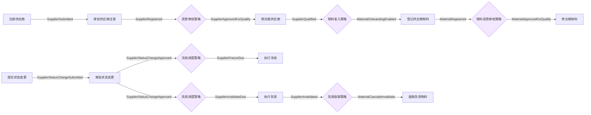

# 供应商管理系统 · 场景与需求说明

> 本文是设计器内置示例本体「供应商管理系统」对应的业务场景与需求规格，作为五模型（OBJ/BHV/EVT/RULE/POLICY）闭环验证的行业用例。
> 来源设计书：《YCM-KH-MOMPF20-U010-22_MOM R2.0 供应商管理功能设计书》。
> 对应实现：[designer/src/metamodel/sample.supplier.ts](designer/src/metamodel/sample.supplier.ts)；在设计器顶栏点击 **「加载供应商示例」** 即可载入。

---

## 一、业务背景

某制造企业（MOM R2.0）需要一套覆盖**供应商全生命周期**与**供应商物料全生命周期**的管理系统：

- **集团与供应商建档**：先维护供应商集团（工商、账户信息），再注册供应商（主子表：银行账户 / 联系人 / 资格证书 / 签订协议），供应商可绑定到集团；
- **审批与四态治理**：供应商注册经两级审批进入「临时」态，资质审核通过后转「合格」；运营期通过状态更新单做 **冻结 / 解冻 / 失效 / 转合格**，其中冻结/失效支持「区间内即时、否则定时任务生效」；
- **物料准入**：合格供应商方可登记其可采购物料，物料同样具备「临时/合格/冻结/失效」四态及独立的状态更新单；
- **信息更新留痕**：供应商信息更新时，旧版本数据保留并标记废弃，保证可追溯。

关键诉求是：**业务规则（编码生成、唯一性、必填、默认账户唯一、安全库存范围、转合格拦截）可独立沉淀**，状态流转与跨聚合联动通过**事件驱动策略**松耦合编排，新增/调整决策点不影响既有原子行为定义。

## 二、参与者（Actor）

| 角色 | 职责 |
|---|---|
| 采购/供应商管理员 | 维护集团、注册供应商、登记物料、发起状态变更 |
| 一级审批 | 第一级审批节点 |
| 二级审批 | 第二级审批节点 |
| 定时任务/调度器 | 在冻结/失效开始时间到达时触发状态生效 |
| 系统/策略引擎 | 自动执行资质审核、物料准入、状态路由、失效级联等决策 |

> 注：ACTOR 主体模型在当前 MVP 中尚未实现，此处仅描述业务角色，便于后续落地授权模型。

## 三、功能需求（供应商与物料全生命周期）

| 编号 | 需求 | 触发 | 关键约束 |
|---|---|---|---|
| FR-1 | 创建供应商集团 | 管理员手动 | 集团名称必填；提交生成集团编码 `G+4位流水` |
| FR-2 | 注册供应商 | 管理员手动 | 名称/简称/分类/类型/商品分类/国家 必填；银行账户至多一条默认；编码唯一；启动两级审批 |
| FR-3 | 审批供应商注册 | 注册提交后 | 两级审批通过，状态置「临时」 |
| FR-4 | 转合格供应商 | 资质审核通过 / 转合格审批 | 已合格则拦截 |
| FR-5 | 登记供应商物料 | 供应商转合格后 | 供应商须为合格态；「供应商+物料」唯一；安全在库月数 0~120 |
| FR-6 | 转合格物料 | 物料资质审核通过 | 已合格则拦截 |
| FR-7 | 提交供应商状态变更 | 管理员手动 | 冻结/解冻/失效/转合格；转合格已合格则拦截 |
| FR-8 | 审批供应商状态变更 | 状态变更提交后 | 两级审批通过后按类型路由 |
| FR-9 | 执行供应商冻结 | 审批通过/定时到期 | 区间内即时、否则按开始时间定时生效 |
| FR-10 | 执行供应商解冻 | 审批通过 | 回退至冻结前状态 |
| FR-11 | 执行供应商失效 | 审批通过/定时到期 | 状态置「失效」 |
| FR-12 | 供应商失效物料级联 | 供应商失效后 | 名下在用物料级联失效（业务自洽补全） |
| FR-13 | 提交物料状态变更 | 管理员手动 | 冻结/解冻/失效/转合格；转合格已合格则拦截 |
| FR-14 | 审批物料状态变更 | 物料状态变更提交后 | 两级审批通过后按类型路由 |
| FR-15 | 执行物料冻结 | 审批通过 | 状态置「冻结」 |

> 设计书原文不足之处的补全：**FR-12 供应商失效→物料级联失效** 在原设计书中未显式定义，本模型按业务自洽原则补全为事件驱动的跨聚合联动策略。

## 四、本体模型映射

本场景套用五模型（OBJ / BHV / EVT / RULE / POLICY），数量：**5 聚合 / 15 行为 / 23 事件 / 9 规则 / 9 策略**。

### 4.1 OBJ 对象模型（5 个聚合根）

| 聚合 | identity | 子实体 / 值对象 | 不变量 | 引用 |
|---|---|---|---|---|
| **SupplierGroup 供应商集团** | groupCode | — | 集团编码非空且唯一 | — |
| **Supplier 供应商** | supplierCode | 子实体 BankAccount、SupplierContact、QualificationCert、SupplierAgreement；值对象 BusinessRegistrationInfo（工商信息） | 编码非空唯一；默认银行账户≤1；状态∈{临时,合格,冻结,失效}；名称/简称必填 | → SupplierGroup；→ Supplier（旧版本留痕自引用） |
| **SupplierMaterial 供应商物料** | lineId | — | 「供应商+物料」唯一；安全库存 0~120；状态∈四态 | → Supplier |
| **SupplierStatusUpdate 供应商状态更新单** | docNo | 子实体 SupplierStatusLine | 单号非空且明细≥1 | — |
| **MaterialStatusUpdate 供应商物料状态更新单** | docNo | 子实体 MaterialStatusLine | 单号非空且明细≥1 | — |

### 4.2 BHV 行为模型（15 个）

| 行为 | 所属聚合 | 订阅事件 | 应用规则 | 产生事件 |
|---|---|---|---|---|
| CreateSupplierGroup 创建供应商集团 | SupplierGroup | — | GroupCodeGenRule | GroupRegistered |
| RegisterSupplier 注册供应商 | Supplier | — | SupplierCodeGenRule、DefaultBankAccountRule、SupplierCodeUniqueRule | SupplierSubmitted |
| ApproveSupplier 审批供应商注册 | Supplier | SupplierSubmitted | SupplierInfoCompleteRule | SupplierRegistered |
| QualifySupplier 转合格供应商 | Supplier | SupplierApprovedForQualify | — | SupplierQualified |
| RegisterMaterial 登记供应商物料 | SupplierMaterial | MaterialOnboardingEnabled | MaterialUniqueRule、SafetyStockRule | MaterialRegistered |
| QualifyMaterial 转合格物料 | SupplierMaterial | MaterialApprovedForQualify | — | MaterialQualified |
| SubmitSupplierStatusChange 提交供应商状态变更 | SupplierStatusUpdate | — | AlreadyQualifiedRule | SupplierStatusChangeSubmitted |
| ApproveSupplierStatusChange 审批供应商状态变更 | SupplierStatusUpdate | SupplierStatusChangeSubmitted | — | SupplierStatusChangeApproved |
| ExecuteSupplierFreeze 执行供应商冻结 | Supplier | SupplierFreezeDue | — | SupplierFrozen |
| ExecuteSupplierUnfreeze 执行供应商解冻 | Supplier | SupplierUnfreezeDue | — | SupplierUnfrozen |
| ExecuteSupplierInvalidate 执行供应商失效 | Supplier | SupplierInvalidateDue | — | SupplierInvalidated |
| CascadeInvalidateMaterial 级联失效供应商物料 | SupplierMaterial | MaterialCascadeInvalidate | — | MaterialInvalidated |
| SubmitMaterialStatusChange 提交物料状态变更 | MaterialStatusUpdate | — | MaterialAlreadyQualifiedRule | MaterialStatusChangeSubmitted |
| ApproveMaterialStatusChange 审批物料状态变更 | MaterialStatusUpdate | MaterialStatusChangeSubmitted | — | MaterialStatusChangeApproved |
| ExecuteMaterialFreeze 执行物料冻结 | SupplierMaterial | MaterialFreezeDue | — | MaterialFrozen |

### 4.3 RULE 规则模型（9 个纯规则）

| 规则 | 类型 | 说明 |
|---|---|---|
| GroupCodeGenRule 集团编码生成 | calculation | `G+4位流水`（当前最大编码加1） |
| SupplierCodeGenRule 供应商编码生成 | calculation | `国家代码+4位流水`（当前最大编码加1） |
| SupplierCodeUniqueRule 供应商编码唯一 | validation | 编码不可重复 |
| DefaultBankAccountRule 默认账户唯一 | validation | 银行账户至多一条默认 |
| SupplierInfoCompleteRule 必填项校验 | validation | 名称/简称/分类/类型/商品分类/国家 必填 |
| MaterialUniqueRule 物料唯一 | validation | 「供应商+物料」编码唯一 |
| SafetyStockRule 安全库存范围 | validation | 安全在库月数 0~120 |
| AlreadyQualifiedRule 供应商转合格拦截 | validation | 已合格则拦截 |
| MaterialAlreadyQualifiedRule 物料转合格拦截 | validation | 已合格则拦截 |

> 规则为「纯规则」：仅由行为通过 `appliedRuleRefs` 同步调用，不订阅/不触发事件。

### 4.4 POLICY 策略模型（9 个事件驱动反应器）

| 策略 | 订阅事件 | 触发事件 | 决策含义 |
|---|---|---|---|
| QualificationReviewPolicy 资质审核 | SupplierRegistered | SupplierApprovedForQualify | 证书有效、协议齐全则进入转合格 |
| SupplierQualifyPolicy 转合格路由 | SupplierStatusChangeApproved | SupplierApprovedForQualify | 类型=转合格时路由 |
| MaterialOnboardingPolicy 物料准入开通 | SupplierQualified | MaterialOnboardingEnabled | 合格供应商开通物料登记 |
| MaterialReviewPolicy 物料资质审核 | MaterialRegistered | MaterialApprovedForQualify | 物料主数据/参数合规则进入转合格 |
| SupplierFreezePolicy 冻结调度 | SupplierStatusChangeApproved | SupplierFreezeDue | 类型=冻结，区间内即时/否则定时 |
| SupplierUnfreezePolicy 解冻路由 | SupplierStatusChangeApproved | SupplierUnfreezeDue | 类型=取消冻结时路由 |
| SupplierInvalidatePolicy 失效调度 | SupplierStatusChangeApproved | SupplierInvalidateDue | 类型=失效，区间内即时/否则定时 |
| MaterialCascadePolicy 失效物料级联 | SupplierInvalidated | MaterialCascadeInvalidate | 供应商失效联动名下物料失效 |
| MaterialFreezePolicy 物料冻结路由 | MaterialStatusChangeApproved | MaterialFreezeDue | 类型=冻结时路由 |

> 策略均「订阅事件 → 条件判断 → 触发事件」，承载状态机路由、定时调度与跨聚合联动等智能决策。

### 4.5 EVT 事件模型（23 个）

GroupRegistered、SupplierSubmitted、SupplierRegistered、SupplierApprovedForQualify、SupplierQualified、MaterialOnboardingEnabled、MaterialRegistered、MaterialApprovedForQualify、MaterialQualified、SupplierStatusChangeSubmitted、SupplierStatusChangeApproved、SupplierFreezeDue、SupplierUnfreezeDue、SupplierInvalidateDue、SupplierFrozen、SupplierUnfrozen、SupplierInvalidated、MaterialCascadeInvalidate、MaterialInvalidated、MaterialStatusChangeSubmitted、MaterialStatusChangeApproved、MaterialFreezeDue、MaterialFrozen。

## 五、闭环演示

本用例覆盖五模型架构的多种事件-策略闭环模式（无环 DAG）：

1. **行为→事件→行为（审批链）**：注册供应商 → `SupplierSubmitted` → 审批供应商注册。
2. **行为→事件→策略→事件→行为（智能决策链）**：审批注册 → `SupplierRegistered` → 资质审核策略 → `SupplierApprovedForQualify` → 转合格供应商。
3. **策略→事件→…（状态机路由）**：审批状态变更 → `SupplierStatusChangeApproved` → 冻结/解冻/失效/转合格四条路由策略并行分发。
4. **跨聚合联动链**：执行失效 → `SupplierInvalidated` → 失效级联策略 → `MaterialCascadeInvalidate` → 级联失效物料。

## 六、验收标准

| 项 | 期望 | 实测 |
|---|---|---|
| 模型数量 | OBJ 5 / BHV 15 / EVT 23 / RULE 9 / POLICY 9 | ✅ 一致 |
| 一致性校验 | 0 错误 / 0 警告（"✓ 校验通过"） | ✅ errors=0 warnings=0 |
| Schema 解析 | ontologyProjectSchema 解析通过 | ✅ schema OK |
| 引用完整性 | 无悬空引用（对象/规则/事件引用均存在） | ✅ |
| 环路 | 事件-策略图为无环 DAG | ✅ 无 EVENT_CYCLE |
| 孤立事件 | 每个事件均有生产者或消费者 | ✅ 无 ORPHAN_EVENT |
| 策略完整性 | 每条策略均有订阅与触发事件 | ✅ 无 POLICY_NO_SUB / POLICY_NO_TRIGGER |
| 构建 | `vue-tsc -b && vite build` 通过 | ✅ 153 模块 |

> 校验由 `validateProject` 与 `ontologyProjectSchema` 双重保证；浏览器顶栏显示 **「✓ 校验通过」**。
