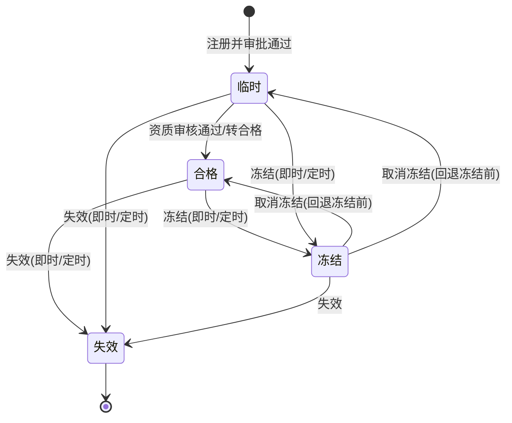
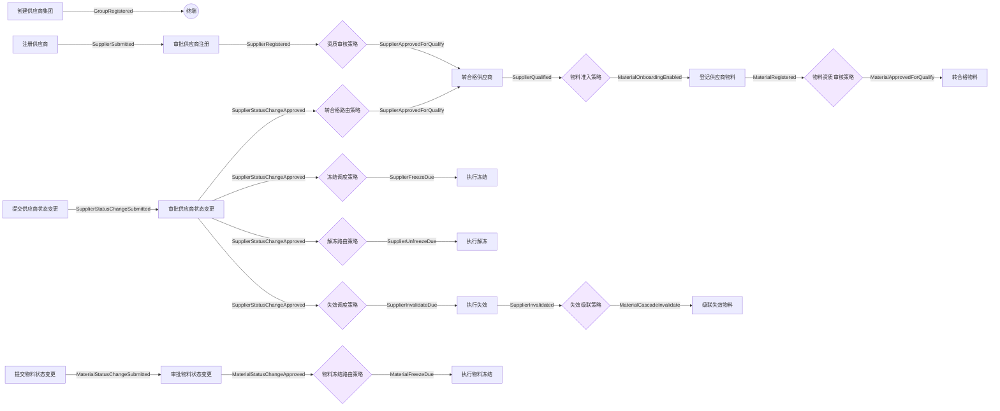

# 供应商管理系统 · 本体模型设计书

> 版本：V1（与可运行 MVP 实现严格对齐）
> 来源设计书：《YCM-KH-MOMPF20-U010-22_MOM R2.0 供应商管理功能设计书》
> 实现基准（数据一致性以此为准）：[designer/src/metamodel/sample.supplier.ts](designer/src/metamodel/sample.supplier.ts)
> 元模型与校验规则：[本体模型设计书-MVP实现范围版.md](本体模型设计书-MVP实现范围版.md)
> 场景与需求：[供应商管理系统-场景与需求.md](供应商管理系统-场景与需求.md)
> 载入方式：设计器顶栏点击 **「加载供应商示例」**。

| 版本 | 日期 | 作成 | 变更内容 |
|---|---|---|---|
| V1 | 2026-06-25 | Ontology Designer | 基于供应商管理功能设计书首版建模，OBJ 5 / BHV 15 / EVT 23 / RULE 9 / POLICY 9，校验 0 错 0 警 |

---

## 0. 如何阅读本设计书（兼模板说明）

本设计书面向「**单个业务领域**」的本体建模交付，章节结构设计为**可复用模板**：

- **第 1~2 章**：业务范围与生命周期，回答“这个领域要管什么、对象有哪些状态”。
- **第 3 章**：模型清单总览（五模型数量与职责）。
- **第 4~8 章**：分别详解 OBJ / BHV / EVT / RULE / POLICY 五类模型，每一类统一采用「**元定义 → 业务实例明细 → 示意示例**」三段式。
- **第 9 章**：事件-策略闭环编排全景图。
- **第 10 章**：一致性校验与验收。
- **附录 A**：模板化复用指南——把本结构套用到新业务时，每节填什么。

> 约定：本文**模型定义**（id / 名称 / 类型 / 必填 / 引用 / 事件链 / 规则条件）与 [designer/src/metamodel/sample.supplier.ts](designer/src/metamodel/sample.supplier.ts) **逐项一致**；标注「示意」的具体实例取值仅用于帮助理解，MVP 示例本身不含实例数据。

---

## 1. 业务范围

供应商管理覆盖**供应商**与**供应商物料**两条主线的全生命周期：

1. **建档与注册**：维护供应商集团（工商/账户）→ 注册供应商（主子表：银行账户/联系人/资格证书/签订协议，可绑定集团）。
2. **审批与资质**：供应商注册经两级审批进入「临时」→ 资质审核通过转「合格」。
3. **物料准入**：合格供应商方可登记可采购物料；物料经审核转「合格」。
4. **状态治理（四态）**：临时/合格/冻结/失效，通过状态更新单做 冻结 / 解冻 / 失效 / 转合格；冻结、失效支持「区间内即时、否则定时任务生效」。
5. **跨聚合联动**：供应商失效时，名下在用物料级联失效（设计书未显式定义，按业务自洽补全）。
6. **信息更新留痕**：供应商信息更新时旧版本保留并标记废弃，经 `oldSupplierId` 自引用追溯。

## 2. 生命周期（四态状态机）

供应商与供应商物料共享同一套四态机（枚举值 临时0 / 合格1 / 冻结2 / 失效3）：



> 状态值与转移在模型中由 OBJ 的 `supplierStatus`/`materialStatus` 枚举属性承载，由 BHV（执行动作）落库、由 POLICY（路由/调度）编排。

## 3. 模型清单总览

| 模型 | 编码 | 集合 | 数量 | 本业务职责 |
|---|---|---|---|---|
| 对象模型 | OBJ | objects | 5 | 供应商集团、供应商、供应商物料、两类状态更新单 |
| 行为模型 | BHV | behaviors | 15 | 建档/注册/审批/转合格/状态变更/执行 |
| 事件模型 | EVT | events | 23 | 贯穿全生命周期的领域事件（无环 DAG） |
| 规则模型 | RULE | rules | 9 | 编码生成、唯一性、必填、默认账户、安全库存、转合格拦截 |
| 策略模型 | POLICY | policies | 9 | 资质审核、物料准入、状态路由、定时调度、失效级联 |

> 元模型字段定义（OntologyProject / Attribute / ChildEntity / ValueObject / Invariant / AggregateRef 等）见 [本体模型设计书-MVP实现范围版.md](本体模型设计书-MVP实现范围版.md) 第 3 章，本文不再重复，仅在每章给出该模型类型的字段速览。

---

## 4. OBJ 对象模型详解（5 个聚合）

### 4.0 元定义速览

OBJ 字段：`id` / `name` / `description?` / `identity`（聚合根主键字段名）/ `attributes[]` / `entities[]`（子实体）/ `valueObjects[]`（值对象）/ `invariants[]`（不变量）/ `references[]`（仅 ID 引用其它 OBJ）。属性 `Attribute` = `name` / `type` / `required` / `description?`；`type ∈ {string, number, decimal, boolean, date, datetime, enum, reference, object}`。

> 下文属性表中的「唯一」列为可读性增强标注，由 `identity`（主键，全局/聚合内唯一）与 `invariants` 中的 `unique(...)` 约束派生：**主键** = 该对象 `identity` 字段；**联合唯一** = 参与组合唯一约束的字段；**—** = 无唯一性约束。该列不是元模型 `Attribute` 的独立字段。

### 4.1 SupplierGroup 供应商集团

- **职责**：集团级工商与账户信息主数据，供应商通过 `groupCode` 绑定到集团。
- **identity**：`groupCode`（集团编码，`G+4位流水`，提交生成）。

属性（19）：

| 属性名 | 类型 | 必填 | 唯一 | 说明 |
|---|---|---|---|---|
| groupCode | string | 是 | 主键 | 集团编码：G+4位流水，提交后生成 |
| groupName | string | 是 | — | 集团名称 |
| bankName | string | 否 | — | 开户行 |
| bankAccount | string | 否 | — | 收款账户 |
| employeeCount | number | 否 | — | 公司人数 |
| contactAddress | string | 否 | — | 联系地址 |
| taxpayerNo | string | 否 | — | 纳税人识别号 |
| groupStatus | enum | 否 | — | 集团状态：存续1/注销2/吊销3/撤销4/破产5/重整6 |
| establishDate | date | 否 | — | 成立时间 |
| legalPerson | string | 否 | — | 法定代表人 |
| registeredCapital | decimal | 否 | — | 注册资本(万元) |
| paidInCapital | decimal | 否 | — | 实缴资本(万元) |
| enterpriseNature | enum | 否 | — | 企业性质：国有1/民营2/外资3/合作社4/集体5/个体6/药品经营7 |
| licenseNo | string | 否 | — | 营业执照编号 |
| businessScope | string | 否 | — | 经营范围 |
| registeredAddress | string | 否 | — | 注册地址 |
| businessInfoUpdateTime | datetime | 否 | — | 工商信息更新时间 |
| remark | string | 否 | — | 备注 |
| discarded | boolean | 是 | — | 废弃标记（隐藏域） |

- **子实体 / 值对象**：无。
- **不变量**：`inv_group_code` — `groupCode != null && unique(groupCode)`（集团编码非空且全局唯一）。
- **引用**：无。

**示意实例**（illustrative）：

```yaml
groupCode: G0001
groupName: 华东化工集团有限公司
bankName: 工商银行上海分行
groupStatus: 存续1
legalPerson: 王建国
registeredCapital: 50000
discarded: false
```

### 4.2 Supplier 供应商

- **职责**：供应商聚合根（主子表），覆盖注册、审批、信息更新留痕与四态生命周期。
- **identity**：`supplierCode`（供应商编码，`国家代码+4位流水`，提交生成）。

主表属性（33）：

| 属性名 | 类型 | 必填 | 唯一 | 说明 |
|---|---|---|---|---|
| supplierCode | string | 是 | 主键 | 供应商编码：国家代码+4位流水，提交后生成 |
| supplierName | string | 是 | — | 供应商名称 |
| supplierShortName | string | 是 | — | 供应商简称 |
| supplierCategory | enum | 是 | — | 供应商分类：集团内1/集团外2 |
| supplierType | enum | 是 | — | 供应商类型：原材料1/非原材料2 |
| goodsCategory | enum | 是 | — | 商品分类：化学品1/副资材2 |
| country | enum | 是 | — | 国家/地区：CN中国/JP日本/US美国 |
| groupCode | reference | 否 | — | 所属集团（引用 SupplierGroup） |
| industry | enum | 否 | — | 所属行业：制造业1/物流业2… |
| postalCode | string | 否 | — | 邮政编码 |
| contactAddress | string | 否 | — | 联系地址 |
| phone | string | 否 | — | 电话 |
| email | string | 否 | — | Email地址 |
| annualRevenue | decimal | 否 | — | 年营收 |
| employeeCount | number | 否 | — | 公司人数 |
| taxRate | decimal | 否 | — | 税率(%) |
| creditLevel | string | 否 | — | 信用等级 |
| creditLimit | decimal | 否 | — | 信用额度 |
| creditPeriod | string | 否 | — | 信用期限 |
| settlementMethod | enum | 否 | — | 结算方式：转账支票1/现金支票2… |
| paymentCondition | string | 否 | — | 付款条件 |
| currency | enum | 否 | — | 币种：RMB人民币/JPY日元/USD美元 |
| deliveryMethod | enum | 否 | — | 到货方式：送到工厂1/送到工厂含卸货2 |
| deliveryWarehouse | string | 否 | — | 到货仓库（主数据） |
| tradeMethod | enum | 否 | — | 贸易方式：一般贸易1/加工贸易2… |
| tradeTerms | enum | 否 | — | 交易条款：EXW/FOB |
| qualityRequirement | string | 否 | — | 品质要求 |
| initiator | string | 否 | — | 发起人（当前登录账号） |
| firstApprover | string | 是 | — | 一级审批 |
| secondApprover | string | 是 | — | 二级审批 |
| oldSupplierId | reference | 否 | — | 旧供应商ID：信息更新留痕，指向上一版（自引用） |
| supplierStatus | enum | 是 | — | 供应商状态：临时0/合格1/冻结2/失效3（隐藏域） |
| discarded | boolean | 是 | — | 废弃标记（隐藏域） |

子实体（4）。子实体 `identity` 字段即聚合内唯一标识（主键），下表属性列以 `(主键)` 标注：

| 子实体 id | 名称 | identity（主键） | 属性 |
|---|---|---|---|
| BankAccount | 银行账户信息 | bankAccountNo | bankAccountNo(必,主键)、accountName(必)、bankName、isDefault(必,bool)、belongBank、bankLineNo |
| SupplierContact | 供应商联系人 | seq | seq(必,num,主键)、contactName(必)、contactPhone、contactMobile、contactEmail、department、position |
| QualificationCert | 供应商资格证书 | certName | certName(必,主键)、certType(enum 安全生产许可证1/企业资质证2)、attachment、expireDate(date) |
| SupplierAgreement | 供应商签订协议 | agreementName | agreementName(必,主键)、agreementDate(date)、attachment、uploadDate(date)、agreementType(enum 采购1/保密2…) |

值对象（1）：

| 值对象 id | 名称 | 属性 |
|---|---|---|
| BusinessRegistrationInfo | 工商信息 | enterpriseStatus(enum)、establishDate(date)、legalPerson、registeredCapital(dec)、paidInCapital(dec)、enterpriseNature(enum)、enterpriseType(enum)、licenseNo、taxpayerNo、registeredAddress、businessScope、businessInfoUpdateTime(datetime) |

不变量（4）：

| id | 表达式 | 说明 |
|---|---|---|
| inv_supplier_code | `supplierCode != null && unique(supplierCode)` | 供应商编码非空且全局唯一 |
| inv_default_bank | `count(bankAccounts where isDefault == true) <= 1` | 银行账户至多一条默认 |
| inv_supplier_status | `supplierStatus in {0,1,2,3}` | 供应商状态仅限四态 |
| inv_supplier_required | `supplierName != null && supplierShortName != null` | 名称与简称必填 |

引用（2）：

| 目标对象 | 引用字段 | 说明 |
|---|---|---|
| SupplierGroup | groupCode | 供应商绑定到集团 |
| Supplier | oldSupplierId | 信息更新留痕：指向被替换的上一版供应商（自引用） |

**示意实例**（illustrative）：

```yaml
supplierCode: CN0001
supplierName: 上海远华化工有限公司
supplierShortName: 远华化工
supplierCategory: 集团外2
supplierType: 原材料1
goodsCategory: 化学品1
country: CN
groupCode: G0001
supplierStatus: 合格1
firstApprover: 李审一
secondApprover: 赵审二
discarded: false
bankAccounts:
  - { bankAccountNo: '6222021001', accountName: 上海远华化工有限公司, isDefault: true }
contacts:
  - { seq: 1, contactName: 周敏, contactMobile: '13800000000', department: 采购部 }
certificates:
  - { certName: 安全生产许可证, certType: 安全生产许可证1, expireDate: '2027-12-31' }
agreements:
  - { agreementName: 采购框架协议, agreementType: 采购1, agreementDate: '2026-01-10' }
businessRegistrationInfo:
  { enterpriseStatus: 存续1, legalPerson: 周敏, registeredCapital: 8000 }
```

### 4.3 SupplierMaterial 供应商物料

- **职责**：供应商可采购物料聚合根，承载采购参数与四态生命周期。
- **identity**：`lineId`（供应商物料行 ID）。

属性（22）：

| 属性名 | 类型 | 必填 | 唯一 | 说明 |
|---|---|---|---|---|
| lineId | string | 是 | 主键 | 供应商物料行ID |
| materialCode | string | 是 | 联合唯一 | 物料编码（物料主数据带入） |
| materialName | string | 否 | — | 物料名称 |
| specModel | string | 否 | — | 规格型号 |
| materialType | enum | 否 | — | 物料类型（主数据） |
| category1 | enum | 否 | — | 一级分类（物料分类主数据） |
| category2 | enum | 否 | — | 二级分类（物料分类主数据） |
| category3 | enum | 否 | — | 三级分类（物料分类主数据） |
| unit | enum | 否 | — | 单位（主数据） |
| supplierCode | reference | 是 | 联合唯一 | 所属供应商（引用 Supplier） |
| supplierName | string | 否 | — | 供应商名称（冗余展示） |
| productName | string | 是 | — | 商品名称 |
| tagName | string | 否 | — | 标签名 |
| shelfCondition | string | 否 | — | 保质条件 |
| minContainQty | number | 否 | — | 最小收容数 |
| minDeliveryQty | number | 否 | — | 最小送货量 |
| purchaseRatio | decimal | 否 | — | 采购比例(%) |
| purchaseCycle | number | 否 | — | 采购周期(日) |
| safetyStockMonths | number | 否 | — | 安全在库月数（最大120） |
| remark | string | 否 | — | 备注 |
| materialStatus | enum | 是 | — | 物料状态：临时0/合格1/冻结2/失效3（隐藏域） |
| discarded | boolean | 是 | — | 废弃标记（隐藏域） |

> `lineId` 为代理主键（行ID）；业务唯一键为联合唯一 `（supplierCode + materialCode）`，见不变量 `inv_material_unique`。

- **子实体 / 值对象**：无。
- **不变量**：

| id | 表达式 | 说明 |
|---|---|---|
| inv_material_unique | `unique(supplierCode, materialCode)` | 同一供应商下物料编码唯一 |
| inv_safety_stock | `safetyStockMonths >= 0 && safetyStockMonths <= 120` | 安全在库月数范围 0~120 |
| inv_material_status | `materialStatus in {0,1,2,3}` | 物料状态仅限四态 |

- **引用**：`Supplier`（refField `supplierCode`，物料归属供应商）。

**示意实例**（illustrative）：

```yaml
lineId: SM-CN0001-M1001
materialCode: M1001
materialName: 工业级乙醇
supplierCode: CN0001
supplierName: 上海远华化工有限公司
productName: 99.9% 工业乙醇
safetyStockMonths: 3
materialStatus: 合格1
discarded: false
```

### 4.4 SupplierStatusUpdate 供应商状态更新单

- **职责**：供应商状态变更单据（主子表），审批通过后按类型更新供应商状态；支持冻结的定时生效。
- **identity**：`docNo`（单据编号）。

主表属性（13）：

| 属性名 | 类型 | 必填 | 唯一 | 说明 |
|---|---|---|---|---|
| docNo | string | 是 | 主键 | 单据编号 |
| operator | string | 是 | — | 操作人（当前用户） |
| operateTime | datetime | 是 | — | 操作时间（当前时间） |
| targetStatus | enum | 是 | — | 变更类型/目标状态：临时0/合格1/冻结2/失效3 |
| startTime | datetime | 否 | — | 冻结开始时间（区间内即时、否则定时生效） |
| endTime | datetime | 否 | — | 冻结结束时间 |
| attachment | string | 否 | — | 附件 |
| reason | string | 否 | — | 原因 |
| remark | string | 否 | — | 备注 |
| firstApprover | string | 是 | — | 一级审批 |
| secondApprover | string | 是 | — | 二级审批 |
| approvalStatus | enum | 是 | — | 审批状态 |
| isCancel | boolean | 是 | — | 是否取消（取消冻结回退至冻结前状态） |

子实体（1）`SupplierStatusLine` 状态更新明细（identity `supplierCode`）：

| 属性名 | 类型 | 必填 | 唯一 | 说明 |
|---|---|---|---|---|
| supplierCode | string | 是 | 主键 | 供应商编码 |
| supplierName | string | 否 | — | 供应商名称 |
| supplierType | enum | 否 | — | 供应商类型 |
| supplierCategory | enum | 否 | — | 供应商分类 |
| groupCode | string | 否 | — | 集团 |
| supplierId | string | 否 | — | 供应商ID（隐藏域） |
| currentStatus | enum | 否 | — | 当前状态（隐藏域） |
| isCancel | boolean | 否 | — | 是否取消（隐藏域） |

- **不变量**：`inv_status_doc` — `docNo != null && count(lines) >= 1`（单据编号非空且至少一条明细）。
- **引用**：无（通过明细行 `supplierCode` 关联供应商，批量操作）。

**示意实例**（illustrative）：

```yaml
docNo: SSU20260601001
operator: 张三
targetStatus: 冻结2
startTime: '2026-07-01 00:00:00'
approvalStatus: 已通过
isCancel: false
lines:
  - { supplierCode: CN0001, supplierName: 上海远华化工有限公司, currentStatus: 合格1 }
```

### 4.5 MaterialStatusUpdate 供应商物料状态更新单

- **职责**：供应商物料状态变更单据（主子表），审批通过后按类型更新物料状态。
- **identity**：`docNo`（单据编号）。

主表属性（11）：

| 属性名 | 类型 | 必填 | 唯一 | 说明 |
|---|---|---|---|---|
| docNo | string | 是 | 主键 | 单据编号 |
| operator | string | 是 | — | 操作人（当前用户） |
| operateTime | datetime | 是 | — | 操作时间（当前时间） |
| targetStatus | enum | 是 | — | 变更类型/目标状态：临时0/合格1/冻结2/失效3 |
| attachment | string | 否 | — | 附件 |
| reason | string | 否 | — | 原因 |
| remark | string | 否 | — | 备注 |
| firstApprover | string | 否 | — | 一级审批 |
| secondApprover | string | 否 | — | 二级审批 |
| approvalStatus | enum | 是 | — | 审批状态 |
| isCancel | boolean | 是 | — | 是否取消（取消冻结回退至冻结前状态） |

子实体（1）`MaterialStatusLine` 物料状态更新明细（identity `materialCode`）：

| 属性名 | 类型 | 必填 | 唯一 | 说明 |
|---|---|---|---|---|
| materialCode | string | 是 | 主键 | 物料编码 |
| materialName | string | 否 | — | 物料名称 |
| specModel | string | 否 | — | 规格型号 |
| materialType | enum | 否 | — | 物料类型 |
| supplierCode | string | 否 | — | 供应商编码 |
| supplierName | string | 否 | — | 供应商名称 |
| productName | string | 否 | — | 商品名称 |
| materialId | string | 否 | — | 供应商物料ID（隐藏域） |
| currentStatus | enum | 否 | — | 当前状态（隐藏域） |
| isCancel | boolean | 否 | — | 是否取消（隐藏域） |

- **不变量**：`inv_mat_status_doc` — `docNo != null && count(lines) >= 1`。
- **引用**：无。

**示意实例**（illustrative）：

```yaml
docNo: MSU20260601001
operator: 张三
targetStatus: 冻结2
approvalStatus: 已通过
isCancel: false
lines:
  - { materialCode: M1001, materialName: 工业级乙醇, supplierCode: CN0001, currentStatus: 合格1 }
```

---

## 5. BHV 行为模型详解（15 个）

### 5.0 元定义速览

BHV 字段：`id` / `name` / `description?` / `objectRef`（归属聚合根）/ `preconditions[]` / `postconditions[]` / `appliedRuleRefs[]`（同步应用的 RULE）/ `producedEventRefs[]`（产生的 EVT）/ `subscribedEventRefs[]`（订阅的 EVT）。规则通过 `appliedRuleRefs` **同步调用**，事件编排通过 produced/subscribed **异步解耦**。

### 5.1 行为清单

| id | 名称 | 归属聚合 | 订阅事件 | 应用规则 | 产生事件 |
|---|---|---|---|---|---|
| CreateSupplierGroup | 创建供应商集团 | SupplierGroup | — | GroupCodeGenRule | GroupRegistered |
| RegisterSupplier | 注册供应商 | Supplier | — | SupplierCodeGenRule、DefaultBankAccountRule、SupplierCodeUniqueRule | SupplierSubmitted |
| ApproveSupplier | 审批供应商注册 | Supplier | SupplierSubmitted | SupplierInfoCompleteRule | SupplierRegistered |
| QualifySupplier | 转合格供应商 | Supplier | SupplierApprovedForQualify | — | SupplierQualified |
| RegisterMaterial | 登记供应商物料 | SupplierMaterial | MaterialOnboardingEnabled | MaterialUniqueRule、SafetyStockRule | MaterialRegistered |
| QualifyMaterial | 转合格物料 | SupplierMaterial | MaterialApprovedForQualify | — | MaterialQualified |
| SubmitSupplierStatusChange | 提交供应商状态变更 | SupplierStatusUpdate | — | AlreadyQualifiedRule | SupplierStatusChangeSubmitted |
| ApproveSupplierStatusChange | 审批供应商状态变更 | SupplierStatusUpdate | SupplierStatusChangeSubmitted | — | SupplierStatusChangeApproved |
| ExecuteSupplierFreeze | 执行供应商冻结 | Supplier | SupplierFreezeDue | — | SupplierFrozen |
| ExecuteSupplierUnfreeze | 执行供应商解冻 | Supplier | SupplierUnfreezeDue | — | SupplierUnfrozen |
| ExecuteSupplierInvalidate | 执行供应商失效 | Supplier | SupplierInvalidateDue | — | SupplierInvalidated |
| CascadeInvalidateMaterial | 级联失效供应商物料 | SupplierMaterial | MaterialCascadeInvalidate | — | MaterialInvalidated |
| SubmitMaterialStatusChange | 提交物料状态变更 | MaterialStatusUpdate | — | MaterialAlreadyQualifiedRule | MaterialStatusChangeSubmitted |
| ApproveMaterialStatusChange | 审批物料状态变更 | MaterialStatusUpdate | MaterialStatusChangeSubmitted | — | MaterialStatusChangeApproved |
| ExecuteMaterialFreeze | 执行物料冻结 | SupplierMaterial | MaterialFreezeDue | — | MaterialFrozen |

### 5.2 关键行为前后置条件

| id | 前置条件 | 后置条件 |
|---|---|---|
| RegisterSupplier | 名称/简称/分类/类型/商品分类/国家 必填；银行账户至多一条默认 | 生成供应商编码；供应商进入审批中 |
| ApproveSupplier | 供应商处于审批中 | 供应商状态置为临时 |
| QualifySupplier | 供应商为临时/冻结前状态；非已合格 | 供应商状态置为合格 |
| RegisterMaterial | 供应商为合格状态；供应商+物料编码不重复 | 生成供应商物料；物料状态置为临时 |
| ExecuteSupplierFreeze | 冻结申请已审批 | 供应商状态置为冻结；记录冻结前状态 |
| ExecuteSupplierUnfreeze | 供应商为冻结状态 | 状态回退至冻结前；冻结操作标记取消 |
| CascadeInvalidateMaterial | 所属供应商已失效 | 名下物料状态置为失效 |

**示意示例**（RegisterSupplier）：

```yaml
behavior: RegisterSupplier            # 注册供应商
objectRef: Supplier
preconditions: [ '名称/简称/分类/类型/商品分类/国家 必填', '银行账户至多一条默认' ]
appliedRules: [ SupplierCodeGenRule, DefaultBankAccountRule, SupplierCodeUniqueRule ]
produces: SupplierSubmitted           # → 下游 ApproveSupplier 订阅
```

---

## 6. EVT 事件模型详解（23 个）

### 6.0 元定义速览

EVT 字段：`id` / `name` / `description?` / `payload[]`（Attribute 列表）/ `deliverySemantics ∈ {AT_LEAST_ONCE, EXACTLY_ONCE, BEST_EFFORT}`。事件是 BHV 与 POLICY 之间的**解耦连接点**：生产者写入、订阅者反应。

### 6.1 事件清单

| id | 名称 | 载荷 | 投递语义 | 生产者 → 消费者 |
|---|---|---|---|---|
| GroupRegistered | 集团已建档 | groupCode | AT_LEAST_ONCE | CreateSupplierGroup → （终端） |
| SupplierSubmitted | 供应商注册已提交 | supplierCode, initiator | AT_LEAST_ONCE | RegisterSupplier → ApproveSupplier |
| SupplierRegistered | 供应商注册完成 | supplierCode | AT_LEAST_ONCE | ApproveSupplier → QualificationReviewPolicy |
| SupplierApprovedForQualify | 供应商资质审核通过 | supplierCode | AT_LEAST_ONCE | 资质审核/转合格策略 → QualifySupplier |
| SupplierQualified | 供应商已转合格 | supplierCode | AT_LEAST_ONCE | QualifySupplier → MaterialOnboardingPolicy |
| MaterialOnboardingEnabled | 供应商物料准入已开通 | supplierCode | AT_LEAST_ONCE | MaterialOnboardingPolicy → RegisterMaterial |
| MaterialRegistered | 供应商物料已登记 | supplierCode, materialCode | AT_LEAST_ONCE | RegisterMaterial → MaterialReviewPolicy |
| MaterialApprovedForQualify | 物料资质审核通过 | lineId | AT_LEAST_ONCE | MaterialReviewPolicy → QualifyMaterial |
| MaterialQualified | 供应商物料已转合格 | lineId | AT_LEAST_ONCE | QualifyMaterial → （终端） |
| SupplierStatusChangeSubmitted | 供应商状态变更已提交 | docNo, targetStatus | AT_LEAST_ONCE | SubmitSupplierStatusChange → ApproveSupplierStatusChange |
| SupplierStatusChangeApproved | 供应商状态变更已审批 | docNo, targetStatus | EXACTLY_ONCE | ApproveSupplierStatusChange → 四路由策略 |
| SupplierFreezeDue | 供应商冻结到期生效 | supplierCode | EXACTLY_ONCE | SupplierFreezePolicy → ExecuteSupplierFreeze |
| SupplierUnfreezeDue | 供应商解冻生效 | supplierCode | EXACTLY_ONCE | SupplierUnfreezePolicy → ExecuteSupplierUnfreeze |
| SupplierInvalidateDue | 供应商失效生效 | supplierCode | EXACTLY_ONCE | SupplierInvalidatePolicy → ExecuteSupplierInvalidate |
| SupplierFrozen | 供应商已冻结 | supplierCode | AT_LEAST_ONCE | ExecuteSupplierFreeze → （终端） |
| SupplierUnfrozen | 供应商已解冻 | supplierCode | AT_LEAST_ONCE | ExecuteSupplierUnfreeze → （终端） |
| SupplierInvalidated | 供应商已失效 | supplierCode | AT_LEAST_ONCE | ExecuteSupplierInvalidate → MaterialCascadePolicy |
| MaterialCascadeInvalidate | 物料联动失效指令 | supplierCode | AT_LEAST_ONCE | MaterialCascadePolicy → CascadeInvalidateMaterial |
| MaterialInvalidated | 供应商物料已失效 | lineId | AT_LEAST_ONCE | CascadeInvalidateMaterial → （终端） |
| MaterialStatusChangeSubmitted | 物料状态变更已提交 | docNo, targetStatus | AT_LEAST_ONCE | SubmitMaterialStatusChange → ApproveMaterialStatusChange |
| MaterialStatusChangeApproved | 物料状态变更已审批 | docNo, targetStatus | EXACTLY_ONCE | ApproveMaterialStatusChange → MaterialFreezePolicy |
| MaterialFreezeDue | 物料冻结生效 | lineId | EXACTLY_ONCE | MaterialFreezePolicy → ExecuteMaterialFreeze |
| MaterialFrozen | 供应商物料已冻结 | lineId | AT_LEAST_ONCE | ExecuteMaterialFreeze → （终端） |

> 投递语义约定：状态机「审批结果/到期生效」类用 `EXACTLY_ONCE`（幂等、不可重复触发状态跃迁）；通用通知类用 `AT_LEAST_ONCE`。

**示意示例**（SupplierStatusChangeApproved）：

```yaml
event: SupplierStatusChangeApproved   # 供应商状态变更已审批
payload: { docNo: SSU20260601001, targetStatus: 冻结2 }
deliverySemantics: EXACTLY_ONCE       # 由策略按 targetStatus 路由
```

---

## 7. RULE 规则模型详解（9 个）

### 7.0 元定义速览

RULE 字段：`id` / `name` / `description?` / `type ∈ {validation, calculation, derivation, risk}` / `condition`。RULE 为**纯规则**：仅被 BHV 通过 `appliedRuleRefs` 同步调用，**不订阅、不触发**事件。

### 7.1 规则清单

| id | 名称 | 类型 | 条件表达式 condition | 被引用于 |
|---|---|---|---|---|
| GroupCodeGenRule | 集团编码生成规则 | calculation | `groupCode = "G" + pad(max(existing.groupCode.serial) + 1, 4)` | CreateSupplierGroup |
| SupplierCodeGenRule | 供应商编码生成规则 | calculation | `supplierCode = country + pad(max(existing.supplierCode.serial) + 1, 4)` | RegisterSupplier |
| SupplierCodeUniqueRule | 供应商编码唯一校验 | validation | `unique(Supplier.supplierCode)` | RegisterSupplier |
| DefaultBankAccountRule | 默认银行账户唯一校验 | validation | `count(bankAccounts where isDefault == true) <= 1` | RegisterSupplier |
| SupplierInfoCompleteRule | 供应商必填项校验 | validation | `supplierName && supplierShortName && supplierCategory && supplierType && goodsCategory && country` | ApproveSupplier |
| MaterialUniqueRule | 供应商物料唯一校验 | validation | `unique(SupplierMaterial.supplierCode + SupplierMaterial.materialCode)` | RegisterMaterial |
| SafetyStockRule | 安全在库月数范围校验 | validation | `safetyStockMonths >= 0 && safetyStockMonths <= 120` | RegisterMaterial |
| AlreadyQualifiedRule | 供应商转合格拦截 | validation | `targetStatus == 合格 ? supplierStatus != 合格 : true` | SubmitSupplierStatusChange |
| MaterialAlreadyQualifiedRule | 物料转合格拦截 | validation | `targetStatus == 合格 ? materialStatus != 合格 : true` | SubmitMaterialStatusChange |

**示意示例**（SafetyStockRule 触发拦截）：

```text
输入：safetyStockMonths = 150
判定：150 <= 120 → false  ⇒ 校验不通过，登记被拦截
```

---

## 8. POLICY 策略模型详解（9 个）

### 8.0 元定义速览

POLICY 字段：`id` / `name` / `description?` / `subscribedEventRefs[]`（订阅 EVT）/ `condition`（触发判定）/ `triggeredEventRefs[]`（满足条件触发 EVT）。POLICY 是事件驱动的一等模型，承载状态机路由、定时调度与跨聚合联动等智能决策。

### 8.1 策略清单

| id | 名称 | 订阅事件 | 条件 condition | 触发事件 |
|---|---|---|---|---|
| QualificationReviewPolicy | 供应商资质审核策略 | SupplierRegistered | 资格证书均在有效期内 且 必备协议齐全 | SupplierApprovedForQualify |
| SupplierQualifyPolicy | 供应商转合格路由策略 | SupplierStatusChangeApproved | `targetStatus == 合格` | SupplierApprovedForQualify |
| MaterialOnboardingPolicy | 物料准入开通策略 | SupplierQualified | 供应商状态为合格 | MaterialOnboardingEnabled |
| MaterialReviewPolicy | 物料资质审核策略 | MaterialRegistered | 物料主数据齐全 且 采购参数合规 | MaterialApprovedForQualify |
| SupplierFreezePolicy | 供应商冻结调度策略 | SupplierStatusChangeApproved | `targetStatus == 冻结`（now ∈ [startTime,endTime] 即时，否则定时） | SupplierFreezeDue |
| SupplierUnfreezePolicy | 供应商解冻路由策略 | SupplierStatusChangeApproved | `targetStatus == 取消冻结` | SupplierUnfreezeDue |
| SupplierInvalidatePolicy | 供应商失效调度策略 | SupplierStatusChangeApproved | `targetStatus == 失效`（now ≥ startTime 即时，否则定时） | SupplierInvalidateDue |
| MaterialCascadePolicy | 供应商失效物料级联策略 | SupplierInvalidated | 存在状态非失效的名下物料 | MaterialCascadeInvalidate |
| MaterialFreezePolicy | 物料冻结路由策略 | MaterialStatusChangeApproved | `targetStatus == 冻结` | MaterialFreezeDue |

> 同一事件 `SupplierStatusChangeApproved` 被 4 条策略并行订阅，按 `targetStatus` 条件互斥路由——这是**单事件多策略状态机分发**的范式。

**示意示例**（SupplierFreezePolicy 定时调度）：

```yaml
policy: SupplierFreezePolicy
on: SupplierStatusChangeApproved      # 订阅
when: targetStatus == 冻结 且 now < startTime
emit: SupplierFreezeDue                # 触发：定时任务在 startTime 到期后发出
```

---

## 9. 事件-策略闭环编排全景



四类闭环范式：

1. **行为→事件→行为（审批链）**：注册供应商 → SupplierSubmitted → 审批供应商注册。
2. **行为→事件→策略→事件→行为（智能决策链）**：审批注册 → SupplierRegistered → 资质审核策略 → SupplierApprovedForQualify → 转合格供应商。
3. **单事件多策略状态机分发**：审批状态变更 → SupplierStatusChangeApproved → 冻结/解冻/失效/转合格四策略按 targetStatus 互斥路由。
4. **跨聚合联动链**：执行失效 → SupplierInvalidated → 失效级联策略 → MaterialCascadeInvalidate → 级联失效物料。

---

## 10. 一致性校验与验收

| 项 | 期望 | 实测 |
|---|---|---|
| 模型数量 | OBJ 5 / BHV 15 / EVT 23 / RULE 9 / POLICY 9 | ✅ 一致 |
| Schema 解析 | ontologyProjectSchema 通过 | ✅ schema OK |
| 一致性校验 | 0 错误 / 0 警告 | ✅ errors=0 warnings=0 |
| 引用完整性 | 对象/规则/事件引用均存在 | ✅ 无 DANGLING_* |
| 环路 | 事件-策略图为无环 DAG | ✅ 无 EVENT_CYCLE |
| 孤立事件 | 每个事件均有生产者或消费者 | ✅ 无 ORPHAN_EVENT |
| 策略完整性 | 每条策略均有订阅与触发 | ✅ 无 POLICY_NO_SUB / POLICY_NO_TRIGGER |
| 构建 | `vue-tsc -b && vite build` | ✅ 153 模块 |

校验码定义见 [本体模型设计书-MVP实现范围版.md](本体模型设计书-MVP实现范围版.md) 第 4~5 章；浏览器顶栏显示 **「✓ 校验通过」**。

---

## 附录 A. 模板化复用指南（新业务填充说明）

将本设计书结构套用到新业务时，按下表逐节填充。**先定对象与状态，再定行为，再用事件/策略串成闭环，最后跑校验。**

| 章节 | 填什么 | 建模要点 / 校验红线 |
|---|---|---|
| 1 业务范围 | 领域要管理的核心实体与主线流程 | 用 3~6 条概述，标明跨聚合联动点 |
| 2 生命周期 | 核心对象的状态枚举与状态机 | 状态值落到 OBJ 枚举属性；转移由 BHV 落库、POLICY 编排 |
| 3 模型清单 | 五模型各自数量与职责 | 每类至少 1 个；OBJ 是地基 |
| 4 OBJ | 每个聚合：identity、属性、子实体、值对象、不变量、引用 | identity 必须是自身属性；属性表用「唯一」列标注 **主键**（identity 字段）/ **联合唯一**（组合唯一字段）/ **—**；`references` 只放 ID 字段；多默认/唯一类约束写成 invariant |
| 5 BHV | 每个动作：objectRef、前后置、应用规则、产生/订阅事件 | objectRef 必须指向已存在 OBJ；规则放 `appliedRuleRefs`，事件放 produced/subscribed |
| 6 EVT | 每个事件：payload、投递语义 | 每个事件至少有一个生产者或消费者（否则 ORPHAN_EVENT 警告） |
| 7 RULE | 纯规则：type + condition | 不得订阅/触发事件；只被 BHV 同步调用 |
| 8 POLICY | 事件驱动：订阅 + 条件 + 触发 | 每条策略必须既有订阅又有触发（否则 POLICY_NO_SUB/POLICY_NO_TRIGGER 警告） |
| 9 闭环编排 | 事件-策略全景图 | 必须为无环 DAG（否则 EVENT_CYCLE 错误） |
| 10 校验验收 | 数量与校验结果 | 目标：0 错误；warnings 尽量 0 |

**命名约定**：模型 id 用 `^[A-Za-z][A-Za-z0-9_]*$`（字母开头，字母/数字/下划线）；聚合用名词（`Supplier`）、行为用动宾（`RegisterSupplier`）、事件用「主语+过去分词」（`SupplierRegistered`）、策略用「名词+Policy」（`SupplierFreezePolicy`）。

**落地路径**：① 在设计器中可视化建模并导出 YAML；或 ② 仿照 [designer/src/metamodel/sample.supplier.ts](designer/src/metamodel/sample.supplier.ts) 直接编写 `OntologyProject`，经 `ontologyProjectSchema` 与 `validateProject` 双重校验通过后接入。

> 后续可据本附录抽出一份空白《本体模型设计书-业务模板.md》（仅保留章节骨架与填写说明），实现“新业务照模板填空”。
