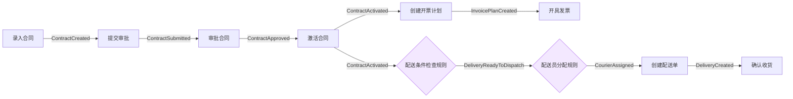

# 合同管理系统 · 场景与需求说明

> 本文是设计器内置示例本体「合同管理系统」对应的业务场景与需求规格，作为 MVP 闭环验证的基准用例。
> 对应实现：[designer/src/metamodel/sample.ts](designer/src/metamodel/sample.ts)；建模规范见 [本体模型设计规格书.md](本体模型设计规格书.md)。

---

## 一、业务背景

某制造企业需要一套覆盖**合同全生命周期**的管理系统：销售录入合同（基本信息、付款条款、产品明细），经信用风控与审批后生效；合同生效后，系统据合同内容自动展开两条并行的业务流：

- **开票流**：按付款条款生成开票计划，到期开具发票；
- **配送流**：判断是否需要并可以配送（实物商品且有空闲配送员），自动分配配送员、创建配送单，直至客户确认收货。

系统的关键诉求是：**业务规则（信用、配送条件、配送员分配）可独立演进**，流程通过**事件驱动**松耦合编排，新增/调整决策点不影响既有行为定义。

## 二、参与者（Actor）

| 角色 | 职责 |
|---|---|
| 销售 | 录入合同、提交审批 |
| 审批人 | 审批合同（依赖信用风控结果） |
| 财务 | 开具发票 |
| 配送员 | 执行配送（由系统按规则分配） |
| 系统/规则引擎 | 自动执行信用检查、配送条件检查、配送员分配等决策 |

> 注：ACTOR 主体模型在当前 MVP 中尚未实现（属规格书 Tier3 草案），此处仅描述业务角色，便于后续落地授权模型。

## 三、功能需求（合同全生命周期）

| 编号 | 需求 | 触发 | 关键约束 |
|---|---|---|---|
| FR-1 | 录入合同 | 销售手动 | 客户必须存在；至少一条产品明细；自动核算金额 |
| FR-2 | 提交审批 | 合同创建后 | 仅草稿状态可提交 |
| FR-3 | 审批合同 | 提交审批后 | 审批前必须通过信用风控检查 |
| FR-4 | 激活合同 | 审批通过后 | 仅已审批状态可激活 |
| FR-5 | 创建开票计划 | 合同生效后 | 按付款条款生成 |
| FR-6 | 开具发票 | 开票计划创建后/到期 | 仅待开票状态可开票 |
| FR-7 | 配送条件检查 | 合同生效后 | 实物商品且有空闲配送员才进入配送 |
| FR-8 | 配送员分配 | 配送就绪后 | 按负载与就近原则分配 |
| FR-9 | 创建配送单 | 配送员分配后 | 已分配配送员才能创建 |
| FR-10 | 确认收货 | 配送员手动 | 仅配送中状态可确认 |

## 四、本体模型映射

本场景套用核心 4 模型（OBJ / BHV / EVT / RULE），数量：**4 聚合 / 8 行为 / 10 事件 / 4 规则**。

### 4.1 OBJ 对象模型（4 个聚合根）

| 聚合 | identity | 子实体 / 值对象 | 不变量 | 引用 |
|---|---|---|---|---|
| **Contract 合同** | contractNo | 子实体 PaymentTerm、ContractItem；值对象 ShippingAddress | 金额=明细小计之和；小计=数量×单价；付款之和=金额；明细≥1 | → Customer |
| **Customer 客户** | customerId | — | 已用信用 ≤ 信用额度 | — |
| **Invoice 开票计划** | invoiceNo | — | 开票金额 > 0 | → Contract |
| **Delivery 配送单** | deliveryNo | — | — | → Contract |

### 4.2 BHV 行为模型（8 个）

| 行为 | 所属聚合 | 订阅事件 | 应用规则 | 产生事件 |
|---|---|---|---|---|
| CreateContract 录入合同 | Contract | — | AmountCalcRule | ContractCreated |
| SubmitForApproval 提交审批 | Contract | ContractCreated | — | ContractSubmitted |
| ApproveContract 审批合同 | Contract | ContractSubmitted | CreditCheckRule | ContractApproved |
| ActivateContract 激活合同 | Contract | ContractApproved | — | ContractActivated |
| CreateInvoicePlan 创建开票计划 | Invoice | ContractActivated | — | InvoicePlanCreated |
| IssueInvoice 开具发票 | Invoice | InvoicePlanCreated | — | InvoiceIssued |
| CreateDelivery 创建配送单 | Delivery | CourierAssigned | — | DeliveryCreated |
| ConfirmDelivery 确认收货 | Delivery | — | — | DeliveryCompleted |

### 4.3 RULE 规则模型（4 个，覆盖多类型）

| 规则 | 类型 | 订阅 | 触发 | 说明 |
|---|---|---|---|---|
| AmountCalcRule 金额计算 | calculation | — | — | 录入时同步核算金额 |
| CreditCheckRule 信用检查 | risk | — | — | 审批前同步风控 |
| DeliveryConditionCheck 配送条件检查 | event-driven | ContractActivated | DeliveryReadyToDispatch | 智能决策节点 |
| CourierAssignmentRule 配送员分配 | event-driven | DeliveryReadyToDispatch | CourierAssigned | 规则链下一环 |

> 体现"同步应用规则"（calculation/risk，被 `appliedRuleRefs` 调用）与"事件驱动规则"（订阅→触发）两种用法并存。

### 4.4 EVT 事件模型（10 个）

ContractCreated、ContractSubmitted、ContractApproved、ContractActivated、InvoicePlanCreated、InvoiceIssued、DeliveryReadyToDispatch、CourierAssigned、DeliveryCreated、DeliveryCompleted。

## 五、闭环演示

本用例覆盖架构方案的三种事件-规则闭环模式：

1. **行为→事件→行为（简单链）**：提交审批 → `ContractSubmitted` → 审批合同。
2. **行为→事件→规则→事件→行为（智能决策链）**：激活合同 → `ContractActivated` → 配送条件检查规则 → `DeliveryReadyToDispatch` → …
3. **规则→事件→规则（规则链）**：配送条件检查规则 → `DeliveryReadyToDispatch` → 配送员分配规则 → `CourierAssigned`。

## 六、验收标准

| 项 | 期望 |
|---|---|
| 模型数量 | OBJ 4 / BHV 8 / EVT 10 / RULE 4 |
| 一致性校验 | 0 错误 / 0 警告（"✓ 校验通过"） |
| 引用完整性 | 无悬空引用 |
| 环路 | 事件-规则图为无环 DAG |
| 事件链可视化 | 22 节点 / 18 边，完整呈现上述闭环 |
| 聚合图 | 4 个聚合均可展示子实体/值对象/引用 |
| 导入导出 | YAML 往返一致 |

> 实际测试结果见 [MVP测试结果.md](MVP测试结果.md)。
