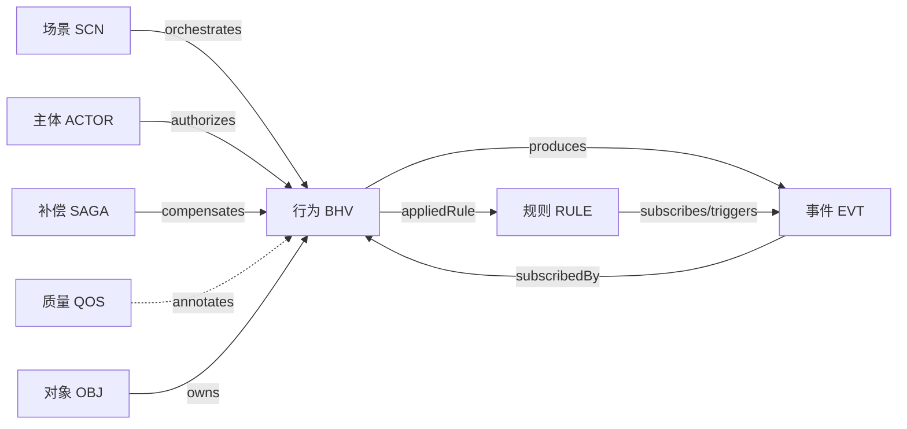
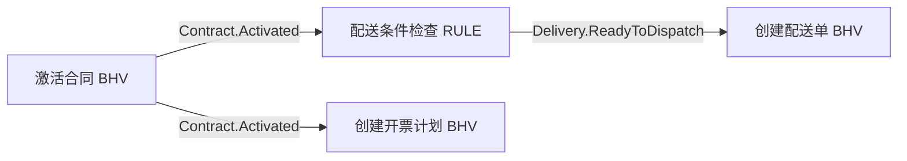

# 本体模型 + AI 大模型驱动的 AI 原生应用架构设计方案（优化版）

> 本文是《本体模型+AI大模型驱动的AI原生应用架构设计方案-详细版本》的优化重构版。在保留原文核心思想的基础上，做了以下调整：
>
> 1. **统一模型命名**：用语义化短码（OBJ/BHV/RULE/EVT/SCN/ACTOR/SAGA/QOS）替代不连续的 `M1/M2/ME/...` 编号，提升可读性，并避免与 MDA/MOF 标准中 `M1/M2/M3` 含义冲突。
> 2. **新增「元模型」一章**：补齐本体的形式化基础（Schema），这是设计器、校验与 AI 稳定生成的地基。
> 3. **补全缺失关注点**：持久化映射、接口、视图、版本演进等扩展模型。
> 4. **强化工程现实**：新增「事件-规则闭环安全（环路检测/可追溯）」与「AI 生成的确定性、回写与验证」两节。
> 5. **修正案例口径**：将量化收益显式标注为**预期目标值**，而非实测结论。

---

## 模型命名对照表

| 语义短码 | 原编号 | 中文名 | 一句话职责 |
|---|---|---|---|
| **OBJ** | M1 | 对象模型 | 是什么——业务实体、聚合根及关系 |
| **BHV** | M2 | 行为模型 | 做什么——对象的原子操作 |
| **RULE** | M3 | 规则模型 | 为什么——可复用的解耦业务规则 |
| **EVT** | ME | 事件模型 | 如何传播——业务事件及其传播路径 |
| **SCN** | M4 | 场景模型 | 怎么编排——业务流程与用例 |
| **ACTOR** | M5 | 主体模型 | 谁能做——角色、权限与授权 |
| **SAGA** | M6 | 异常补偿模型 | 失败怎么办——补偿与 Saga 协调 |
| **QOS** | M7 | 质量约束模型 | 做得怎么样——非功能性约束 |

> 扩展模型（本版新增建议）：**MAP** 持久化映射、**API** 接口契约、**VIEW** 视图/读模型、**VER** 版本演进。

---

## 引言

在数字化转型浪潮中，企业软件系统面临前所未有的挑战：业务需求变化频繁、技术栈更新迅速、系统集成复杂度持续攀升。传统软件开发模式已难以满足企业对敏捷性、可维护性和智能化的需求。

本文提出一种创新架构方法——**本体驱动的 AI 原生应用架构**，通过将业务语义与技术实现分离，结合 AI 大模型的语义理解能力，为企业应用开发提供全新解决方案。全文从问题分析、核心理念、元模型基础、模型体系、架构设计、AI 集成、实施路径、案例展示等维度系统阐述这一架构的设计理念与落地方法。

---

## 一、传统软件开发的核心困境

回顾软件工程数十年的演进——从瀑布到敏捷、从单体到微服务，技术在不断进步，但仍有一些根深蒂固的问题长期困扰开发团队与业务部门：

1. **需求变更导致维护困难**：业务逻辑直接编码在程序中，与技术实现紧耦合。规则一变，开发者需在海量代码中定位、修改，且担心牵连其他模块，演进成本越来越高。
2. **业务逻辑与技术实现强耦合**：业务规则散落在控制器、服务层、数据访问层各处。业务专家看不懂系统实际逻辑，技术人员把握不住业务全貌，技术栈升级或重构风险极高，业务知识也难以沉淀复用。
3. **跨系统集成复杂、数据孤岛**：企业常运行数十上百个异构系统，点对点集成形成复杂依赖网。缺乏统一语义定义，同一业务概念在不同系统中含义不一，造成数据孤岛。
4. **AI 能力难以融入**：传统架构并非为 AI 设计，AI 多以"外挂"存在，与核心业务缺乏深度集成。业务知识埋在代码里，AI 难以有效利用，应用停留在表面。
5. **业务知识散失、难以复用**：知识分散在专家头脑、需求文档、代码实现三处。人员流动导致知识断层，文档与实现脱节，代码逻辑非技术人员看不懂。

这些问题的根源，在于传统范式的一个基本假设：**业务逻辑应直接编码在程序中**。在小规模、稳定业务时代它是合理的，但在今天高速变化、高度复杂的环境中已成为瓶颈。我们需要一种新范式：把业务语义从技术实现中解放出来，**让业务知识成为可独立管理、演进、复用的资产**，同时为 AI 深度集成奠定基础。

---

## 二、本体驱动的 AI 原生应用架构：核心理念

核心理念可概括为四条原则：**业务语义与技术实现分离、本体模型作为业务知识载体、AI 大模型理解本体生成代码、事件驱动的松耦合架构**。

1. **业务语义与技术实现分离**——架构基石。不再把业务逻辑编码进程序，而用形式化本体模型（声明式 YAML）描述业务世界，独立于任何语言和框架。业务专家可直接参与本体设计；技术实现由 AI 理解本体后生成或由开发者据此编码。业务变更在本体层快速响应，技术升级不影响业务定义。
2. **本体模型作为业务知识载体**——核心资产。八大本体模型全面覆盖企业应用各方面（见第四章），相互配合形成完整的业务知识表达体系。
3. **AI 大模型理解本体生成代码**——创新所在。相比模板/规则式代码生成，AI 具备强语义理解力，可理解本体中的语义、约束与设计意图，生成符合最佳实践的代码，并在生成时进行一致性检查、性能与安全分析。
4. **事件驱动的松耦合架构**——运行时基础。模块间通过事件异步通信。聚合根行为完成后发布业务事件，其他聚合根或规则订阅响应，实现真正松耦合，每个聚合可独立演进，规则作为智能决策节点灵活插入事件链。

四大支柱由四个层次支撑：**本体建模层**（业务语义形式化）、**AI 理解层**（语义→技术实现）、**运行时层**（事件驱动支撑运行）、**实现层**（代码生成与部署）。

---

## 三、元模型：本体的形式化基础（新增）

> 这是原文缺失、但对落地（尤其是设计器、校验、AI 稳定生成）至关重要的一章。

八大模型回答了"本体是什么"，但要让本体可被程序解析、校验、生成，必须先回答"**一份合法的本体文件长什么样**"。这就是**元模型（Metamodel）**——描述本体结构的"模型的模型"。

### 3.1 三层抽象关系

```
元模型层 (Metamodel)   —— 定义 OBJ/BHV/EVT/RULE... 各自的合法结构（Schema）
   │  instanceOf
本体模型层 (Ontology)   —— 具体业务的本体实例（订单聚合、确认支付行为……）
   │  generates
运行时层 (Runtime)      —— AI/模板据本体生成的代码与运行时数据
```

> 注意与 MDA/MOF 的区别：经典 MOF 中 `M0=实例、M1=模型、M2=元模型、M3=元元模型`。本文不再复用 `M1/M2` 编号，避免歧义。

### 3.2 元模型用 JSON Schema 落地

每类模型都应有一份机器可校验的 Schema，约束字段、类型、必填项、取值范围与**跨模型引用**。例如行为模型的核心结构（节选）：

```yaml
# BHV 行为模型 Schema（节选，YAML 表达的 JSON Schema）
type: object
required: [id, name, objectRef]
properties:
  id:        { type: string, pattern: "^[A-Za-z][A-Za-z0-9_]*$" }
  name:      { type: string }
  objectRef: { type: string, description: "引用 OBJ.id，必须存在" }
  preconditions:  { type: array, items: { type: string } }
  postconditions: { type: array, items: { type: string } }
  appliedRuleRefs:   { type: array, items: { type: string } }  # 引用 RULE.id
  producedEventRefs: { type: array, items: { type: string } }  # 引用 EVT.id
  subscribedEventRefs:{ type: array, items: { type: string } }  # 引用 EVT.id
```

### 3.3 引用完整性是一等公民

八大模型本质是一张**引用图**，元模型必须把这些引用约束写清楚，校验器才能检测"悬空引用"（引用了不存在的目标）与"环路"。



有了元模型，三件事才能成立：① 结构化编辑器（设计器）可据 Schema 自动生成表单与校验；② 一致性校验可在建模阶段拦截错误；③ AI 拿到结构稳定、语义明确的输入，生成质量与可复现性显著提升。

---

## 四、八大本体模型体系

### 4.1 分层概览

为便于理解与演进，把八大模型按职责分四层：

| 层次 | 模型 | 关注 |
|---|---|---|
| **结构层** | OBJ | 业务对象的静态结构 |
| **行为层** | BHV、RULE、EVT | 操作、规则、事件等动态语义 |
| **编排层** | SCN | 把行为/事件编排成业务流程 |
| **治理层** | ACTOR、SAGA、QOS | 权限、容错、质量等横切关注 |

它们共同回答：**OBJ「是什么」、BHV「做什么」、RULE「为什么」、EVT「如何传播」、SCN「怎么编排」、ACTOR「谁能做」、SAGA「失败怎么办」、QOS「做得怎么样」。**

### 4.2 OBJ 对象模型

整个体系的基础，定义业务域核心领域对象及关系。采用 **DDD 聚合根**概念，强调业务完整性而非数据库表结构。一个聚合根代表一个业务完整性边界，包含**聚合根自身、子实体、值对象**。聚合通过**不变性约束（Invariant）**维护业务规则（如订单总额=所有明细小计之和），聚合之间通过 **ID 引用**而非对象引用。详见第六章。

### 4.3 BHV 行为模型

定义对象能执行的**原子操作**。每个行为是单一对象发出的、不可再分的核心操作单元，遵循单一职责。包含前置条件、后置条件、应用的规则、产生的事件等完整信息。例如"确认订单支付"：前置=订单待支付且金额>0，后置=状态置为已支付并记录支付时间，应用规则=支付金额校验+风控，成功后产生"订单支付确认"事件。复杂流程由 SCN 编排多个行为实现，而非在单个行为内膨胀。

### 4.4 RULE 规则模型

专注可复用的**解耦业务规则**，从行为逻辑中分离。支持多类型：验证规则、计算规则、推导规则、风控规则。尤为重要的是**事件驱动规则**：可订阅事件、执行条件判断、满足时触发新事件，成为事件链中的智能决策节点。例如"配送条件检查规则"订阅"合同激活"事件，判断是否满足配送条件，满足则触发"配送就绪"事件。规则独立可复用，规则变更不影响行为定义。

### 4.5 EVT 事件模型

从行为模型中独立出来的核心动态模型，定义业务事件及传播路径。每个事件有明确的**生产者**（行为/规则）和**订阅者**（行为/规则），通过引用构建完整事件链。支持三种传播模式：行为→行为简单链、行为→规则→行为智能决策链、规则→规则规则链。事件可标注**顺序语义**：`AT_LEAST_ONCE`、`EXACTLY_ONCE`、`BEST_EFFORT`，指导事件总线实现。

### 4.6 SCN 场景模型

定义业务流程与用例场景，通过编排行为和事件链描述完整业务流。一个场景含多个步骤（行为调用或事件触发），支持顺序、并行、条件分支、循环等流程控制，以及异常处理与补偿策略。例如"订单履约"场景包含确认支付、扣减库存、创建物流单、发送通知等步骤，通过事件链串联。

### 4.7 ACTOR 主体模型

定义系统参与者、角色、权限边界及行为执行授权。支持 RBAC 与 ABAC，灵活定义"谁能执行哪些行为、访问哪些数据"。也支持外部系统作为主体，定义系统间接口权限。权限管理与业务逻辑分离，权限变更不影响业务实现。

### 4.8 SAGA 异常补偿模型

定义行为失败的异常分类、补偿策略及 Saga 协调机制。为每个行为定义对应补偿行为，流程失败时自动执行补偿逻辑，保证最终一致性。例如支付成功但库存扣减失败，需执行支付退款补偿。支持正向/反向补偿，以及补偿的超时与重试。

### 4.9 QOS 质量约束模型

定义非功能性约束：性能 SLA、可靠性、并发策略等。以**标注（Annotation）**形式附加在行为和场景上，不侵入业务逻辑。例如"确认支付"标注响应时间≤500ms、可用性 99.9%、支持 1000 QPS。为性能测试、容量规划、监控告警提供依据，也为 AI 优化提供目标函数。

### 4.10 扩展模型（本版新增建议）

原文以散文形式提及但未形式化的几个关注点，建议提升为正式（或可选）模型：

- **MAP 持久化映射**：聚合根→表、子实体→从表、值对象平铺/JSON 等映射策略。AI 生成 DDL 与 ORM 需要它作为正式输入。
- **API 接口契约**：对外暴露的接口（REST/gRPC/...）及与事件的映射，集成与网关据此生成。
- **VIEW 视图/读模型**：面向查询的 CQRS 读模型，弥补"全文偏后端、缺前端语义来源"的不足。
- **VER 版本演进**：本体自身的版本、diff 与迁移脚本生成规则，支撑安全演进。

---

## 五、事件-规则闭环：构建智能决策网络

传统事件驱动多是"行为→事件→行为"的简单链。本架构引入**事件-规则闭环**：规则不再只是被动校验器/计算器，而是事件链中的主动参与者与智能决策节点，形成"**行为→事件→规则→事件→行为**"的完整闭环。

核心思想：把规则提升为事件驱动架构中的一等公民。规则订阅事件，事件发生时规则引擎自动触发；规则内含条件判断，可访问事件载荷与其他聚合状态；满足条件时触发新事件，新事件又被其他行为/规则订阅，形成连续事件链。

三种基本模式：

1. **行为→行为简单链**：最基础，适用于确定性流程（订单支付→库存扣减）。
2. **行为→规则→行为智能决策链**：闭环核心。把复杂条件判断封装进规则（合同激活→配送条件检查规则→配送就绪→创建配送单）。
3. **规则→规则规则链**：最高级，多规则经事件串联成决策链（库存扣减→补货规则→补货需求→采购审批规则→审批需求），每个规则专注一个决策点。

优势：业务逻辑解耦、决策逻辑可复用、流程灵活可调、全链路可追溯。实现上需要强大的规则引擎（Drools/OPA 或自研），支持异步执行、超时控制、错误处理，并与事件总线深度集成。

### 5.1 闭环安全：环路检测与可追溯性（新增）

闭环很强大，但有两个必须正视的工程风险：

- **环路（死循环）**：规则 A→事件 X→规则 B→事件 Y→规则 A 可能形成无限循环。**必须在建模阶段做静态环路检测**（对事件-规则图做有向环检测），并在运行时设置最大跳数/TTL 兜底。
- **可追溯性**：深层事件链调试困难。每个事件应携带唯一 **追踪 ID（traceId）**，记录生产者、订阅者、处理时延与结果；接入分布式追踪（Jaeger/Zipkin）可视化完整路径。

> 设计器应内建"事件链环路高亮"作为核心校验之一。

---

## 六、聚合根：业务完整性的边界设计

聚合根（Aggregate Root）代表业务完整性边界，直接影响并发性能、事务边界与语义清晰度。本架构采用 DDD 聚合根，从业务视角而非数据库视角建模。

**本质**：一组在业务上必须保持一致的相关对象，聚合根是唯一入口，外部只能经聚合根访问/修改内部对象，由聚合根维护不变性约束。例如订单聚合含订单头与明细列表，"订单总额=所有明细小计之和"是不变性约束，任何明细修改都经聚合根重算总额。

**设计原则**：① 唯一入口——所有操作经聚合根行为方法；② 事务边界——一个事务只改一个聚合，跨聚合用事件实现最终一致性；③ 不变性保护——违反约束的操作被拒绝；④ 引用原则——聚合间用 ID 引用，避免边界模糊与级联加载。

**识别聚合边界**（判断维度）：业务完整性、生命周期（同生共死）、事务边界、访问路径、引用方式（对象引用→同一聚合；ID 引用→独立聚合）。以订单为例：订单与明细为一个聚合（订单为根、明细为子实体）；订单与客户、订单与产品为独立聚合，经 ID 引用。可在明细冗余产品名等展示字段，通过领域事件保持最终一致。

**三类对象**：聚合根（全局唯一标识、独立生命周期）、子实体（聚合内唯一标识、依赖根）、值对象（无标识、按属性相等、不可变）。

**不变性约束**：定义聚合必须始终满足的规则（总额=明细之和、明细小计=数量×单价、至少含一个明细、已支付订单不可改明细），在行为方法中强制执行。

**大小控制**：聚合越小并发冲突越少、性能越好，但太小则完整性难保证。经验法则：子实体不超过 3–5 个、总字段不超过 30。过大可拆分（独立生命周期/被多聚合引用→提升为独立聚合；很少一起改→拆分并用事件一致；并发冲突频繁→缩小边界）。

**业务优先于技术**：聚合根描述业务对象而非数据库表。映射是实现细节（订单→orders 主表、明细→order_items 从表、收货地址值对象平铺为 `shipping_address_*`）。这部分映射建议沉淀为 **MAP 持久化映射模型**（见 4.10）。

---

## 七、语义驱动的分层架构与四层数据流

业务架构分四层，职责清晰、接口标准化：

1. **业务语义层**：八大本体模型（声明式 YAML），业务知识唯一权威来源，业务专家可直接参与。
2. **AI 理解层**：核心创新。读取本体→**语义解析→代码生成→验证优化**，把业务语义自动转为技术实现。
3. **应用运行时层**：事件驱动执行环境，核心组件含聚合根、行为、事件总线、规则引擎。
4. **数据持久层**：关系库、事件存储、规则缓存、查询视图等多种机制。

**数据流转**：业务专家在语义层改本体 → AI 理解层重新生成代码 → 部署到运行时层 → 运行数据落到持久层。业务变更响应从"数周"缩短到"数小时"级（**目标值**）。

**优势**：业务与技术彻底分离、AI 深度集成（非外挂）、各层独立演进、开发效率提升。

---

## 八、事件驱动的松耦合架构

应用架构以**事件驱动架构（EDA）**为核心。组件含聚合根、事件总线、规则引擎、外部系统集成层。行为完成后发布事件到总线，总线据订阅关系路由给订阅者（其他行为/规则/外部系统）。

**松耦合**：发布者无需知道谁订阅、订阅者无需知道事件来源，聚合可独立演进，订阅者可随时增减。**异步处理**：发布即返回，订阅者后台异步处理，适合长流程并保持响应性能。**规则作为智能决策节点**：把复杂决策从行为分离为可独立管理的规则。

**事件总线选型**：单体可用内存事件总线（Spring `ApplicationEventPublisher`）；分布式用 Kafka（高吞吐、可持久化回放）、RabbitMQ（复杂路由、事务消息）、Pulsar（多租户、地理分布）。**顺序语义**按场景标注（至少一次/恰好一次/尽力而为），订阅者需实现幂等。**可观测性**：每事件唯一 traceId，接入分布式追踪与日志聚合，快速定位故障。

---

## 九、数据架构：设计时与运行时分离

**设计时数据**=本体模型元文件（YAML），描述业务语义；**运行时数据**=系统运行产生的业务数据（库/事件存储/缓存）。两者各司其职，并由 AI 理解层连接。

- **设计时层**：八个（含扩展模型则更多）YAML 元文件，纳入 Git 版本控制，支持历史、回退、分支。YAML 人类可读、结构化、可注释、可引用继承。
- **运行时层**（多模型策略）：关系库（PostgreSQL/MySQL）存聚合数据；**事件溯源**（EventStore/Axon 或通用库+事件表）记录全部事件，支持回放与审计；规则缓存（Redis）提性能；**CQRS 读模型**（视图/物化视图/MongoDB/ES）优化查询。

**演进**：AI 比对新旧本体生成迁移脚本（ALTER TABLE），并分析影响范围、提示风险（删字段丢数据、改类型转换失败）。建议把这套规则沉淀为 **VER 版本演进模型**。

**一致性**：聚合内事务强一致，聚合间事件最终一致；强一致场景用 Saga 或分布式事务，谨慎使用。

---

## 十、统一的事件驱动集成

以事件总线为集成中枢，实现系统间松耦合集成。核心业务系统发布事件，外部系统经**协议适配器**（REST/gRPC/SOAP/WebSocket）订阅并转换协议。新系统接入只需订阅相关事件，不影响现有系统。

关键机制：异步解耦（降低系统间依赖）、容错重试（指数退避、最大重试、死信队列，订阅者幂等）、数据转换（字段映射，AI 可辅助生成映射代码）、安全认证（OAuth2/JWT、事件携带安全上下文、敏感数据加密）、监控可观测（集成关系/数据流/时延/错误率）、API 网关（Kong/APISIX，统一入口、路由、限流熔断）。建议把对外接口沉淀为 **API 接口契约模型**（见 4.10）。

---

## 十一、AI 集成：从语义理解到代码生成

AI 工作流四步：

1. **本体输入**：读取结构化 YAML 元文件（含注释/描述/约束）。
2. **语义理解**：理解聚合、行为、规则、事件及其关系与约束；识别聚合边界、事务范围、事件链传播路径。
3. **代码生成**：生成聚合根类、行为方法（前置/后置/事件发布）、事件处理器、规则执行器、数据访问层；遵循 SOLID、设计模式、命名规范。
4. **验证与优化**：语义一致性检查、代码质量（静态分析）、性能优化建议、安全检查（SQL 注入/XSS/敏感信息）。

模型选型：GPT 系列（强代码与推理）、Claude（长文本与代码理解）、Gemini（多模态）；特定领域可微调开源模型（LLaMA/Mistral）。集成方式：云服务/本地部署/混合。

### 11.1 AI 生成的工程约束：确定性、回写与验证（新增）

原文对"AI 全自动生成"较乐观，落地需补三条工程约束：

- **确定性 / 可复现**：同一本体多次生成应得到语义等价、可审计的结果。推荐**混合模式**——确定性模板生成骨架（实体/接口/事件路由），AI 仅在受约束范围内补复杂业务逻辑；并固定模型版本、提示词与温度参数。
- **回写隔离（生成不覆盖手写）**：采用 **Generation Gap 模式**——生成"基类/抽象层"，手写"子类/扩展点"；或用受保护区标记。模型再次生成时只覆盖生成区，保护手写区。
- **生成即验证**：每次生成后，自动校验代码与本体一致（不变性约束、前后置条件、事件订阅关系），并跑自动化测试。建议**人机协作**：AI 出初稿、人审复杂逻辑与性能关键路径。

> 这三条是把"演示级 AI 生成"推进到"生产级 AI 生成"的关键。

---

## 十二、技术栈选型

> 原文此节标注"待大修订"。这里给出选型**原则**与候选，强调"最合适即最好"，避免厂商锁定与盲目追新。

| 层 | 候选 | 说明 |
|---|---|---|
| AI 层 | GPT/Claude/Gemini，或微调 LLaMA/Mistral | 语义理解与代码生成核心 |
| 后端 | Spring Boot / FastAPI / Gin·Echo | 按团队技术栈选 |
| 事件总线 | Kafka / RabbitMQ / Pulsar / 云托管 | 按吞吐、路由、租户需求选 |
| 规则引擎 | Drools / OPA / 轻量表达式引擎 | 与事件总线集成 |
| 数据库 | PostgreSQL（主）/ MongoDB / 时序库 / Neo4j | 多模型策略 |
| 缓存 | Redis / Memcached / Caffeine | 热点、会话、分布式锁 |
| 容器与编排 | Docker + Kubernetes | 弹性伸缩、滚动发布 |
| 可观测 | Prometheus+Grafana / ELK·EFK / Jaeger·Zipkin | 指标、日志、追踪 |
| API 网关 | Kong / APISIX / 云网关 | 统一入口 |

选型原则：**云原生优先、开源优先、成熟度优先、生态优先**，同时兼顾团队能力与学习成本。

---

## 十三、实施路径：从试点到全面推广

分四阶段循序渐进：

- **准备期（1–2 周）**：团队培训（本体建模、DDD、EDA、YAML、AI 使用）、工具准备、选择中等规模且相对独立的试点项目。
- **试点期（4–6 周）**：核心聚合建模（先 1–2 个聚合）→ 事件链设计（重点是事件驱动规则）→ AI 代码生成验证（人工审查质量）→ 小范围部署（功能/性能/安全/验收测试）。
- **推广期（2–3 月）**：扩展到更多业务域、完善规则库、优化 AI 生成质量、建立最佳实践。
- **成熟期（持续）**：全面应用、持续优化、知识库积累、生态建设。

**关键成功因素**：高层支持、团队能力、工具支撑、持续迭代。**常见挑战**：思维转变（代码优先→模型优先）、AI 质量不确定（初期多人工审查）、遗留系统迁移（渐进式、先边缘后核心、经事件总线集成新旧）。

---

## 十四、案例：合同管理系统

**场景**：某制造企业合同全生命周期管理。销售录入合同（基本信息、付款条款、产品明细），审批后生效；生效后判断是否需配送（实物需、服务不需），需配送且有空闲配送员则自动创建配送单并分配；同时据付款条款生成开票计划，到期提醒财务开票。

**本体应用**：

- **OBJ**：合同聚合根（合同号、客户ID、金额、状态）+ 付款条款子实体 + 产品明细子实体。不变性：金额=明细小计之和、付款金额之和=合同金额、至少含一个明细。
- **BHV**：录入合同、提交审批、审批通过、激活合同（发"合同激活"事件）、创建开票计划、创建配送单。
- **RULE**：配送条件检查规则（事件驱动）——订阅"合同激活"，判断实物商品且有空闲配送员，满足则触发"配送就绪"，载荷携带配送员与预计送达时间。
- **EVT**：合同激活（`Contract.Activated`，由激活行为产生，被配送规则与开票行为订阅）、配送就绪（`Delivery.ReadyToDispatch`，由配送规则产生，被创建配送单订阅）、开票到期（`Invoice.DueDate`，由定时任务产生，被开票提醒订阅）。

**事件链**：



**预期实施效果（目标值，非实测）**：开发效率提升约 60%、AI 自动生成约 70% 代码、可维护性显著提升、业务变更响应从约 1 周缩短到约 1 天。例如新增一个配送条件判断，只需改"配送条件检查规则"定义，AI 重新生成规则执行代码即可生效。

> 说明：上述数字为方案的**设计目标/预期**，应在真实试点中以基线对比方式度量验证后再对外引用。

**技术细节（示例）**：Spring Boot + Kafka + Drools + PostgreSQL；合同聚合→`contracts` 主表，付款条款/产品明细→`payment_terms`/`contract_items` 从表；事件存 `events` 表；规则存 YAML，引擎启动时加载；AI 生成用大模型 API；K8s + Docker 部署。

---

## 十五、价值主张（六大优势）

1. **业务语义清晰**：声明式本体直接表达业务概念，非技术人员也能理解、参与，业务知识可复用。
2. **AI 原生支持**：从设计之初即深度集成 AI，理解语义、自动生成高质量代码、持续优化演进。
3. **松耦合架构**：事件驱动解耦，聚合独立演进，易扩展易维护。
4. **智能决策**：事件-规则闭环把规则变为决策节点，支持复杂业务编排。
5. **快速响应变化**：改本体→AI 重新生成→快速上线，变更周期从数周缩短到数天甚至数小时（目标值）。
6. **质量保证**：语义一致性检查、自动化测试生成、持续质量监控。

六大优势相互支撑、相互促进，共同构成核心价值主张。

---

## 十六、演进展望

- **近期（6–12 月）**：提升 AI 生成质量、提供更多领域模型模板、可视化建模工具、开发者社区。
- **中期（1–2 年）**：多模态 AI 输入、自动化测试生成、智能运维、跨语言代码生成。
- **远期（2–3 年）**：AI 自主架构优化、自适应系统演进、知识图谱深度集成、行业标准制定。

愿景：构建 AI 原生应用开发的新范式——**业务专家定义语义、AI 生成实现、开发者攻坚复杂问题**，三者协同创造高质量软件。

---

## 结语

本文在保留原方案核心思想的基础上，统一了模型命名、补齐了元模型这一形式化地基、补全了持久化映射/接口/视图/版本等关注点，并强化了事件-规则闭环安全与 AI 生成的工程约束。

本体驱动的 AI 原生应用架构不是终点而是起点。随着 AI 能力进步与生态成熟，它有望成为企业应用开发的主流范式之一。下一步建议从一个**可运行的本体设计器 MVP**入手，把"建模—校验—可视化—导出"主框架先跑通，再逐步接入 AI 生成闭环。
