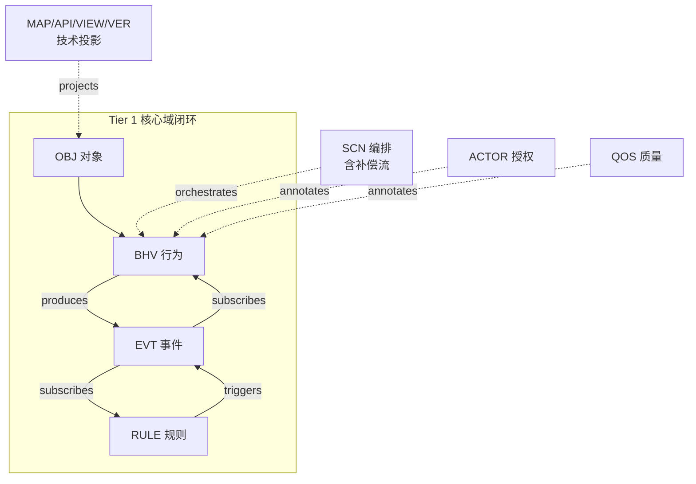
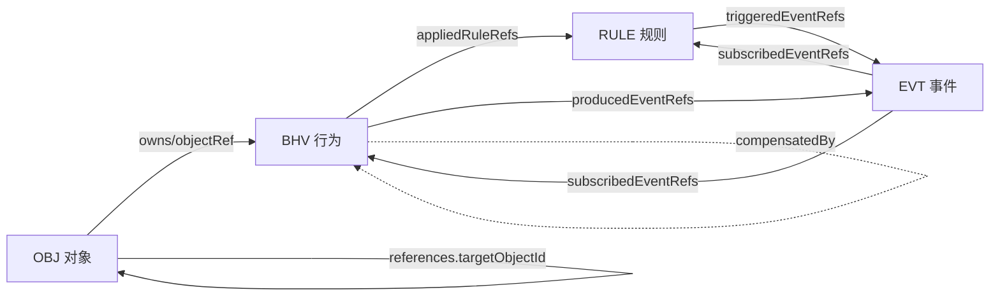
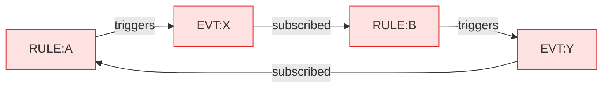
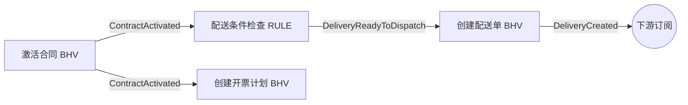
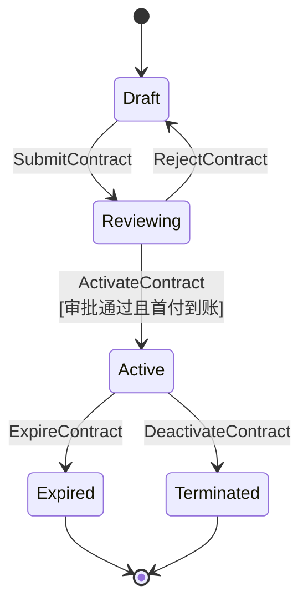
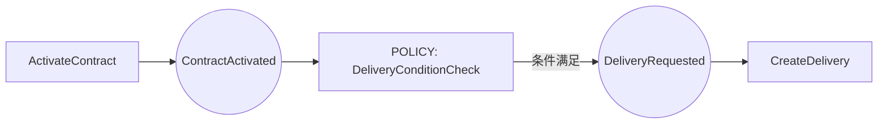

# 本体模型设计规格书（Ontology Model Design Specification）

> **版本**：v1.0　**状态**：草案（与设计器 MVP 代码对齐）
> **定位**：本文是《本体模型 + AI 大模型驱动的 AI 原生应用架构设计方案》中"模型体系"部分的**正式设计规格**，供本体设计器、校验器、AI 代码生成、以及人工建模共同遵循。
> **权威来源**：核心 4 模型（OBJ/BHV/EVT/RULE）的字段定义以设计器 MVP 的实现为准（[designer/src/metamodel/types.ts](designer/src/metamodel/types.ts)、[schema.ts](designer/src/metamodel/schema.ts)、[validation.ts](designer/src/services/validation.ts)）。本规格与代码互为镜像，任一方变更须同步另一方。
> **相关文档**：架构方案见 [本体模型+AI大模型驱动的AI原生应用架构设计方案-优化版.md](本体模型+AI大模型驱动的AI原生应用架构设计方案-优化版.md)。

---

## 目录

- [第 0 章　阅读指南](#第-0-章阅读指南)
- [第 1 章　模型精简与分层（核心设计决策）](#第-1-章模型精简与分层核心设计决策)
- [第 2 章　通用约定](#第-2-章通用约定)
- [第 3 章　核心域模型完整规格](#第-3-章核心域模型完整规格)
- [第 4 章　编排模型（SCN，吸收 SAGA）](#第-4-章编排模型scn吸收-saga)
- [第 5 章　横切切面模型（ACTOR / QOS）](#第-5-章横切切面模型actor--qos)
- [第 6 章　技术投影模型（要点）](#第-6-章技术投影模型要点)
- [第 7 章　跨模型校验规则汇总](#第-7-章跨模型校验规则汇总)
- [第 8 章　端到端示例：合同管理系统](#第-8-章端到端示例合同管理系统)
- [第 9 章　元模型 v2 扩展：5 个 P0 维度](#第-9-章元模型-v2-扩展5-个-p0-维度)
- [附录 A　模型速查表](#附录-a模型速查表)
- [附录 B　与原"八大模型"映射](#附录-b与原八大模型映射)
- [附录 C　维度与必填槽位清单](#附录-c维度与必填槽位清单)

---

## 第 0 章　阅读指南

每个**一等模型**（OBJ/BHV/EVT/RULE）按统一模板给出六段内容：

1. **定位与职责**——这个模型回答什么问题、边界在哪。
2. **字段表**——字段 / 类型 / 必填 / 引用目标 / 约束。
3. **数据结构**——TypeScript `interface` + JSON Schema（YAML 表达）。
4. **YAML 实例示例**——可直接被设计器导入的真实片段。
5. **校验规则**——结构校验 + 跨模型引用完整性。
6. **与相邻模型的边界**——容易混淆处的划界。

**编排 / 切面 / 投影**模型（SCN、ACTOR、QOS、MAP/API/VIEW/VER）当前为**骨架草案**：给出定位、建议数据结构与示例，标注 `🅢 草案` 表示尚未进入 MVP 实现，待核心闭环稳定后落地。

---

## 第 1 章　模型精简与分层（核心设计决策）

### 1.1 对原"八大模型"的评估

原方案把 OBJ / BHV / RULE / EVT / SCN / ACTOR / SAGA / QOS 八个模型**平级并列**，方向正确（DDD 聚合 + 事件驱动），但把**四种不同性质**的东西放在同一抽象层，带来认知负担与职责重叠：

| 性质 | 模型 | 评估 |
|---|---|---|
| 核心域（一等公民） | OBJ、BHV、EVT、RULE | ✅ 恰当，构成"行为→事件→规则→事件→行为"的最小闭环 |
| 编排 | SCN | ⚠️ 与 EVT/RULE 的编排式协作职责重叠，需取舍指南 |
| 横切关注点 | ACTOR、QOS、SAGA | ⚠️ 本质是"附着在行为/场景上的切面"，与 OBJ 平级并不恰当 |
| 技术投影 | MAP、API、VIEW、VER | ✅ 已标为扩展，属实现投影非业务语义 |

### 1.2 精简结论：四层模型

把"8 个平级"重构为**四层**。模型能力不丢失，但心智模型更清晰，并将 **SAGA 降格**为行为的补偿引用与场景的补偿流：

| 层 | 模型 | 角色 | 本规格状态 |
|---|---|---|---|
| **Tier 1 核心域** | **OBJ · BHV · EVT · RULE** | 一等公民，事件-规则闭环最小集 | ✅ 完整规格（对齐 MVP） |
| **Tier 2 编排** | **SCN**（吸收 SAGA 补偿流） | 把行为/事件编排成业务流程 | 🅢 骨架草案 |
| **Tier 3 横切切面** | **ACTOR**（授权）· **QOS**（质量） | 注解 + 可选复用目录 | 🅢 骨架草案 |
| **Tier 4 技术投影** | **MAP · API · VIEW · VER** | 实现投影，可后置 | 要点 |



### 1.3 SAGA 降格说明

补偿的本质是"**撤销某个行为的另一个行为**"，它天然依附于行为与流程，而非独立的领域概念。因此取消 SAGA 作为顶层模型，拆解为两处：

- **行为级**：`BHV.compensatedBy` —— 指向一个补偿行为（一个 BHV.id），声明"本行为失败/回滚时该执行谁"。
- **流程级**：`SCN.compensation` —— 场景编排里定义补偿触发顺序、超时与重试（Saga 协调）。

这样既保留了补偿能力，又消除了一个与 OBJ 平级却只描述横切关注点的模型。

### 1.4 三处"逻辑"的边界（最重要的澄清）

建模中最常见的困惑是"**这段逻辑该写哪**"。系统中有三处可承载"逻辑"，必须划清：

| 承载位置 | 语义 | 何时成立 | 一致性 | 典型例子 |
|---|---|---|---|---|
| `OBJ.invariants` 不变量 | 聚合内**永远必须成立**的结构约束 | 任何时刻 | 同步、强一致（聚合内） | 合同金额 = 所有明细小计之和 |
| `BHV.pre/postconditions` 前后置 | 操作的**进入守卫 / 退出承诺** | 执行该行为的瞬间 | 同步（单次操作） | 合同状态为草稿才能提交审批 |
| `RULE` 规则 | **可复用 / 跨聚合 / 事件驱动**的决策 | 被行为引用，或被事件触发 | 可异步（跨聚合最终一致） | 配送条件检查（订阅"合同激活"事件） |

**判定口诀**：恒真且限于聚合内 → 不变量；只是某操作的门槛 → 前后置；需要复用、跨聚合或由事件驱动 → 规则。

### 1.5 编排（SCN）vs 编排式协作（EVT/RULE）

两种协调风格并存，需给出选择指南，避免重复表达同一流程：

| 维度 | 编排式协作（Choreography，EVT+RULE） | 编排（Orchestration，SCN） |
|---|---|---|
| 控制 | 去中心，事件驱动各自响应 | 中心化，由场景显式驱动步骤 |
| 耦合 | 最松 | 较紧（场景知道全流程） |
| 可见性 | 链路分散，需追踪 ID 还原 | 流程显式、可审计 |
| 适用 | 松耦合扩展、领域事件传播 | 复杂跨聚合事务、需补偿、需人工节点 |

**建议**：默认用 EVT/RULE 闭环表达松耦合协作；当流程**跨多个聚合、需补偿、需人工审批或强顺序**时，才升级为 SCN 编排。**同一段流程不要同时用两种方式表达**。

---

## 第 2 章　通用约定

### 2.1 标识符与命名

- **id 规则**（所有模型实例、子实体、值对象、不变量通用）：正则 `^[A-Za-z][A-Za-z0-9_]*$`，即字母开头，仅含字母 / 数字 / 下划线。
- **id 唯一性**：在**同类集合内**唯一（`objects` / `behaviors` / `events` / `rules` 各自命名空间）。
- **命名风格**：模型 id 用 `PascalCase`（如 `Contract`、`ActivateContract`、`ContractActivated`、`DeliveryConditionCheck`）；属性名 / 字段名用 `camelCase`（如 `contractNo`、`courierId`）。
- **name**：人类可读中文名，可重复，仅用于展示。

### 2.2 引用约定

- 引用字段以 `Ref`（单引用）/ `Refs`（引用数组）结尾，值为被引用模型的 **id 字符串**（非内嵌对象）。
- 聚合之间一律 **ID 引用**（`AggregateRef`），不得对象内嵌——这是 DDD 聚合边界的硬约束。
- 所有 `xxxRef(s)` 必须指向**存在的目标 id**，否则为"悬空引用"错误（见第 7 章）。

| 引用字段 | 所在模型 | 指向 |
|---|---|---|
| `objectRef` | BHV | OBJ.id |
| `appliedRuleRefs` | BHV | RULE.id |
| `producedEventRefs` | BHV | EVT.id |
| `subscribedEventRefs` | BHV / RULE | EVT.id |
| `triggeredEventRefs` | RULE | EVT.id |
| `references[].targetObjectId` | OBJ | OBJ.id |
| `compensatedBy` 🅢 | BHV | BHV.id |

### 2.3 属性类型系统

`Attribute.type` 取值（用于对象属性、子实体属性、值对象属性、事件载荷）：

| 类型 | 含义 | 备注 |
|---|---|---|
| `string` | 字符串 | |
| `number` | 整数 / 一般数值 | |
| `decimal` | 高精度小数 | 金额等，避免浮点误差 |
| `boolean` | 布尔 | |
| `date` | 日期 | 无时间部分 |
| `datetime` | 日期时间 | |
| `enum` | 枚举 | 取值集合在 `description` 或扩展字段约束 |
| `reference` | 跨聚合 ID 引用字段 | 配合 OBJ.references 使用 |
| `object` | 内嵌结构 | 复杂值，谨慎使用 |

### 2.4 公共字段

所有一等模型实例均含：

| 字段 | 类型 | 必填 | 说明 |
|---|---|---|---|
| `id` | string | 是 | 符合 2.1 规则，集合内唯一 |
| `name` | string | 是 | 展示名 |
| `description` | string | 否 | 业务说明，AI 生成的重要语义来源 |

### 2.5 项目容器 `OntologyProject`

一个本体工作区 = 一个 `OntologyProject`，是导入 / 导出 / 持久化的根对象：

```ts
interface OntologyProject {
  version: string          // 本体版本，如 "1.0"
  name: string             // 工作区名称
  objects: ObjectModel[]   // OBJ 集合
  behaviors: BehaviorModel[] // BHV 集合
  events: EventModel[]     // EVT 集合
  rules: RuleModel[]       // RULE 集合
  // 🅢 草案扩展：scenarios / actors / qosProfiles / mappings ...
}
```

### 2.6 引用完整性总图

整套本体本质是一张**有向引用图**，校验器据此检测悬空引用与环路：



---

## 第 3 章　核心域模型完整规格

### 3.1 OBJ 对象模型

#### 定位与职责

整个体系的基础，定义业务域的**领域对象及关系**。采用 DDD **聚合根**概念：一个 OBJ 实例就是一个聚合根，代表一个**业务完整性边界**，由"聚合根自身 + 子实体 + 值对象"组成，通过**不变量**维护一致性，聚合之间仅以 **ID 引用**。它回答"**是什么**"。

#### 字段表

`ObjectModel`（聚合根）：

| 字段 | 类型 | 必填 | 引用 | 说明 |
|---|---|---|---|---|
| `id` | string | 是 | — | 聚合根标识，集合内唯一 |
| `name` | string | 是 | — | 展示名 |
| `description` | string | 否 | — | 业务说明 |
| `identity` | string | 是 | — | 聚合根的**唯一标识属性名**（如 `contractNo`） |
| `attributes` | Attribute[] | 是 | — | 聚合根自身属性 |
| `entities` | ChildEntity[] | 是 | — | 子实体列表（可空数组） |
| `valueObjects` | ValueObject[] | 是 | — | 值对象列表（可空数组） |
| `invariants` | Invariant[] | 是 | — | 不变量列表（可空数组） |
| `references` | AggregateRef[] | 是 | OBJ.id | 对其他聚合的 ID 引用 |

`ChildEntity`（子实体，聚合内、依赖聚合根）：

| 字段 | 类型 | 必填 | 说明 |
|---|---|---|---|
| `id` | string | 是 | 子实体标识 |
| `name` | string | 是 | 展示名 |
| `identity` | string | 是 | 聚合内唯一标识属性名 |
| `attributes` | Attribute[] | 是 | 子实体属性 |

`ValueObject`（值对象，无标识、按值相等、不可变）：

| 字段 | 类型 | 必填 | 说明 |
|---|---|---|---|
| `id` | string | 是 | 值对象标识（建模用） |
| `name` | string | 是 | 展示名 |
| `attributes` | Attribute[] | 是 | 值对象属性 |

`Invariant`（不变量）：

| 字段 | 类型 | 必填 | 说明 |
|---|---|---|---|
| `id` | string | 是 | 约束标识 |
| `expression` | string | 是 | 约束表达式（如 `amount == sum(items.subtotal)`） |
| `description` | string | 否 | 自然语言说明 |

`AggregateRef`（聚合间 ID 引用）：

| 字段 | 类型 | 必填 | 引用 | 说明 |
|---|---|---|---|---|
| `targetObjectId` | string | 是 | OBJ.id | 被引用聚合根 id |
| `refField` | string | 是 | — | 本聚合持有的引用字段名 |
| `description` | string | 否 | — | 说明 |

`Attribute`（通用属性，见 2.3 类型系统）：

| 字段 | 类型 | 必填 | 说明 |
|---|---|---|---|
| `name` | string | 是 | 属性名（camelCase） |
| `type` | AttributeType | 是 | 见 2.3 |
| `required` | boolean | 是 | 是否必填 |
| `description` | string | 否 | 说明 |

#### 数据结构（TypeScript）

```ts
interface Attribute {
  name: string
  type: 'string' | 'number' | 'decimal' | 'boolean' | 'date'
      | 'datetime' | 'enum' | 'reference' | 'object'
  required: boolean
  description?: string
}
interface Invariant { id: string; expression: string; description?: string }
interface ChildEntity { id: string; name: string; identity: string; attributes: Attribute[] }
interface ValueObject { id: string; name: string; attributes: Attribute[] }
interface AggregateRef { targetObjectId: string; refField: string; description?: string }

interface ObjectModel {
  id: string
  name: string
  description?: string
  identity: string
  attributes: Attribute[]
  entities: ChildEntity[]
  valueObjects: ValueObject[]
  invariants: Invariant[]
  references: AggregateRef[]
}
```

#### 数据结构（JSON Schema，YAML 表达）

```yaml
type: object
required: [id, name, identity, attributes, entities, valueObjects, invariants, references]
properties:
  id:          { type: string, pattern: "^[A-Za-z][A-Za-z0-9_]*$" }
  name:        { type: string, minLength: 1 }
  description: { type: string }
  identity:    { type: string, minLength: 1 }       # 聚合根唯一标识属性名
  attributes:  { type: array, items: { $ref: "#/$defs/attribute" } }
  entities:
    type: array
    items:
      type: object
      required: [id, name, identity, attributes]
      properties:
        id:       { type: string, pattern: "^[A-Za-z][A-Za-z0-9_]*$" }
        name:     { type: string }
        identity: { type: string }
        attributes: { type: array, items: { $ref: "#/$defs/attribute" } }
  valueObjects:
    type: array
    items:
      type: object
      required: [id, name, attributes]
      properties:
        id:   { type: string, pattern: "^[A-Za-z][A-Za-z0-9_]*$" }
        name: { type: string }
        attributes: { type: array, items: { $ref: "#/$defs/attribute" } }
  invariants:
    type: array
    items:
      type: object
      required: [id, expression]
      properties:
        id:         { type: string }
        expression: { type: string, minLength: 1 }
        description:{ type: string }
  references:
    type: array
    items:
      type: object
      required: [targetObjectId, refField]
      properties:
        targetObjectId: { type: string }    # 必须存在于 objects[].id
        refField:       { type: string }
        description:    { type: string }
$defs:
  attribute:
    type: object
    required: [name, type, required]
    properties:
      name:     { type: string }
      type:     { enum: [string, number, decimal, boolean, date, datetime, enum, reference, object] }
      required: { type: boolean }
      description: { type: string }
```

#### YAML 实例示例

```yaml
id: Contract
name: 合同
description: 合同聚合根，覆盖合同全生命周期
identity: contractNo
attributes:
  - { name: contractNo, type: string,    required: true,  description: 合同号 }
  - { name: customerId, type: reference, required: true,  description: 客户ID（引用） }
  - { name: amount,     type: decimal,   required: true,  description: 合同金额 }
  - { name: status,     type: enum,      required: true,  description: 草稿/待审批/已审批/生效 }
  - { name: productType,type: enum,      required: true,  description: 实物/服务 }
entities:
  - id: PaymentTerm
    name: 付款条款
    identity: seq
    attributes:
      - { name: seq,    type: number,  required: true }
      - { name: ratio,  type: decimal, required: true }
      - { name: amount, type: decimal, required: true }
      - { name: dueDate,type: date,    required: true }
  - id: ContractItem
    name: 产品明细
    identity: itemId
    attributes:
      - { name: itemId,    type: string,    required: true }
      - { name: productId, type: reference, required: true }
      - { name: productName,type: string,   required: false, description: 冗余展示 }
      - { name: quantity,  type: number,    required: true }
      - { name: price,     type: decimal,   required: true }
      - { name: subtotal,  type: decimal,   required: true }
valueObjects:
  - id: ShippingAddress
    name: 收货地址
    attributes:
      - { name: province, type: string, required: true }
      - { name: city,     type: string, required: true }
      - { name: detail,   type: string, required: true }
invariants:
  - { id: inv_amount, expression: "amount == sum(items.subtotal)",        description: 合同金额=明细小计之和 }
  - { id: inv_pay,    expression: "sum(paymentTerms.amount) == amount",   description: 付款金额之和=合同金额 }
  - { id: inv_items,  expression: "count(items) >= 1",                    description: 至少一个明细 }
references:
  - { targetObjectId: Customer, refField: customerId, description: 引用客户聚合 }
```

#### 校验规则

- **结构**：`id` 合法且 `objects[]` 内唯一；`identity` 非空；`entities`/`valueObjects`/`invariants`/`references` 必须存在（可为空数组）。
- **引用完整性**：`references[].targetObjectId` 必须存在于某个 `objects[].id`，否则 `DANGLING_OBJ_REF`（error）。
- **建议（warning 级，未来）**：子实体数量 > 5 或总字段 > 30 时提示聚合过大（对应架构文档"大小控制"经验法则）。

#### 与相邻模型的边界

- **OBJ vs BHV**：OBJ 只描述**结构与不变量**，不含操作；任何"动作"属于 BHV，并以 `objectRef` 归属本聚合。
- **OBJ.invariants vs RULE**：不变量是聚合内恒真约束（同步、强一致）；跨聚合或事件驱动的判断属 RULE（见 1.4）。
- **OBJ vs MAP**：表 / 列映射、值对象平铺等是**持久化投影**，归 MAP（见第 6 章），不污染 OBJ。

---

### 3.2 BHV 行为模型

#### 定位与职责

定义对象能执行的**原子操作**——单一聚合根发出的、不可再分、遵循单一职责的核心操作单元。携带前置条件、后置条件、应用规则、产生 / 订阅的事件。复杂流程交由 SCN 编排多个 BHV，而非在单个 BHV 内膨胀。它回答"**做什么**"。

#### 字段表

| 字段 | 类型 | 必填 | 引用 | 说明 |
|---|---|---|---|---|
| `id` | string | 是 | — | 行为标识，集合内唯一 |
| `name` | string | 是 | — | 展示名 |
| `description` | string | 否 | — | 业务说明 |
| `objectRef` | string | 是 | OBJ.id | **所属聚合根**，必须存在 |
| `preconditions` | string[] | 是 | — | 前置条件表达式 / 文字（可空数组） |
| `postconditions` | string[] | 是 | — | 后置条件 / 承诺（可空数组） |
| `appliedRuleRefs` | string[] | 是 | RULE.id | 同步应用的规则 |
| `producedEventRefs` | string[] | 是 | EVT.id | 成功后产生的事件 |
| `subscribedEventRefs` | string[] | 是 | EVT.id | 由哪些事件触发本行为 |

**🅢 草案扩展字段**（吸收 SAGA / ACTOR / QOS，尚未进入 MVP）：

| 字段 | 类型 | 引用 | 说明 |
|---|---|---|---|
| `compensatedBy` | string | BHV.id | 本行为的补偿行为（SAGA 降格） |
| `authorize` | { roles?: string[]; policy?: string } | ACTOR | 授权注解（见 5.1） |
| `qos` | string | QOS.id | 绑定的 SLA Profile（见 5.2） |

#### 数据结构（TypeScript）

```ts
interface BehaviorModel {
  id: string
  name: string
  description?: string
  objectRef: string              // -> ObjectModel.id
  preconditions: string[]
  postconditions: string[]
  appliedRuleRefs: string[]      // -> RuleModel.id[]
  producedEventRefs: string[]    // -> EventModel.id[]
  subscribedEventRefs: string[]  // -> EventModel.id[]

  // 🅢 草案扩展
  compensatedBy?: string                          // -> BehaviorModel.id
  authorize?: { roles?: string[]; policy?: string }
  qos?: string                                    // -> QosProfile.id
}
```

#### 数据结构（JSON Schema，YAML 表达）

```yaml
type: object
required: [id, name, objectRef, preconditions, postconditions,
           appliedRuleRefs, producedEventRefs, subscribedEventRefs]
properties:
  id:          { type: string, pattern: "^[A-Za-z][A-Za-z0-9_]*$" }
  name:        { type: string, minLength: 1 }
  description: { type: string }
  objectRef:   { type: string, minLength: 1, description: "必须存在于 objects[].id" }
  preconditions:      { type: array, items: { type: string } }
  postconditions:     { type: array, items: { type: string } }
  appliedRuleRefs:    { type: array, items: { type: string } }   # -> rules[].id
  producedEventRefs:  { type: array, items: { type: string } }   # -> events[].id
  subscribedEventRefs:{ type: array, items: { type: string } }   # -> events[].id
  # 🅢 草案扩展
  compensatedBy: { type: string }                                # -> behaviors[].id
  authorize:
    type: object
    properties:
      roles:  { type: array, items: { type: string } }
      policy: { type: string }
  qos: { type: string }                                          # -> qosProfiles[].id
```

#### YAML 实例示例

```yaml
- id: ActivateContract
  name: 激活合同
  objectRef: Contract
  preconditions:  [ "合同状态为已审批" ]
  postconditions: [ "合同状态置为生效" ]
  appliedRuleRefs: []
  producedEventRefs: [ ContractActivated ]
  subscribedEventRefs: []
  # 🅢 草案：失败补偿 + 授权 + SLA
  compensatedBy: DeactivateContract
  authorize: { roles: [ SalesManager ] }
  qos: qos_fast_write

- id: CreateDelivery
  name: 创建配送单
  objectRef: Delivery
  preconditions:  [ "存在可用配送员" ]
  postconditions: [ "创建配送单并分配配送员" ]
  appliedRuleRefs: []
  producedEventRefs: [ DeliveryCreated ]
  subscribedEventRefs: [ DeliveryReadyToDispatch ]
```

#### 校验规则

- **结构**：`id` 合法且唯一；五个数组字段必须存在（可空）。
- **引用完整性**：
  - `objectRef` 必须存在 → 否则 `DANGLING_OBJECT`（error）。
  - `appliedRuleRefs` 指向存在的 RULE → 否则 `DANGLING_RULE`（error）。
  - `producedEventRefs` / `subscribedEventRefs` 指向存在的 EVT → 否则 `DANGLING_EVENT`（error）。
  - 🅢 `compensatedBy` 指向存在的 BHV；不应等于自身。
- **环路**：`produced/subscribed` 参与事件-规则图的环路检测（见第 7 章）。

#### 与相邻模型的边界

- **BHV vs RULE**：行为是"做一件事"；规则是"判断 / 计算 / 决策"。可复用或事件驱动的判断抽到 RULE，用 `appliedRuleRefs` 引用。
- **BHV vs SCN**：单个行为保持原子；多行为按流程顺序 / 分支 / 并行编排归 SCN。
- **补偿**：不再单列 SAGA，用 `compensatedBy` 表达行为级补偿。

---

### 3.3 EVT 事件模型

#### 定位与职责

从行为中独立出来的核心**动态模型**，定义业务事件及其载荷与传播语义。事件是聚合 / 规则之间松耦合通信的载体：行为或规则产生事件，其他行为或规则订阅响应，由此构成事件链。它回答"**如何传播**"。注意：事件的**生产 / 订阅关系**记录在 BHV 与 RULE 上（`producedEventRefs` / `subscribedEventRefs` / `triggeredEventRefs`），EVT 自身只定义"事件是什么"。

#### 字段表

| 字段 | 类型 | 必填 | 说明 |
|---|---|---|---|
| `id` | string | 是 | 事件标识，集合内唯一 |
| `name` | string | 是 | 展示名 |
| `description` | string | 否 | 业务说明 |
| `payload` | Attribute[] | 是 | 事件载荷字段（可空数组） |
| `deliverySemantics` | enum | 是 | 投递语义，见下 |

`deliverySemantics` 取值：

| 值 | 含义 | 对订阅者的要求 |
|---|---|---|
| `AT_LEAST_ONCE` | 至少一次 | 订阅者需**幂等** |
| `EXACTLY_ONCE` | 恰好一次 | 需事件总线 / 去重支持 |
| `BEST_EFFORT` | 尽力而为 | 允许丢失，用于非关键通知 |

#### 数据结构（TypeScript）

```ts
type DeliverySemantics = 'AT_LEAST_ONCE' | 'EXACTLY_ONCE' | 'BEST_EFFORT'

interface EventModel {
  id: string
  name: string
  description?: string
  payload: Attribute[]
  deliverySemantics: DeliverySemantics
}
```

#### 数据结构（JSON Schema，YAML 表达）

```yaml
type: object
required: [id, name, payload, deliverySemantics]
properties:
  id:          { type: string, pattern: "^[A-Za-z][A-Za-z0-9_]*$" }
  name:        { type: string, minLength: 1 }
  description: { type: string }
  payload:     { type: array, items: { $ref: "#/$defs/attribute" } }
  deliverySemantics: { enum: [AT_LEAST_ONCE, EXACTLY_ONCE, BEST_EFFORT] }
```

#### YAML 实例示例

```yaml
- id: ContractActivated
  name: 合同激活
  payload:
    - { name: contractNo,  type: string, required: true }
    - { name: productType, type: enum,   required: true }
  deliverySemantics: AT_LEAST_ONCE

- id: DeliveryReadyToDispatch
  name: 配送就绪
  payload:
    - { name: contractNo, type: string,   required: true }
    - { name: courierId,  type: string,   required: true }
    - { name: eta,        type: datetime, required: false }
  deliverySemantics: AT_LEAST_ONCE
```

#### 校验规则

- **结构**：`id` 合法且唯一；`deliverySemantics` 为枚举三值之一；`payload` 必须存在（可空）。
- **孤立事件**（warning）：某事件既无生产者（无 BHV.producedEventRefs / RULE.triggeredEventRefs 指向它）又无订阅者（无 BHV/RULE.subscribedEventRefs 指向它）→ `ORPHAN_EVENT`。
- **环路**：事件作为节点参与事件-规则图环路检测（见第 7 章）。

#### 与相邻模型的边界

- **EVT vs BHV/RULE**：EVT 只声明"事件契约"（id + 载荷 + 语义）；谁产生、谁订阅在 BHV/RULE 上声明。这样事件可被多方独立引用。
- **命名建议**：用"领域.过去式"风格（如 `Contract.Activated` / `Delivery.ReadyToDispatch`）表达"已发生的事实"。

---

### 3.4 RULE 规则模型

#### 定位与职责

专注**可复用、解耦的业务规则**，从行为逻辑中分离。支持多类型；尤为关键的是**事件驱动规则**——订阅事件、执行条件判断、满足时触发新事件，成为事件链中的**智能决策节点**，从而形成"行为→事件→规则→事件→行为"的闭环。它回答"**为什么 / 凭什么决策**"。

#### 字段表

| 字段 | 类型 | 必填 | 引用 | 说明 |
|---|---|---|---|---|
| `id` | string | 是 | — | 规则标识，集合内唯一 |
| `name` | string | 是 | — | 展示名 |
| `description` | string | 否 | — | 业务说明 |
| `type` | enum | 是 | — | 规则类型，见下 |
| `subscribedEventRefs` | string[] | 是 | EVT.id | 订阅的事件（事件驱动规则） |
| `condition` | string | 是 | — | 条件表达式 / 判断逻辑 |
| `triggeredEventRefs` | string[] | 是 | EVT.id | 条件满足时触发的事件 |

`type` 取值：

| 值 | 含义 |
|---|---|
| `validation` | 验证规则（数据 / 状态合法性） |
| `calculation` | 计算规则（派生数值） |
| `derivation` | 推导规则（推导新事实 / 状态） |
| `risk` | 风控规则 |
| `event-driven` | 事件驱动规则（订阅→判断→触发） |

#### 数据结构（TypeScript）

```ts
type RuleType = 'validation' | 'calculation' | 'derivation' | 'risk' | 'event-driven'

interface RuleModel {
  id: string
  name: string
  description?: string
  type: RuleType
  subscribedEventRefs: string[]  // -> EventModel.id[]
  condition: string
  triggeredEventRefs: string[]   // -> EventModel.id[]
}
```

#### 数据结构（JSON Schema，YAML 表达）

```yaml
type: object
required: [id, name, type, subscribedEventRefs, condition, triggeredEventRefs]
properties:
  id:          { type: string, pattern: "^[A-Za-z][A-Za-z0-9_]*$" }
  name:        { type: string, minLength: 1 }
  description: { type: string }
  type:        { enum: [validation, calculation, derivation, risk, event-driven] }
  subscribedEventRefs: { type: array, items: { type: string } }  # -> events[].id
  condition:           { type: string }
  triggeredEventRefs:  { type: array, items: { type: string } }  # -> events[].id
```

#### YAML 实例示例

```yaml
- id: DeliveryConditionCheck
  name: 配送条件检查规则
  description: 事件驱动规则——事件链中的智能决策节点
  type: event-driven
  subscribedEventRefs: [ ContractActivated ]
  condition: "产品类型为实物 且 配送区域存在空闲配送员"
  triggeredEventRefs: [ DeliveryReadyToDispatch ]
```

#### 校验规则

- **结构**：`id` 合法且唯一；`type` 为枚举五值之一；两个事件数组与 `condition` 必须存在。
- **引用完整性**：`subscribedEventRefs` / `triggeredEventRefs` 必须指向存在的 EVT → 否则 `DANGLING_EVENT`（error）。
- **语义**：`type == event-driven` 但 `subscribedEventRefs` 为空 → `EVENT_RULE_NO_SUB`（warning）。
- **环路**：订阅 / 触发关系参与事件-规则图环路检测（见第 7 章）。

#### 与相邻模型的边界

- **RULE vs BHV 前后置**：一次性、属于某操作的守卫写在 BHV 前后置；可复用 / 跨聚合 / 事件驱动的判断抽为 RULE。
- **RULE vs OBJ 不变量**：聚合内恒真约束是不变量；规则可跨聚合、可异步。
- **同步应用 vs 事件驱动**：被 `BHV.appliedRuleRefs` 同步调用的规则（validation/calculation 等），与 `event-driven` 规则是两种使用方式，可并存。

---

## 第 4 章　编排模型（SCN，吸收 SAGA）

> 🅢 **草案**：以下为编排模型的结构骨架，待核心闭环稳定后进入 MVP。

#### 定位与职责

定义业务流程与用例场景，通过**编排**行为与事件链描述完整业务流。一个场景由多个**步骤**组成，支持顺序、并行、条件分支、循环，并内建**补偿流**（吸收原 SAGA 的 Saga 协调）。它回答"**怎么编排 + 失败怎么办**"。

#### 字段表（骨架）

| 字段 | 类型 | 必填 | 引用 | 说明 |
|---|---|---|---|---|
| `id` / `name` / `description` | — | — | — | 公共字段 |
| `trigger` | { type: 'event' \| 'manual'; eventRef?: string } | 是 | EVT.id | 场景触发方式 |
| `steps` | Step[] | 是 | — | 步骤列表 |
| `compensation` | CompensationFlow | 否 | — | 补偿编排（Saga） |

`Step`：

| 字段 | 类型 | 引用 | 说明 |
|---|---|---|---|
| `id` | string | — | 步骤标识 |
| `kind` | 'behavior' \| 'wait-event' \| 'branch' \| 'parallel' \| 'loop' | — | 步骤类型 |
| `behaviorRef` | string | BHV.id | `kind=behavior` 时调用的行为 |
| `eventRef` | string | EVT.id | `kind=wait-event` 时等待的事件 |
| `condition` | string | — | `kind=branch`/`loop` 的条件 |
| `next` | string[] | Step.id | 后继步骤（分支 / 并行多个） |

`CompensationFlow`：`{ strategy: 'backward' | 'forward'; timeoutMs?: number; maxRetry?: number }`，每个已执行步骤回退到其 `behaviorRef.compensatedBy`。

#### 数据结构（TypeScript，建议）

```ts
interface SceneStep {
  id: string
  kind: 'behavior' | 'wait-event' | 'branch' | 'parallel' | 'loop'
  behaviorRef?: string   // -> BehaviorModel.id
  eventRef?: string      // -> EventModel.id
  condition?: string
  next?: string[]        // -> SceneStep.id[]
}
interface CompensationFlow {
  strategy: 'backward' | 'forward'
  timeoutMs?: number
  maxRetry?: number
}
interface ScenarioModel {
  id: string
  name: string
  description?: string
  trigger: { type: 'event' | 'manual'; eventRef?: string }
  steps: SceneStep[]
  compensation?: CompensationFlow
}
```

#### YAML 实例示例

```yaml
- id: OrderFulfillment
  name: 合同履约
  trigger: { type: event, eventRef: ContractActivated }
  steps:
    - { id: s1, kind: behavior, behaviorRef: CreateInvoicePlan, next: [s2] }
    - { id: s2, kind: wait-event, eventRef: DeliveryReadyToDispatch, next: [s3] }
    - { id: s3, kind: behavior, behaviorRef: CreateDelivery }
  compensation: { strategy: backward, timeoutMs: 30000, maxRetry: 3 }
```

#### 校验规则（建议）

- `trigger.eventRef`（若有）、`steps[].behaviorRef` / `eventRef` / `next` 必须指向存在的目标。
- 步骤图不应有不可达步骤；补偿要求引用的每个 `behaviorRef` 具备 `compensatedBy`（否则 warning）。

#### 与相邻模型的边界

- **SCN vs EVT/RULE**：见 1.5 取舍——同一流程二选一表达。SCN 用于显式、可审计、需补偿的复杂跨聚合流程。
- **SCN 吸收 SAGA**：补偿编排在 `compensation` 中表达，行为级补偿目标在 `BHV.compensatedBy`。

---

## 第 5 章　横切切面模型（ACTOR / QOS）

> 🅢 **草案**：二者本质是**附着在行为 / 场景上的注解**，外加一份可复用目录。不与核心域模型平级。

### 5.1 ACTOR 主体 / 授权

#### 定位与职责

定义参与者、角色、权限边界与**行为执行授权**，支持 RBAC 与 ABAC，把"谁能做什么"与业务逻辑分离。它回答"**谁能做**"。

#### 结构（建议）

- **角色目录**（可复用）：

```ts
interface ActorRole {
  id: string                 // 如 SalesManager
  name: string
  description?: string
  kind: 'human' | 'system'   // 支持外部系统作为主体
}
```

- **授权注解**（附着在 BHV，见 3.2 草案字段 `authorize`）：

```yaml
# BHV 上
authorize:
  roles: [ SalesManager ]                 # RBAC
  policy: "actor.dept == contract.dept"   # ABAC（可选表达式）
```

#### 校验规则（建议）

`BHV.authorize.roles` 必须指向存在的 `ActorRole.id`；缺失授权的对外行为可给 warning（按策略）。

#### 边界

授权是横切关注点，不进入 OBJ/BHV 的业务字段；通过注解 + 角色目录表达，避免与领域结构耦合。

### 5.2 QOS 质量约束

#### 定位与职责

定义**非功能性约束**（性能 SLA、可靠性、并发），以**标注**形式附加在行为 / 场景上，不侵入业务逻辑，并为性能测试、容量规划、监控告警、AI 优化目标函数提供依据。它回答"**做得怎么样**"。

#### 结构（建议）

- **SLA Profile 目录**（可复用）：

```ts
interface QosProfile {
  id: string                 // 如 qos_fast_write
  name: string
  maxLatencyMs?: number      // 响应时间上限
  availability?: number      // 如 0.999
  throughputQps?: number     // 目标 QPS
  concurrency?: string       // 并发策略说明
}
```

- **绑定**：`BHV.qos`（见 3.2 草案字段）或 `SCN` 引用某个 `QosProfile.id`。

```yaml
# 目录
qosProfiles:
  - { id: qos_fast_write, name: 快写, maxLatencyMs: 500, availability: 0.999, throughputQps: 1000 }
# BHV 绑定
qos: qos_fast_write
```

#### 校验规则（建议）

`BHV.qos` / `SCN.qos` 必须指向存在的 `QosProfile.id`；数值范围合理性检查（如 0 < availability ≤ 1）。

#### 边界

QOS 是注解层；其复用目录独立维护。把"目标值"与业务语义分开，便于度量与演进。

---

## 第 6 章　技术投影模型（要点）

> 这四个是**实现投影**，把业务本体映射到具体技术。它们不属于业务语义核心，按需启用；建议在核心闭环稳定、进入代码生成阶段再形式化。

| 模型 | 作用 | 关键内容（要点） |
|---|---|---|
| **MAP 持久化映射** | 聚合 → 存储 | 聚合根→主表、子实体→从表、值对象平铺 / JSON、ID 引用→外键；AI 生成 DDL 与 ORM 的正式输入 |
| **API 接口契约** | 对外暴露 | REST / gRPC 端点与 BHV / EVT 的映射、请求 / 响应 Schema、错误码；网关与集成据此生成 |
| **VIEW 视图 / 读模型** | 面向查询 | CQRS 读模型 / 物化视图定义，弥补"缺前端语义来源"，订阅事件刷新 |
| **VER 版本演进** | 安全演进 | 本体自身版本、diff 规则、迁移脚本（ALTER）生成与影响分析 |

**与核心模型的关系**：MAP/API/VIEW 是 OBJ/BHV/EVT 的不同**投影视角**；VER 作用于"本体文件"本身。它们都引用核心模型 id，但核心模型**不反向依赖**它们——保持业务语义纯净。

---

## 第 7 章　跨模型校验规则汇总

校验分两类：**单模型结构校验**（由各模型 JSON Schema / Zod 完成）与**跨模型一致性校验**（由校验器在全项目范围执行）。下表为跨模型校验码，与设计器实现 [validation.ts](designer/src/services/validation.ts) 对齐：

| 校验码 | 级别 | 触发对象 | 含义 |
|---|---|---|---|
| `DUPLICATE_ID` | error | 各集合 | 同类集合内 id 重复 |
| `DANGLING_OBJ_REF` | error | OBJ | `references.targetObjectId` 指向不存在的聚合 |
| `DANGLING_OBJECT` | error | BHV | `objectRef` 指向不存在的聚合 |
| `DANGLING_RULE` | error | BHV | `appliedRuleRefs` 指向不存在的规则 |
| `DANGLING_EVENT` | error | BHV / RULE | 事件引用（produced/subscribed/triggered）指向不存在的事件 |
| `EVENT_RULE_NO_SUB` | warning | RULE | `event-driven` 规则未订阅任何事件 |
| `ORPHAN_EVENT` | warning | EVT | 事件既无生产者也无订阅者 |
| `EVENT_CYCLE` | error | 全局 | 事件-规则图中存在有向环 |

**🅢 草案扩展校验**（随 SCN/ACTOR/QOS 落地）：`DANGLING_COMPENSATION`（`compensatedBy` 失效）、`DANGLING_ROLE`、`DANGLING_QOS`、`UNREACHABLE_STEP`（场景不可达步骤）。

### 7.1 环路检测算法

把事件-规则关系建成**有向图**后做有向环检测（DFS 三色标记 WHITE/GRAY/BLACK；遇到 GRAY 节点即发现环）：

- **节点**：`BHV:<id>`、`EVT:<id>`、`RULE:<id>`
- **边**：
  - `BHV --produces--> EVT`（`producedEventRefs`）
  - `EVT --> BHV`（行为 `subscribedEventRefs`）
  - `EVT --> RULE`（规则 `subscribedEventRefs`）
  - `RULE --triggers--> EVT`（`triggeredEventRefs`）



> 闭环很强大但可能成环（A→X→B→Y→A 无限循环）。**必须在建模阶段静态检测**，运行时再以最大跳数 / TTL 兜底。设计器把"事件链环路高亮"作为核心校验之一。

---

## 第 8 章　端到端示例：合同管理系统

把核心 4 模型串成一个可被设计器导入的完整本体（节选关键部分；🅢 段落为草案模型示意）。

### 8.1 完整本体（核心 4 模型，YAML）

```yaml
version: "1.0"
name: 合同管理系统

objects:
  - id: Contract
    name: 合同
    identity: contractNo
    attributes:
      - { name: contractNo, type: string,    required: true }
      - { name: customerId, type: reference, required: true }
      - { name: amount,     type: decimal,   required: true }
      - { name: status,     type: enum,      required: true }
      - { name: productType,type: enum,      required: true }
    entities:
      - { id: PaymentTerm, name: 付款条款, identity: seq, attributes: [
          { name: seq, type: number, required: true },
          { name: amount, type: decimal, required: true },
          { name: dueDate, type: date, required: true } ] }
      - { id: ContractItem, name: 产品明细, identity: itemId, attributes: [
          { name: itemId, type: string, required: true },
          { name: quantity, type: number, required: true },
          { name: price, type: decimal, required: true },
          { name: subtotal, type: decimal, required: true } ] }
    valueObjects: []
    invariants:
      - { id: inv_amount, expression: "amount == sum(items.subtotal)" }
      - { id: inv_items,  expression: "count(items) >= 1" }
    references:
      - { targetObjectId: Customer, refField: customerId }
  - id: Customer
    name: 客户
    identity: customerId
    attributes: [ { name: customerId, type: string, required: true },
                  { name: name, type: string, required: true } ]
    entities: []
    valueObjects: []
    invariants: []
    references: []
  - id: Delivery
    name: 配送单
    identity: deliveryNo
    attributes: [ { name: deliveryNo, type: string, required: true },
                  { name: contractNo, type: reference, required: true },
                  { name: courierId, type: string, required: true } ]
    entities: []
    valueObjects: []
    invariants: []
    references: [ { targetObjectId: Contract, refField: contractNo } ]

behaviors:
  - { id: SubmitForApproval, name: 提交审批, objectRef: Contract,
      preconditions: ["合同状态为草稿"], postconditions: ["合同状态置为待审批"],
      appliedRuleRefs: [], producedEventRefs: [ContractSubmitted], subscribedEventRefs: [] }
  - { id: ActivateContract, name: 激活合同, objectRef: Contract,
      preconditions: ["合同状态为已审批"], postconditions: ["合同状态置为生效"],
      appliedRuleRefs: [], producedEventRefs: [ContractActivated], subscribedEventRefs: [] }
  - { id: CreateInvoicePlan, name: 创建开票计划, objectRef: Contract,
      preconditions: ["合同已生效"], postconditions: ["生成开票计划"],
      appliedRuleRefs: [], producedEventRefs: [], subscribedEventRefs: [ContractActivated] }
  - { id: CreateDelivery, name: 创建配送单, objectRef: Delivery,
      preconditions: ["存在可用配送员"], postconditions: ["创建配送单并分配配送员"],
      appliedRuleRefs: [], producedEventRefs: [DeliveryCreated], subscribedEventRefs: [DeliveryReadyToDispatch] }

events:
  - { id: ContractSubmitted, name: 合同提交审批,
      payload: [ { name: contractNo, type: string, required: true } ], deliverySemantics: AT_LEAST_ONCE }
  - { id: ContractActivated, name: 合同激活,
      payload: [ { name: contractNo, type: string, required: true },
                 { name: productType, type: enum, required: true } ], deliverySemantics: AT_LEAST_ONCE }
  - { id: DeliveryReadyToDispatch, name: 配送就绪,
      payload: [ { name: contractNo, type: string, required: true },
                 { name: courierId, type: string, required: true } ], deliverySemantics: AT_LEAST_ONCE }
  - { id: DeliveryCreated, name: 配送单已创建,
      payload: [ { name: deliveryNo, type: string, required: true } ], deliverySemantics: AT_LEAST_ONCE }

rules:
  - { id: DeliveryConditionCheck, name: 配送条件检查规则, type: event-driven,
      subscribedEventRefs: [ContractActivated],
      condition: "产品类型为实物 且 配送区域存在空闲配送员",
      triggeredEventRefs: [DeliveryReadyToDispatch] }
```

### 8.2 事件-规则闭环



该图正是核心闭环"**行为→事件→规则→事件→行为**"的体现：`ActivateContract` 产生 `ContractActivated`，被规则 `DeliveryConditionCheck` 订阅；规则判断后触发 `DeliveryReadyToDispatch`，再被行为 `CreateDelivery` 订阅。

### 8.3 🅢 草案叠加：编排 + 授权 + SLA

```yaml
# SCN：把上面的闭环显式编排，并定义补偿
scenarios:
  - id: OrderFulfillment
    name: 合同履约
    trigger: { type: event, eventRef: ContractActivated }
    steps:
      - { id: s1, kind: behavior, behaviorRef: CreateInvoicePlan, next: [s2] }
      - { id: s2, kind: wait-event, eventRef: DeliveryReadyToDispatch, next: [s3] }
      - { id: s3, kind: behavior, behaviorRef: CreateDelivery }
    compensation: { strategy: backward, timeoutMs: 30000, maxRetry: 3 }

# ACTOR：角色目录
actors:
  - { id: SalesManager, name: 销售经理, kind: human }

# QOS：SLA 目录
qosProfiles:
  - { id: qos_fast_write, name: 快写, maxLatencyMs: 500, availability: 0.999, throughputQps: 1000 }

# 在 BHV 上叠加注解（示意）
# behaviors[ActivateContract].authorize = { roles: [SalesManager] }
# behaviors[ActivateContract].qos       = qos_fast_write
# behaviors[ActivateContract].compensatedBy = DeactivateContract
```

---

## 第 9 章　元模型 v2 扩展：5 个 P0 维度

> 🅢 **v2 草案（阶段一产物）**：本章在**不改动 MVP 已落地的核心 4 模型代码**的前提下，补齐"用本体完整刻画真实业务系统"所缺的 5 个最高优先级维度，并把原 RULE 中**事件驱动**的部分抽出为独立模型 **POLICY**。
>
> 本章所有新增字段均标注 🅢，表示"规格已定、代码待落"。评审通过后于**阶段五**统一同步进 [types.ts](designer/src/metamodel/types.ts) / [schema.ts](designer/src/metamodel/schema.ts) / [validation.ts](designer/src/services/validation.ts)，并在设计器新增对应编辑器与校验码。
>
> 全章以**合同管理系统**为试金石（试金石 = 凡真实业务出现的维度，本体必须"有处可放"）。

### 9.0　扩展总览

5 个 P0 维度回答的是同一个问题：**"为什么之前用本体描述真实系统会有窟窿？"** 下表是缺口 → 承载位置的总账：

| # | 维度 | 承载位置（v2 新增） | 此前缺口（描述真实系统时放不下的东西） | 层级 |
|---|---|---|---|---|
| P0-1 | **生命周期 / 状态机** | 内嵌 `OBJ.lifecycle` | 对象有哪些状态、谁能从哪态走到哪态——之前只能塞进自由文本 | 核心 |
| P0-2 | **关系基数与类型** | 扩展 `OBJ.references`（`AggregateRef`） | 一对多 / 多对多、组合 vs 关联——之前只有"指向谁"，没有"几个、什么关系" | 核心 |
| P0-3 | **触发方式（含定时）** | 新增 `BHV.trigger` | 行为是人点的、事件来的、还是定时跑的——之前手工入口与定时任务都不可见 | 核心 |
| P0-4 | **术语表** | 项目级 `glossary: Term[]` | "生效""首付"等业务黑话的统一定义与"词↔模型"映射——之前散落各处、口径不一 | 项目 |
| P0-5 | **需求追溯** | 项目级 `requirements: Requirement[]` + 元素 `requirementRefs` | 每条客户需求落到了哪个模型元素、有没有落空或多做——之前完全无据可查 | 项目 |

> 此外把原 `RULE.type=event-driven` 抽为独立 **POLICY** 模型（见 [9.5](#95-policy事件驱动策略从-rule-拆出)），使 RULE 回归"同步纯函数"语义。这不是新维度，而是对既有 RULE 内部"纯函数 / 反应式"两种异质语义的拆分。

**扩展后的项目容器**（仅示意新增字段，既有字段不变）：

```ts
interface OntologyProject {
  // …既有：objects / behaviors / events / rules / scenarios / actors / qosProfiles …
  policies?:     PolicyModel[];   // 🅢 9.5 从 RULE 拆出的事件驱动策略
  glossary?:     Term[];          // 🅢 9.4 项目术语表
  requirements?: Requirement[];   // 🅢 9.6 需求目录（追溯锚点）
}
```

**本章新增校验码**汇总见 [9.7](#97-v2-新增--变更校验码汇总)，**每维度的必填槽位**（供阶段二问卷与完成度计算）见[附录 C](#附录-c维度与必填槽位清单)。

---

### 9.1　生命周期 / 状态机（内嵌 `OBJ.lifecycle`）

**① 定位与职责**　回答"这个对象在它的一生中会处于哪些**状态**、由哪个**行为**驱动**从哪态迁移到哪态**"。状态机内嵌在 OBJ 上（而非独立模型），因为状态是对象的固有属性，且迁移天然由 BHV 驱动——内嵌可让"状态—行为"二者在同一聚合内保持一致。

**② 字段表**

`OBJ.lifecycle`（可选；有明确状态流转的对象才填）：

| 字段 | 类型 | 必填 | 引用目标 | 约束 |
|---|---|---|---|---|
| `stateAttr` | string | 是 | → 本 OBJ 的某个 attribute | 指明哪个枚举属性承载状态；其枚举值应与 `states[].id` 对齐 |
| `states` | `StateModel[]` | 是 | — | 至少 1 个 `initial`、至少 1 个 `final` |
| `transitions` | `TransitionModel[]` | 是 | — | 每条迁移必须由一个 BHV 驱动 |

`StateModel`：

| 字段 | 类型 | 必填 | 约束 |
|---|---|---|---|
| `id` | string | 是 | 在本对象内唯一；建议与 `stateAttr` 枚举值同名 |
| `name` | string | 是 | 业务可读名 |
| `type` | `'initial' \| 'normal' \| 'final'` | 是 | `initial` 唯一；`final` 可多个 |
| `description` | string | 否 | — |

`TransitionModel`：

| 字段 | 类型 | 必填 | 引用目标 | 约束 |
|---|---|---|---|---|
| `id` | string | 是 | — | 本对象内唯一 |
| `from` | string | 是 | → `StateModel.id` | 必须存在 |
| `to` | string | 是 | → `StateModel.id` | 必须存在；不可出 `final` |
| `onBehaviorRef` | string | 是 | → `BHV.id` | 驱动此迁移的行为，必须存在且其 `objectRef` 指向本对象 |
| `guard` | string | 否 | — | 迁移守卫条件（自然语言或表达式，建议引用 RULE/术语） |

**③ 数据结构**

```ts
interface StateModel {
  id: string;
  name: string;
  type: 'initial' | 'normal' | 'final';
  description?: string;
}
interface TransitionModel {
  id: string;
  from: string;            // → StateModel.id
  to: string;              // → StateModel.id
  onBehaviorRef: string;   // → BHV.id（驱动迁移的行为）
  guard?: string;          // 守卫条件
}
interface Lifecycle {
  stateAttr: string;       // → 本 OBJ 的枚举属性名
  states: StateModel[];
  transitions: TransitionModel[];
}
// OBJ 增量：interface ObjectModel { …; lifecycle?: Lifecycle; }
```

**④ YAML 实例示例（合同）**

```yaml
objects:
  - id: Contract
    name: 合同
    # …既有 attributes（含枚举属性 status）/ references …
    lifecycle:
      stateAttr: status
      states:
        - { id: Draft,      name: 草稿,   type: initial }
        - { id: Reviewing,  name: 审批中, type: normal  }
        - { id: Active,     name: 生效,   type: normal  }
        - { id: Expired,    name: 到期,   type: final   }
        - { id: Terminated, name: 终止,   type: final   }
      transitions:
        - { id: t_submit,    from: Draft,     to: Reviewing,  onBehaviorRef: SubmitContract }
        - { id: t_approve,   from: Reviewing, to: Active,     onBehaviorRef: ActivateContract,   guard: "审批通过 且 首付款到账" }
        - { id: t_reject,    from: Reviewing, to: Draft,      onBehaviorRef: RejectContract }
        - { id: t_expire,    from: Active,    to: Expired,    onBehaviorRef: ExpireContract }
        - { id: t_terminate, from: Active,    to: Terminated, onBehaviorRef: DeactivateContract }
```



**⑤ 校验规则**

| 校验码 | 级别 | 触发条件 |
|---|---|---|
| `STATE_UNREACHABLE` | warn | 存在从 `initial` 出发、沿 transitions 不可达的状态 |
| `NO_REACHABLE_TERMINAL` | warn | 从 `initial` 出发无法到达任何 `final` 状态（死循环/悬挂） |
| `DANGLING_TRANSITION_BHV` | error | `transition.onBehaviorRef` 指向不存在的 BHV，或该 BHV 的 `objectRef` 不是本对象 |
| `TRANSITION_STATE_UNDEF` | error | `from`/`to` 指向未定义状态 |
| `STATE_ATTR_MISMATCH` | warn | `stateAttr` 指向的枚举属性的枚举值集合与 `states[].id` 不一致 |
| `LIFECYCLE_PRE_POST_MISMATCH` | warn | 迁移行为的前置/后置条件与 `from`/`to` 状态语义冲突（如行为后置写 Active 却迁到 Expired） |

**⑥ 与相邻模型的边界**

- **状态 vs 普通属性**：只有"驱动行为可用性 / 触发事件"的离散取值才升格为状态机；纯展示性枚举留在普通属性。
- **transition vs BHV**：迁移**不**新增行为，它**引用**既有 BHV；一个 BHV 可驱动多条迁移（如 `DeactivateContract` 在多种 active 子态都可终止）。
- **guard vs RULE**：复杂守卫应抽成 RULE 并在 guard 里引用，避免自由文本不可校验。

---

### 9.2　关系基数与类型（扩展 `OBJ.references` / `AggregateRef`）

**① 定位与职责**　回答"对象之间不仅**指向谁**，还**几个**（基数）、**什么性质**（组合 / 关联 / 聚合）"。这决定了聚合边界、级联删除与外键方向。

**② 字段表**　`AggregateRef`（在既有字段上**新增** 3 个，🅢）：

| 字段 | 类型 | 必填 | 约束 |
|---|---|---|---|
| `target` | string（→OBJ.id） | 是 | 既有字段，不变 |
| `name` | string | 是 | 既有字段，不变 |
| `cardinality` 🅢 | `'ONE_TO_ONE' \| 'ONE_TO_MANY' \| 'MANY_TO_ONE' \| 'MANY_TO_MANY'` | 建议必填 | 从**本对象**视角看向 target 的重数 |
| `kind` 🅢 | `'composition' \| 'association' \| 'aggregation'` | 建议必填 | 组合=同生共死（含于聚合内）；聚合=整体-部分但可独立；关联=平级引用 |
| `inverseName` 🅢 | string | 否 | 反向关系的业务名，便于双向导航与图渲染 |

**③ 数据结构**

```ts
type Cardinality = 'ONE_TO_ONE' | 'ONE_TO_MANY' | 'MANY_TO_ONE' | 'MANY_TO_MANY';
type RefKind     = 'composition' | 'association' | 'aggregation';
interface AggregateRef {
  target: string;            // → OBJ.id
  name: string;
  cardinality?: Cardinality; // 🅢
  kind?: RefKind;            // 🅢
  inverseName?: string;      // 🅢
}
```

**④ YAML 实例示例（合同）**

```yaml
objects:
  - id: Contract
    name: 合同
    references:
      - { target: Customer,     name: 所属客户, cardinality: MANY_TO_ONE, kind: association, inverseName: 名下合同 }
      - { target: ContractLine, name: 合同明细, cardinality: ONE_TO_MANY, kind: composition,  inverseName: 所属合同 }
      - { target: SalesRep,     name: 负责销售, cardinality: MANY_TO_ONE, kind: association }
```

**⑤ 校验规则**

| 校验码 | 级别 | 触发条件 |
|---|---|---|
| `CARDINALITY_MISSING` | warn | 引用未声明 `cardinality`（完成度计为未填） |
| `REF_KIND_MISSING` | warn | 引用未声明 `kind` |
| `COMPOSITION_SHARED` | warn | 同一 target 被多个对象以 `composition` 引用（组合应被单一整体独占） |
| `MANY_TO_MANY_NO_LINK` | info | 出现 `MANY_TO_MANY`，提示考虑是否需要独立的关联对象（连接实体） |

**⑥ 与相邻模型的边界**

- **组合 ⊂ 聚合根**：`composition` 的 target 通常**不**作为独立聚合根，其生命周期挂靠整体；`association` 跨聚合，只能持 ID 引用（呼应"聚合间 ID 引用"原则）。
- 基数只描述**结构重数**，"必须有几个"的业务约束仍由 RULE 表达。

---

### 9.3　触发方式（含定时）（新增 `BHV.trigger`）

**① 定位与职责**　回答"这个行为**由谁/由什么触发**：人工点击、事件到达、还是定时器"。补齐此前两大盲区：**手工入口不可见**、**定时任务无处安放**。

**② 字段表**　`BHV.trigger`（🅢，可选；缺省视为 `manual`）：

| 字段 | 类型 | 必填 | 引用目标 | 约束 |
|---|---|---|---|---|
| `kind` | `'manual' \| 'event' \| 'timer'` | 是 | — | 触发类别 |
| `actorRef` | string | `kind=manual` 时建议 | → `ACTOR.id` | 谁能发起 |
| `eventRefs` | string[] | `kind=event` 时必填 | → `EVT.id` | 触发本行为的事件；应与 BHV 既有 `subscribedEventRefs` 对齐 |
| `schedule` | string | `kind=timer` 时二选一 | — | 周期表达式（cron / ISO-8601 周期，如 `0 9 * * *`） |
| `deadline` | string | `kind=timer` 时二选一 | — | 相对/绝对时点表达式（如 `endDate - P7D`，建议引用对象属性） |

**③ 数据结构**

```ts
interface Trigger {
  kind: 'manual' | 'event' | 'timer';
  actorRef?: string;     // manual → ACTOR.id
  eventRefs?: string[];  // event  → EVT.id
  schedule?: string;     // timer  → cron / ISO-8601
  deadline?: string;     // timer  → 时点表达式
}
// BHV 增量：interface BehaviorModel { …; trigger?: Trigger; }
```

**④ YAML 实例示例（合同）**

```yaml
behaviors:
  - id: SubmitContract
    objectRef: Contract
    trigger: { kind: manual, actorRef: SalesRep }
  - id: CreateInvoice            # 合同生效后自动开票
    objectRef: Invoice
    trigger: { kind: event, eventRefs: [ContractActivated] }
  - id: SendExpiryReminder       # 到期前 7 天，每天 9 点提醒
    objectRef: Contract
    trigger: { kind: timer, schedule: "0 9 * * *", deadline: "endDate - P7D" }
```

**⑤ 校验规则**

| 校验码 | 级别 | 触发条件 |
|---|---|---|
| `TRIGGER_KIND_FIELD_MISMATCH` | error | 字段与 `kind` 不符（如 `manual` 却给 `schedule`，或 `event` 缺 `eventRefs`） |
| `TRIGGER_EVENT_DESYNC` | warn | `trigger.eventRefs` 与 BHV 的 `subscribedEventRefs` 不一致 |
| `DANGLING_TRIGGER_ACTOR` | error | `actorRef` 指向不存在的 ACTOR |
| `DANGLING_TRIGGER_EVENT` | error | `eventRefs` 指向不存在的 EVT |
| `TIMER_NO_SPEC` | error | `kind=timer` 却既无 `schedule` 也无 `deadline` |

**⑥ 与相邻模型的边界**

- `trigger.kind=event` 与 `subscribedEventRefs`：前者是"被触发的入口语义"，后者是"订阅关系"，二者应一致；校验器以 `TRIGGER_EVENT_DESYNC` 守住。
- `timer` 触发的行为同样要产出事件，继续走"行为→事件→规则/策略"闭环，不破坏既有事件链。

---

### 9.4　术语表（项目级 `glossary: Term[]`）

**① 定位与职责**　统一业务黑话口径，并建立**"词 ↔ 模型元素"**映射——让"生效""首付款"等词在全本体只有一个权威定义，且能点回到承载它的 OBJ/BHV/状态。

**② 字段表**　`Term`：

| 字段 | 类型 | 必填 | 引用目标 | 约束 |
|---|---|---|---|---|
| `id` | string | 是 | — | 项目内唯一 |
| `term` | string | 是 | — | 规范词（中文/业务标准名） |
| `definition` | string | 是 | — | 权威定义 |
| `aliases` | string[] | 否 | — | 同义词 / 别名（用于检索与歧义提示） |
| `seeAlso` | string[] | 否 | → `Term.id` | 相关术语 |
| `contextRef` | string | 否 | → 子域/限界上下文名 | 同词在不同上下文含义不同时区分 |
| `relatedElementRefs` | string[] | 否 | → 任意本体元素 id | 建立"词↔模型"映射 |

**③ 数据结构**

```ts
interface Term {
  id: string;
  term: string;
  definition: string;
  aliases?: string[];
  seeAlso?: string[];             // → Term.id
  contextRef?: string;
  relatedElementRefs?: string[];  // → OBJ/BHV/EVT/RULE/POLICY/状态 id
}
```

**④ YAML 实例示例（合同）**

```yaml
glossary:
  - id: term_active
    term: 生效
    definition: 合同双方完成签字且首付款到账后的状态，自此开始计算服务期。
    aliases: [激活, 开始服务]
    seeAlso: [term_firstpay]
    relatedElementRefs: [Contract, ActivateContract, ContractActivated]
  - id: term_firstpay
    term: 首付款
    definition: 合同总额按约定比例的首期回款，是合同生效的前置条件之一。
    aliases: [首期款, 预付款]
```

**⑤ 校验规则**

| 校验码 | 级别 | 触发条件 |
|---|---|---|
| `DUPLICATE_TERM` | error | `term` 或 `aliases` 在项目内重复定义 |
| `DANGLING_TERM_REF` | error | `seeAlso` / `relatedElementRefs` 指向不存在的目标 |
| `UNDEFINED_KEY_TERM` | warn | 模型描述/守卫/条件中高频出现却未入表的业务名词（完成度提示项） |

**⑥ 与相邻模型的边界**　术语表是**索引层**，不承载行为/状态语义；它只**引用**模型元素，不被模型在结构上依赖（删除术语不影响模型可运行性，但会降低完成度与可读性）。

---

### 9.5　POLICY：事件驱动策略（从 RULE 拆出）

**① 定位与职责**　原 RULE 同时承载了两种**异质**语义：**纯函数**（校验/计算/推导/风险，同步、无副作用）与**事件驱动策略**（订阅事件→判断→触发事件，反应式、是编排节点）。v2 将后者抽为独立模型 **POLICY**，使 RULE 回归"纯函数"单一语义，消除内部不一致。

**② RULE 的变更**

| 项 | v1 | v2 |
|---|---|---|
| `type` 枚举 | validation / calculation / derivation / risk / **event-driven** | validation / calculation / derivation / risk（**去掉 event-driven**） |
| `subscribedEventRefs` / `triggeredEventRefs` | 在 RULE 上 | **移除**，迁至 POLICY |
| 被引用方式 | `BHV.appliedRuleRefs` | 不变（仍指向纯 RULE） |

**③ POLICY 字段表 / 数据结构**

| 字段 | 类型 | 必填 | 引用目标 | 约束 |
|---|---|---|---|---|
| `id` | string | 是 | — | 唯一 |
| `name` | string | 是 | — | — |
| `subscribedEventRefs` | string[] | 是 | → `EVT.id` | 至少 1 个 |
| `condition` | string | 是 | — | 判断条件（建议引用 RULE/术语） |
| `triggeredEventRefs` | string[] | 是 | → `EVT.id` | 满足条件后产出的事件 |
| `requirementRefs` | string[] | 否 | → `Requirement.id` | 需求追溯 |

```ts
interface PolicyModel {
  id: string;
  name: string;
  description?: string;
  subscribedEventRefs: string[];  // → EVT.id
  condition: string;
  triggeredEventRefs: string[];   // → EVT.id
  requirementRefs?: string[];     // → Requirement.id
}
```

**④ YAML 实例示例 / 迁移（合同）**　原 `DeliveryConditionCheck`（event-driven RULE）迁为 POLICY：

```yaml
policies:
  - id: DeliveryConditionCheck
    name: 配送条件检查
    subscribedEventRefs: [ContractActivated]
    condition: "合同含实物商品行 且 收货地址已确认"
    triggeredEventRefs: [DeliveryRequested]
    requirementRefs: [req_auto_delivery]
```

事件闭环中 POLICY 接替原 event-driven RULE 的角色：



**⑤ 校验规则**

| 校验码 | 级别 | 触发条件 |
|---|---|---|
| `POLICY_NO_SUB` | warn | POLICY 无任何 `subscribedEventRefs` |
| `POLICY_NO_TRIGGER` | warn | POLICY 无任何 `triggeredEventRefs`（死策略） |
| `DANGLING_EVENT` | error | POLICY 的订阅/触发事件不存在（复用既有码） |
| `RULE_EVENT_FIELD_PRESENT` | error | 纯 RULE 仍残留 `subscribed/triggeredEventRefs`（迁移未完成） |
| 环路检测 | error | **第 7 章三色 DFS 环路检测**的节点集合纳入 POLICY：边为 `EVT→POLICY`（订阅）与 `POLICY→EVT`（触发） |

**⑥ 与相邻模型的边界**

- **RULE = 纯函数**（被 BHV `appliedRuleRefs` 在行为内**同步调用**）；**POLICY = 自治反应器**（独立订阅事件，**不**被 `appliedRuleRefs` 引用）。
- POLICY 的 `condition` 可引用 RULE（把复杂判断委托给纯函数），实现"策略编排 + 规则计算"的分工。

---

### 9.6　需求追溯（`requirements: Requirement[]` + 元素 `requirementRefs`）

**① 定位与职责**　为"**100% / 无漏洞**"提供**可判定**依据：每条已确认的客户需求都必须落到某个本体元素上（不落空），每个核心元素最好都能溯源到某条需求（不凭空多做）。这是把"完成度"从主观变客观的关键锚。

**② 字段表**　`Requirement`：

| 字段 | 类型 | 必填 | 约束 |
|---|---|---|---|
| `id` | string | 是 | 唯一 |
| `text` | string | 是 | 需求原文/复述 |
| `source` | string | 否 | 来源（访谈/文档/客户角色） |
| `priority` | `'high' \| 'medium' \| 'low'` | 否 | — |
| `status` | `'proposed' \| 'confirmed' \| 'deferred' \| 'rejected'` | 是 | 仅 `confirmed` 计入"必须被覆盖" |
| `tags` | string[] | 否 | 主题归类 |

任意本体元素（OBJ/BHV/EVT/RULE/POLICY/SCN/状态/迁移…）可选挂 `requirementRefs: string[]`（→ `Requirement.id`）。

**③ 数据结构**

```ts
interface Requirement {
  id: string;
  text: string;
  source?: string;
  priority?: 'high' | 'medium' | 'low';
  status: 'proposed' | 'confirmed' | 'deferred' | 'rejected';
  tags?: string[];
}
// 各模型增量：requirementRefs?: string[];   // → Requirement.id
```

**④ YAML 实例示例（合同）**

```yaml
requirements:
  - id: req_approve_within_2d
    text: 合同提交后两个工作日内必须给出审批结论。
    source: 客户访谈-销售总监
    priority: high
    status: confirmed
    tags: [审批, SLA]
  - id: req_auto_delivery
    text: 含实物商品的合同生效后应自动发起配送。
    source: 需求文档 v1 §3.2
    priority: medium
    status: confirmed

behaviors:
  - id: ActivateContract
    objectRef: Contract
    requirementRefs: [req_approve_within_2d]   # 元素 → 需求 的回指
```

**⑤ 校验规则（双向追溯）**

| 校验码 | 级别 | 触发条件 | 含义 |
|---|---|---|---|
| `ORPHAN_REQUIREMENT` | error | 某 `status=confirmed` 的需求未被任何元素 `requirementRefs` 引用 | **需求落空**——阻断 100% |
| `UNTRACED_ELEMENT` | warn | 某核心元素（OBJ/BHV/EVT/RULE/POLICY）无任何 `requirementRefs` | **无源元素**——可能过度设计 |
| `DANGLING_REQUIREMENT_REF` | error | `requirementRefs` 指向不存在的需求 | 悬挂引用 |

**⑥ 与相邻模型的边界**　需求层是**治理/追溯层**，不参与运行语义；但 `ORPHAN_REQUIREMENT` 必须清零才能判定"已确认需求全覆盖"，因此它是阶段二完成度闸门的**硬指标**。

---

### 9.7　v2 新增 / 变更校验码汇总

下表是本章引入的全部校验码，阶段五并入 [validation.ts](designer/src/services/validation.ts)；其中标「闸门」者参与阶段二"100% / 无漏洞"判定。

| 维度 | 校验码 | 级别 | 闸门 |
|---|---|---|---|
| 9.1 状态机 | `DANGLING_TRANSITION_BHV` / `TRANSITION_STATE_UNDEF` | error | ✅ |
| 9.1 状态机 | `STATE_UNREACHABLE` / `NO_REACHABLE_TERMINAL` / `STATE_ATTR_MISMATCH` / `LIFECYCLE_PRE_POST_MISMATCH` | warn | — |
| 9.2 关系基数 | `CARDINALITY_MISSING` / `REF_KIND_MISSING` / `COMPOSITION_SHARED` | warn | — |
| 9.3 触发方式 | `TRIGGER_KIND_FIELD_MISMATCH` / `DANGLING_TRIGGER_ACTOR` / `DANGLING_TRIGGER_EVENT` / `TIMER_NO_SPEC` | error | ✅ |
| 9.3 触发方式 | `TRIGGER_EVENT_DESYNC` | warn | — |
| 9.4 术语表 | `DUPLICATE_TERM` / `DANGLING_TERM_REF` | error | ✅ |
| 9.4 术语表 | `UNDEFINED_KEY_TERM` | warn | — |
| 9.5 POLICY | `RULE_EVENT_FIELD_PRESENT` / `DANGLING_EVENT`（含 POLICY 节点环路） | error | ✅ |
| 9.5 POLICY | `POLICY_NO_SUB` / `POLICY_NO_TRIGGER` | warn | — |
| 9.6 需求追溯 | `ORPHAN_REQUIREMENT` / `DANGLING_REQUIREMENT_REF` | error | ✅ |
| 9.6 需求追溯 | `UNTRACED_ELEMENT` | warn | — |

> 校验分 5 类（呼应"无漏洞"定义）：**引用完整**（DANGLING_*）、**闭环健康**（环路 / NO_REACHABLE_TERMINAL）、**覆盖完备**（CARDINALITY_MISSING / UNDEFINED_KEY_TERM）、**需求追溯**（ORPHAN_REQUIREMENT / UNTRACED_ELEMENT）、**语义一致**（*_DESYNC / *_MISMATCH）。

---

### 9.8　与完成度（阶段二）的衔接

- **完成度 = 填充完整度 ∧ 自洽性**，二者皆满才算 100%；本章只交付"维度与校验规格"，不含落地代码。
- 每个 P0 维度贡献一组**必填槽位**（见[附录 C](#附录-c维度与必填槽位清单)）：槽位填满 → 推高"填充完整度"；本章 error 级校验全过 + `ORPHAN_REQUIREMENT` 清零 → 满足"自洽 / 无漏洞"。
- 附录 C 的槽位清单将直接作为**阶段二问卷题目**的来源与**完成度分母**的定义。

---

## 附录 A　模型速查表

| 短码 | 模型 | 层 | 一句话职责 | 关键引用字段 | 规格状态 |
|---|---|---|---|---|---|
| **OBJ** | 对象 | 核心 | 是什么 | `references→OBJ` | ✅ 完整 |
| **BHV** | 行为 | 核心 | 做什么 | `objectRef→OBJ`、`*EventRefs→EVT`、`appliedRuleRefs→RULE` | ✅ 完整 |
| **EVT** | 事件 | 核心 | 如何传播 | （被 BHV/RULE 引用） | ✅ 完整 |
| **RULE** | 规则 | 核心 | 为什么 / 决策 | `subscribed/triggeredEventRefs→EVT` | ✅ 完整 |
| **SCN** | 场景 | 编排 | 怎么编排 + 失败怎么办 | `steps.behaviorRef→BHV`、`eventRef→EVT` | 🅢 草案 |
| **ACTOR** | 主体 | 切面 | 谁能做 | `BHV.authorize.roles→ACTOR` | 🅢 草案 |
| **QOS** | 质量 | 切面 | 做得怎么样 | `BHV.qos→QosProfile` | 🅢 草案 |
| **MAP/API/VIEW/VER** | 投影 | 扩展 | 落到技术 | 引用核心 id | 要点 |

## 附录 B　与原"八大模型"映射

| 原模型 | 原编号 | 本规格归属 | 变化 |
|---|---|---|---|
| 对象模型 | M1 | OBJ（Tier1 核心） | 不变 |
| 行为模型 | M2 | BHV（Tier1 核心） | 增加草案字段 `compensatedBy`/`authorize`/`qos` |
| 规则模型 | M3 | RULE（Tier1 核心） | 不变 |
| 事件模型 | ME | EVT（Tier1 核心） | 不变 |
| 场景模型 | M4 | SCN（Tier2 编排） | 吸收 SAGA 补偿流 |
| 主体模型 | M5 | ACTOR（Tier3 切面） | 降为注解 + 角色目录 |
| 异常补偿模型 | M6 | **降格** | 拆为 `BHV.compensatedBy` + `SCN.compensation` |
| 质量约束模型 | M7 | QOS（Tier3 切面） | 降为注解 + SLA 目录 |

**净变化**：8 个平级模型 → **4 核心 + 1 编排 + 2 切面 + 4 投影**，其中 SAGA 降格。核心 4 模型保持与设计器 MVP 完全一致，可立即落地；其余为分层后的渐进式扩展。

---

## 附录 C　维度与必填槽位清单

> 本附录把**第 3 章核心模型 + 第 9 章 v2 扩展**的所有"必须回答的问题"汇成一张**槽位清单**。它有两个用途：
> **(1)** 作为**阶段二问卷 SOP** 的题库来源（每个槽位 = 一道要向客户问清的问题）；
> **(2)** 作为**完成度百分比的分母定义**（每个必填槽位 = 1 个填充计量点）。
> "已填判定"列给出该槽位算作"完成"的客观标准，"校验码"列连接[第 9.7 节](#97-v2-新增--变更校验码汇总)。

### C.1　OBJ 对象

| 槽位 | 问卷问题 | 归属字段 | 必填 | "已填"判定 | 校验码 |
|---|---|---|---|---|---|
| 身份 | 这是什么对象？ | `id` / `name` | 是 | 非空 | — |
| 属性 | 它有哪些属性、各是什么类型？ | `attributes[]` | 是 | ≥1 个属性 | — |
| 枚举取值 | 枚举型属性的取值集合？ | `attribute.description` | 视情 | 枚举值列全 | — |
| 关系 | 与哪些对象有关系？ | `references[]` | 视情 | 覆盖已知关系 | — |
| 关系基数 | 一对多 / 多对多？ | `references.cardinality` 🅢 | 是 | 每条引用都已声明 | `CARDINALITY_MISSING` |
| 关系类型 | 组合 / 关联 / 聚合？ | `references.kind` 🅢 | 是 | 每条引用都已声明 | `REF_KIND_MISSING` |
| 状态集 | 它有哪些状态？ | `lifecycle.states` 🅢 | 视情 | 含 1 initial + ≥1 final | `NO_REACHABLE_TERMINAL` |
| 状态迁移 | 谁驱动从哪态到哪态？ | `lifecycle.transitions` 🅢 | 视情 | 每个非终态有出边且挂 BHV | `STATE_UNREACHABLE` / `DANGLING_TRANSITION_BHV` |
| 需求溯源 | 这个对象来自哪条需求？ | `requirementRefs` 🅢 | 建议 | 至少 1 条（否则告警） | `UNTRACED_ELEMENT` |

### C.2　BHV 行为

| 槽位 | 问卷问题 | 归属字段 | 必填 | "已填"判定 | 校验码 |
|---|---|---|---|---|---|
| 身份 | 这是什么行为？ | `id` / `name` | 是 | 非空 | — |
| 作用对象 | 作用在哪个对象上？ | `objectRef` | 是 | 指向存在的 OBJ | `DANGLING_*` |
| 触发方式 | 人工点 / 事件来 / 定时跑？ | `trigger.kind` 🅢 | 是 | 已选三者之一 | `TRIGGER_KIND_FIELD_MISMATCH` |
| 触发细节 | 谁能发起 / 哪个事件 / 何时？ | `trigger.actorRef`/`eventRefs`/`schedule`/`deadline` 🅢 | 是 | 与 `kind` 匹配且引用有效 | `TIMER_NO_SPEC` / `DANGLING_TRIGGER_*` |
| 前后置 | 执行前提与执行结果？ | `precondition` / `postcondition` | 是 | 两者非空 | — |
| 产出事件 | 会产生哪些事件？ | `producedEventRefs` | 视情 | 引用有效 | `DANGLING_EVENT` |
| 应用规则 | 调用了哪些（纯）规则？ | `appliedRuleRefs` | 视情 | 引用有效 | `DANGLING_RULE` |
| 需求溯源 | 来自哪条需求？ | `requirementRefs` 🅢 | 建议 | 至少 1 条 | `UNTRACED_ELEMENT` |

### C.3　EVT 事件

| 槽位 | 问卷问题 | 归属字段 | 必填 | "已填"判定 | 校验码 |
|---|---|---|---|---|---|
| 身份 | 这是什么事件？ | `id` / `name` | 是 | 非空 | — |
| 载荷 | 携带哪些数据？ | `payload` | 是 | 字段列全 | — |
| 生产者 | 谁产生它？ | 被 BHV `producedEventRefs` 引用 | 是 | ≥1 生产者 | `ORPHAN_EVENT` |
| 消费者 | 谁消费它？ | 被 BHV/POLICY 订阅 | 是 | ≥1 消费者 | `ORPHAN_EVENT` |

### C.4　RULE 规则（纯函数，4 类型）

| 槽位 | 问卷问题 | 归属字段 | 必填 | "已填"判定 | 校验码 |
|---|---|---|---|---|---|
| 身份 | 这是什么规则？ | `id` / `name` | 是 | 非空 | — |
| 类型 | 校验 / 计算 / 推导 / 风险？ | `type`（去 event-driven） | 是 | 属 4 纯类型之一 | `RULE_EVENT_FIELD_PRESENT` |
| 条件/逻辑 | 判断或计算逻辑？ | `condition` | 是 | 非空 | — |
| 需求溯源 | 来自哪条需求？ | `requirementRefs` 🅢 | 建议 | 至少 1 条 | `UNTRACED_ELEMENT` |

### C.5　POLICY 事件驱动策略 🅢

| 槽位 | 问卷问题 | 归属字段 | 必填 | "已填"判定 | 校验码 |
|---|---|---|---|---|---|
| 身份 | 这是什么策略？ | `id` / `name` | 是 | 非空 | — |
| 订阅事件 | 由哪些事件触发？ | `subscribedEventRefs` | 是 | ≥1 且引用有效 | `POLICY_NO_SUB` / `DANGLING_EVENT` |
| 条件 | 满足什么才动作？ | `condition` | 是 | 非空 | — |
| 触发事件 | 产出哪些事件？ | `triggeredEventRefs` | 是 | ≥1 且引用有效 | `POLICY_NO_TRIGGER` / `DANGLING_EVENT` |
| 需求溯源 | 来自哪条需求？ | `requirementRefs` 🅢 | 建议 | 至少 1 条 | `UNTRACED_ELEMENT` |

### C.6　项目级维度

| 槽位 | 问卷问题 | 归属字段 | 必填 | "已填"判定 | 校验码 |
|---|---|---|---|---|---|
| 术语表 | 关键业务名词是否都有权威定义？ | `glossary` 🅢 | 是 | 无 `UNDEFINED_KEY_TERM`、无重复 | `DUPLICATE_TERM` / `UNDEFINED_KEY_TERM` |
| 需求目录 | 客户需求是否逐条登记？ | `requirements` 🅢 | 是 | 已确认需求全部被引用 | `ORPHAN_REQUIREMENT` |
| 编排 / 切面（SCN/ACTOR/QOS） | 跨对象流程、谁能做、质量约束？ | 🅢 草案模型 | 视情 | 草案阶段不计入硬闸门 | — |

### C.7　完成度计算口径（供阶段二预埋）

- **填充率** $= \dfrac{\text{已填必填槽位数}}{\text{应填必填槽位数}}$；分母按项目中**实际出现的元素**动态展开（如有 N 个对象，则 OBJ 槽位 × N）。
- **自洽** $\Leftrightarrow$ 所有 **error 级闸门校验 = 0**，且 `ORPHAN_REQUIREMENT = 0`（已确认需求全覆盖）。
- **完成度 = 100%** $\Leftrightarrow$ 填充率 $=100\%$ $\wedge$ 自洽 $=\text{true}$。其中 warn 级校验**不**阻断 100%，但应在完成度面板单列为"健康度提示"。

> 此口径仅为阶段二（填充 SOP + 完成度仪表盘）预留接口，本附录不含实现；落地在阶段五随设计器一并完成。

---

> **后续**：核心 4 模型规格已可指导设计器与 AI 生成。SCN/ACTOR/QOS 的草案待评审确认后，再同步到 [types.ts](designer/src/metamodel/types.ts) 与校验器，并在设计器中新增对应编辑器与校验码。


