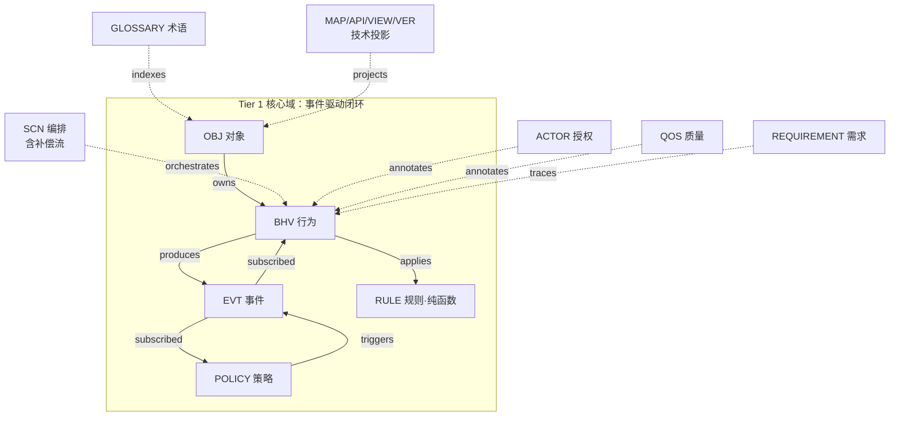
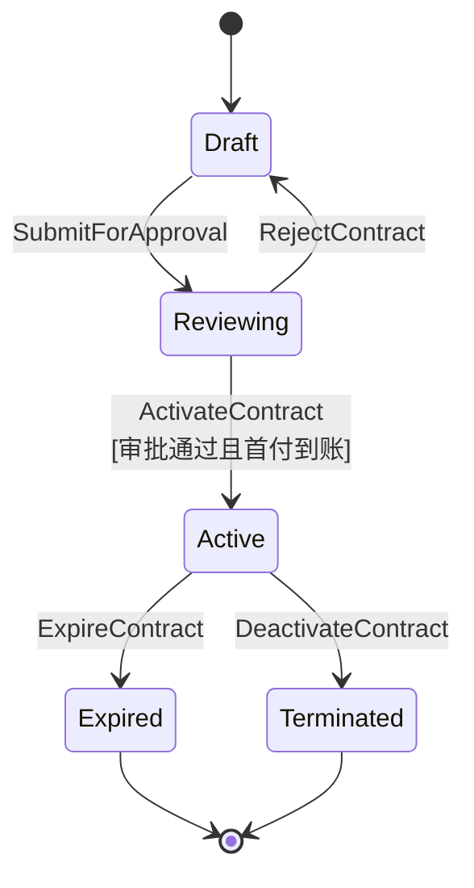
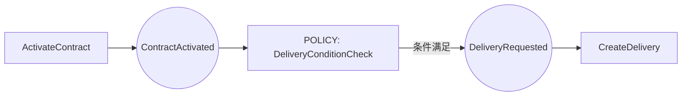
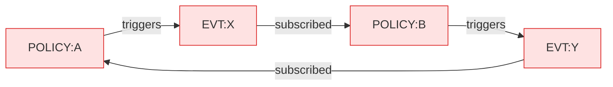
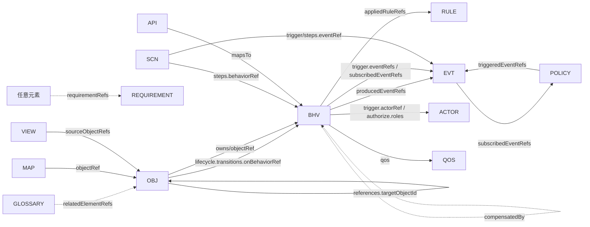
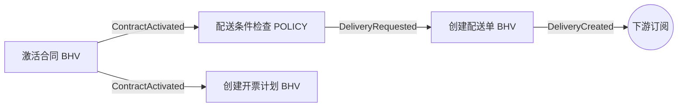

# 本体模型设计规格书（完整版）

> **版本**：v2.0　**状态**：完整版（正式）
> **定位**：本文是用本体模型刻画任意业务系统的**完整元模型规格**——它定义了"用来定义本体的全部元素、字段、结构与约束"，供本体设计器、校验器、AI 代码生成、以及人工建模共同遵循。
> **完整性声明**：本版**不区分 MVP / 草案**，所有模型均为一等、完整规格。它在建模语义上**取代**《本体模型设计规格书》v1.0（v1 仅对齐设计器 MVP 的核心 4 模型）。
> **读者**：业务顾问（用它驱动需求挖掘）、本体建模者、校验器与代码生成器的实现者、AI 编程智能体。
> **相关文档**：架构方案见 [本体模型+AI大模型驱动的AI原生应用架构设计方案-优化版.md](本体模型+AI大模型驱动的AI原生应用架构设计方案-优化版.md)；MVP 对齐版见 [本体模型设计规格书.md](本体模型设计规格书.md)。

---

## 目录

- [第 0 章　概述与元模型全景](#第-0-章概述与元模型全景)
- [第 1 章　建模哲学与设计原则](#第-1-章建模哲学与设计原则)
- [第 2 章　通用约定与项目容器](#第-2-章通用约定与项目容器)
- [第 3 章　核心域模型 Tier1](#第-3-章核心域模型-tier1)
- [第 4 章　编排模型 SCN](#第-4-章编排模型-scn)
- [第 5 章　横切切面模型 ACTOR 与 QOS](#第-5-章横切切面模型-actor-与-qos)
- [第 6 章　治理与追溯模型 GLOSSARY 与 REQUIREMENT](#第-6-章治理与追溯模型-glossary-与-requirement)
- [第 7 章　技术投影模型 MAP API VIEW VER](#第-7-章技术投影模型-map-api-view-ver)
- [第 8 章　跨模型校验规则全集](#第-8-章跨模型校验规则全集)
- [第 9 章　完成度模型与槽位清单](#第-9-章完成度模型与槽位清单)
- [第 10 章　端到端完整示例：合同管理系统](#第-10-章端到端完整示例合同管理系统)
- [第 11 章　与 Palantir 本体模型的对比与评估](#第-11-章与-palantir-本体模型的对比与评估)
- [附录 A　模型速查表](#附录-a模型速查表)
- [附录 B　元模型 TypeScript 总定义](#附录-b元模型-typescript-总定义)

---

## 第 0 章　概述与元模型全景

### 0.1 本体模型是什么

**本体（Ontology）** 是对一个业务域中"有哪些概念、概念有什么结构、概念之间如何关联与互动、受什么规则约束、由谁在何时驱动"的**形式化、机器可读、可校验**的完整描述。

**元模型（Meta-Model）** 是"定义本体的语言"——本规格即元模型规格：它规定了构成任意业务本体的**全部积木**（模型类型）、每块积木的**字段与数据结构**、积木之间的**引用关系**，以及保证整体自洽的**校验规则**。

一个具体业务（如"合同管理"）的本体 = 用这套元模型实例化出的一个 `OntologyProject`。

### 0.2 元模型元素全表

本规格定义 **5 层、14 种模型元素**。下表是完整目录，后续每章给出各元素的完整规格：

| 层 | 模型 | 短码 | 一句话职责 | 章节 |
|---|---|---|---|---|
| **Tier 1 核心域** | 对象 | **OBJ** | 是什么（聚合根 + 结构 + 不变量 + 生命周期） | [3.1](#31-obj-对象模型) |
| | 行为 | **BHV** | 做什么（原子操作 + 前后置 + 触发方式） | [3.2](#32-bhv-行为模型) |
| | 事件 | **EVT** | 如何传播（事件契约 + 投递语义） | [3.3](#33-evt-事件模型) |
| | 规则 | **RULE** | 凭什么（同步纯函数：校验/计算/推导/风控） | [3.4](#34-rule-规则模型纯函数) |
| | 策略 | **POLICY** | 如何反应（事件驱动：订阅→判断→触发） | [3.5](#35-policy-策略模型事件驱动) |
| **Tier 2 编排** | 场景 | **SCN** | 怎么编排 + 失败怎么办（含补偿流 Saga） | [第 4 章](#第-4-章编排模型-scn) |
| **Tier 3 横切切面** | 主体 | **ACTOR** | 谁能做（角色目录 + 授权） | [5.1](#51-actor-主体--授权模型) |
| | 质量 | **QOS** | 做得怎么样（SLA 目录 + 绑定） | [5.2](#52-qos-质量约束模型) |
| **Tier 4 治理与追溯** | 术语 | **GLOSSARY** | 词是什么意思（术语表 + 词↔模型映射） | [6.1](#61-glossary-术语表模型) |
| | 需求 | **REQUIREMENT** | 为谁而建（需求目录 + 双向追溯） | [6.2](#62-requirement-需求与追溯模型) |
| **Tier 5 技术投影** | 持久化 | **MAP** | 落到存储（聚合→表/列/外键） | [7.1](#71-map-持久化映射模型) |
| | 接口 | **API** | 对外暴露（端点↔行为/视图） | [7.2](#72-api-接口契约模型) |
| | 视图 | **VIEW** | 面向查询（读模型/物化视图） | [7.3](#73-view-视图读模型) |
| | 版本 | **VER** | 安全演进（版本/迁移/影响分析） | [7.4](#74-ver-版本演进模型) |

### 0.3 五层全景



### 0.4 元素的阅读模板

每个**模型元素**按统一**六段模板**给出，便于交叉对照：

1. **定位与职责**——它回答什么问题、边界在哪。
2. **字段表**——字段 / 类型 / 必填 / 引用目标 / 约束。
3. **数据结构**——TypeScript `interface`（权威）+ JSON Schema（YAML 表达，用于校验）。
4. **YAML 实例示例**——可被设计器直接导入的真实片段（统一以"合同管理"为例）。
5. **校验规则**——结构校验 + 跨模型引用完整性，给出校验码。
6. **与相邻模型的边界**——容易混淆处的划界。

> 核心域、横切切面、治理模型按完整六段给出；技术投影模型（MAP/API/VIEW/VER）精简为「定位 / 结构 / 示例 / 校验」四段。

---

## 第 1 章　建模哲学与设计原则

### 1.1 DDD 聚合根与聚合间 ID 引用

- 一个 **OBJ 实例 = 一个聚合根**，代表一个**业务完整性边界**，由"聚合根自身 + 子实体 + 值对象 + 不变量"组成。
- 聚合内通过**不变量**维护强一致；**聚合之间只以 ID 引用**（`AggregateRef`），绝不对象内嵌——这是聚合边界的硬约束，保证可独立持久化、独立演进。

### 1.2 事件驱动闭环

核心域以**最小闭环**"**行为→事件→规则/策略→事件→行为**"运转：

- **行为（BHV）** 执行后**产生事件（EVT）**；
- **策略（POLICY）** 订阅事件、判断条件、**触发新事件**，是事件链中的**智能决策节点**；
- 新事件再被下游**行为**订阅，形成闭环。
- **规则（RULE）** 则在行为内被**同步调用**（纯函数式校验/计算/推导/风控），不参与事件传播。

### 1.3 五层分层及职责

| 层 | 角色 | 是否参与运行语义 | 可否后置 |
|---|---|---|---|
| Tier 1 核心域 | 业务的"是什么/做什么/如何反应"，一等公民 | 是（核心） | 否 |
| Tier 2 编排 | 把行为/事件编排成显式、可审计、可补偿的流程 | 是 | 视复杂度 |
| Tier 3 横切切面 | 授权与质量，**注解式**附着，不侵入业务字段 | 是（约束） | 可 |
| Tier 4 治理与追溯 | 术语统一与需求追溯，**治理层** | 否（不运行，但决定完成度） | 否（建模必备） |
| Tier 5 技术投影 | 把业务本体映射到存储/接口/视图/版本 | 否（实现投影） | 可（代码生成阶段） |

> **依赖方向**：高层引用低层 id，**低层绝不反向依赖高层**——核心模型不知道投影/治理的存在，保持业务语义纯净。

### 1.4 四处"逻辑"的边界（最重要的澄清）

建模中最常见的困惑是"**这段逻辑该写哪**"。系统中有**四处**可承载逻辑，必须划清：

| 承载位置 | 语义 | 何时成立 | 一致性 | 典型例子 |
|---|---|---|---|---|
| `OBJ.invariants` 不变量 | 聚合内**永远必须成立**的结构约束 | 任何时刻 | 同步、强一致（聚合内） | 合同金额 = 明细小计之和 |
| `BHV.pre/postconditions` 前后置 | 操作的**进入守卫 / 退出承诺** | 执行该行为的瞬间 | 同步（单次操作） | 草稿状态才能提交审批 |
| `RULE` 规则 | **可复用的纯函数**判断/计算（无副作用、不碰事件） | 被行为同步引用 | 同步 | 信用额度校验、税额计算 |
| `POLICY` 策略 | **事件驱动**的反应式编排（订阅→判断→触发） | 由事件触发 | 可异步（跨聚合最终一致） | 合同激活后判断是否发起配送 |

**判定口诀**：恒真且限聚合内 → 不变量；只是某操作门槛 → 前后置；可复用的纯计算 → 规则；由事件触发并产出事件 → 策略。

### 1.5 编排（SCN）vs 编排式协作（EVT/POLICY）

| 维度 | 编排式协作（Choreography，EVT+POLICY） | 编排（Orchestration，SCN） |
|---|---|---|
| 控制 | 去中心，事件驱动各自响应 | 中心化，由场景显式驱动步骤 |
| 耦合 | 最松 | 较紧（场景知道全流程） |
| 可见性 | 链路分散，需追踪 ID 还原 | 流程显式、可审计 |
| 适用 | 松耦合扩展、领域事件传播 | 复杂跨聚合事务、需补偿、需人工节点 |

**建议**：默认用 EVT/POLICY 闭环表达松耦合协作；当流程**跨多聚合、需补偿、需人工审批或强顺序**时升级为 SCN。**同一段流程不要同时用两种方式表达**。

### 1.6 补偿的表达（无独立 SAGA 模型）

补偿的本质是"**撤销某行为的另一个行为**"，依附于行为与流程，故不设独立模型，拆为两处：

- **行为级**：`BHV.compensatedBy` → 指向补偿行为（BHV.id），声明"本行为失败/回滚时执行谁"。
- **流程级**：`SCN.compensation` → 补偿触发顺序、超时、重试（Saga 协调）。

### 1.7 RULE 与 POLICY 的分工

二者是**两种异质语义**，分立为两个一等模型以消除歧义：

| | RULE 规则 | POLICY 策略 |
|---|---|---|
| 本质 | **纯函数**（输入→输出，无副作用） | **反应式编排节点**（订阅事件→触发事件） |
| 调用方式 | 被 `BHV.appliedRuleRefs` **同步调用** | **自治**订阅事件，不被行为直接调用 |
| 是否碰事件 | 否 | 是（`subscribedEventRefs` / `triggeredEventRefs`） |
| 参与环路检测 | 否 | 是（作为事件图节点） |
| 类型 | validation / calculation / derivation / risk | 无子类型（统一为"订阅-判断-触发"） |

---

## 第 2 章　通用约定与项目容器

### 2.1 标识符与命名

- **id 规则**（所有模型实例、子实体、值对象、不变量、状态等通用）：正则 `^[A-Za-z][A-Za-z0-9_]*$`，字母开头，仅含字母 / 数字 / 下划线。
- **id 唯一性**：在**同类集合内**唯一（`objects` / `behaviors` / `events` / `rules` / `policies` / … 各自命名空间）。
- **命名风格**：模型 id 用 `PascalCase`（`Contract`、`ActivateContract`、`ContractActivated`）；属性 / 字段名用 `camelCase`（`contractNo`、`courierId`）。
- **name**：人类可读中文名，可重复，仅用于展示。
- **EVT 命名建议**：用"领域 + 过去式"表达已发生的事实（`ContractActivated`、`DeliveryReadyToDispatch`）。

### 2.2 引用约定与全量引用表

- 引用字段以 `Ref`（单引用）/ `Refs`（引用数组）结尾，值为被引用模型的 **id 字符串**（非内嵌）。
- 聚合之间一律 **ID 引用**（`AggregateRef`）。
- 所有 `xxxRef(s)` 必须指向**存在的目标 id**，否则为"悬空引用"错误（见[第 8 章](#第-8-章跨模型校验规则全集)）。

| 引用字段 | 所在模型 | 指向 |
|---|---|---|
| `objectRef` | BHV / MAP | OBJ.id |
| `appliedRuleRefs` | BHV | RULE.id |
| `producedEventRefs` | BHV | EVT.id |
| `subscribedEventRefs` | BHV / POLICY | EVT.id |
| `triggeredEventRefs` | POLICY | EVT.id |
| `references[].targetObjectId` | OBJ | OBJ.id |
| `lifecycle.transitions[].onBehaviorRef` | OBJ | BHV.id |
| `trigger.actorRef` | BHV | ACTOR.id |
| `trigger.eventRefs` | BHV | EVT.id |
| `compensatedBy` | BHV | BHV.id |
| `authorize.roles` | BHV | ACTOR.id |
| `qos` | BHV / SCN | QOS.id |
| `steps[].behaviorRef` | SCN | BHV.id |
| `steps[].eventRef` / `trigger.eventRef` | SCN | EVT.id |
| `seeAlso` / `relatedElementRefs` | GLOSSARY | Term.id / 任意元素 id |
| `requirementRefs` | 任意元素 | REQUIREMENT.id |
| `mapsTo.ref` | API | BHV.id / VIEW.id |
| `sourceObjectRefs` / `refreshOnEventRefs` | VIEW | OBJ.id / EVT.id |

### 2.3 属性类型系统

`Attribute.type` 取值（用于对象属性、子实体 / 值对象属性、事件载荷、视图字段、接口请求/响应）：

| 类型 | 含义 | 备注 |
|---|---|---|
| `string` | 字符串 | |
| `number` | 整数 / 一般数值 | |
| `decimal` | 高精度小数 | 金额等，避免浮点误差 |
| `boolean` | 布尔 | |
| `date` | 日期 | 无时间部分 |
| `datetime` | 日期时间 | |
| `enum` | 枚举 | 取值集合写在 `description`，或由 `OBJ.lifecycle` / 术语表约束 |
| `reference` | 跨聚合 ID 引用字段 | 配合 `OBJ.references` 使用 |
| `object` | 内嵌结构 | 复杂值，谨慎使用 |

**合同管理示例**（每种类型对应一个合同字段，便于对号理解）：

```yaml
attributes:
  - { name: contractNo, type: string,   required: true,  description: 合同号 }
  - { name: itemCount,  type: number,   required: true,  description: 明细行数 }
  - { name: amount,     type: decimal,  required: true,  description: 合同金额（高精度，避免浮点误差） }
  - { name: isVip,      type: boolean,  required: false, description: 是否 VIP 客户 }
  - { name: endDate,    type: date,     required: true,  description: 服务到期日（无时间） }
  - { name: signedAt,   type: datetime, required: false, description: 签署时间（含时间） }
  - { name: status,     type: enum,     required: true,  description: 草稿/审批中/生效/到期/终止 }
  - { name: customerId, type: reference,required: true,  description: 跨聚合引用客户 ID }
  - { name: address,    type: object,   required: false, description: 内嵌收货地址值对象 }
```

### 2.4 公共字段与通用追溯字段

所有一等模型实例均含：

| 字段 | 类型 | 必填 | 说明 |
|---|---|---|---|
| `id` | string | 是 | 符合 2.1，集合内唯一 |
| `name` | string | 是 | 展示名 |
| `description` | string | 否 | 业务说明，AI 生成的重要语义来源 |
| `requirementRefs` | string[] | 否 | → REQUIREMENT.id，需求追溯（见 [6.2](#62-requirement-需求与追溯模型)） |

### 2.5 项目容器 `OntologyProject`（完整）

一个本体工作区 = 一个 `OntologyProject`，是导入 / 导出 / 持久化的根对象。完整版包含全部 5 层集合：

```ts
interface OntologyProject {
  version: string                 // 本体版本，如 "2.0"
  name: string                    // 工作区名称
  description?: string

  // ── Tier 1 核心域 ──
  objects: ObjectModel[]
  behaviors: BehaviorModel[]
  events: EventModel[]
  rules: RuleModel[]
  policies: PolicyModel[]

  // ── Tier 2 编排 ──
  scenarios: ScenarioModel[]

  // ── Tier 3 横切切面 ──
  actors: ActorRole[]
  qosProfiles: QosProfile[]

  // ── Tier 4 治理与追溯 ──
  glossary: Term[]
  requirements: Requirement[]

  // ── Tier 5 技术投影（可后置） ──
  mappings?: PersistenceMapping[]
  apis?: ApiContract[]
  views?: ViewModel[]
  versionInfo?: VersionInfo
}
```

> 完整的各子接口定义见各章；一站式聚合定义见[附录 B](#附录-b元模型-typescript-总定义)。

---

## 第 3 章　核心域模型 Tier1

核心域是本体的运行核心，由 5 个一等模型构成事件驱动闭环：**OBJ · BHV · EVT · RULE · POLICY**。

### 3.1 OBJ 对象模型

#### 定位与职责

定义业务域的**领域对象及关系**。一个 OBJ 实例 = 一个 **DDD 聚合根**，代表一个业务完整性边界，由"聚合根自身 + 子实体 + 值对象"组成，通过**不变量**维护一致性，聚合间仅以 **ID 引用**，并可声明**生命周期状态机**。它回答"**是什么**"。

#### 字段表

`ObjectModel`（聚合根）：

| 字段 | 类型 | 必填 | 引用 | 说明 |
|---|---|---|---|---|
| `id` | string | 是 | — | 聚合根标识，集合内唯一 |
| `name` | string | 是 | — | 展示名 |
| `description` | string | 否 | — | 业务说明 |
| `identity` | string | 是 | — | 聚合根的**唯一标识属性名**（如 `contractNo`） |
| `attributes` | Attribute[] | 是 | — | 聚合根自身属性 |
| `entities` | ChildEntity[] | 是 | — | 子实体列表（可空数组） |
| `valueObjects` | ValueObject[] | 是 | — | 值对象列表（可空数组） |
| `invariants` | Invariant[] | 是 | — | 不变量列表（可空数组） |
| `references` | AggregateRef[] | 是 | OBJ.id | 对其他聚合的 ID 引用（含基数与关系类型） |
| `lifecycle` | Lifecycle | 否 | — | 生命周期状态机（有状态流转的对象才填） |
| `requirementRefs` | string[] | 否 | REQUIREMENT.id | 需求追溯 |

`ChildEntity`（子实体，聚合内、依赖聚合根）：`{ id, name, identity, attributes }`
`ValueObject`（值对象，无标识、按值相等、不可变）：`{ id, name, attributes }`
`Invariant`（不变量）：`{ id, expression, description? }`
`Attribute`（通用属性，见 [2.3](#23-属性类型系统)）：`{ name, type, required, description? }`

`AggregateRef`（聚合间 ID 引用，含**基数与关系类型**）：

| 字段 | 类型 | 必填 | 引用 | 说明 |
|---|---|---|---|---|
| `targetObjectId` | string | 是 | OBJ.id | 被引用聚合根 id |
| `refField` | string | 是 | — | 本聚合持有的引用字段名 |
| `cardinality` | enum | 建议 | — | `ONE_TO_ONE` / `ONE_TO_MANY` / `MANY_TO_ONE` / `MANY_TO_MANY`（从本对象视角看向 target 的重数；完成度必填，缺失为 warn） |
| `kind` | enum | 建议 | — | `composition`（组合，同生共死）/ `association`（关联，平级）/ `aggregation`（聚合，整体-部分但可独立；完成度必填，缺失为 warn） |
| `inverseName` | string | 否 | — | 反向关系业务名，便于双向导航与图渲染 |
| `description` | string | 否 | — | 说明 |

`Lifecycle`（生命周期状态机）：

| 字段 | 类型 | 必填 | 引用 | 说明 |
|---|---|---|---|---|
| `stateAttr` | string | 是 | → 本 OBJ 枚举属性 | 指明哪个枚举属性承载状态；其枚举值应与 `states[].id` 对齐 |
| `states` | StateModel[] | 是 | — | 至少 1 个 `initial` + 至少 1 个 `final` |
| `transitions` | TransitionModel[] | 是 | — | 每条迁移由一个 BHV 驱动 |

`StateModel`：`{ id, name, type: 'initial'|'normal'|'final', description? }`（`initial` 唯一，`final` 可多个）
`TransitionModel`：

| 字段 | 类型 | 必填 | 引用 | 说明 |
|---|---|---|---|---|
| `id` | string | 是 | — | 本对象内唯一 |
| `from` | string | 是 | StateModel.id | 起始状态 |
| `to` | string | 是 | StateModel.id | 目标状态；不可出 `final` |
| `onBehaviorRef` | string | 是 | BHV.id | 驱动此迁移的行为；其 `objectRef` 须为本对象 |
| `guard` | string | 否 | — | 迁移守卫条件（建议引用 RULE / 术语） |

#### 数据结构（TypeScript）

```ts
type AttributeType = 'string' | 'number' | 'decimal' | 'boolean' | 'date'
                   | 'datetime' | 'enum' | 'reference' | 'object'
interface Attribute { name: string; type: AttributeType; required: boolean; description?: string }
interface Invariant { id: string; expression: string; description?: string }
interface ChildEntity { id: string; name: string; identity: string; attributes: Attribute[] }
interface ValueObject { id: string; name: string; attributes: Attribute[] }

type Cardinality = 'ONE_TO_ONE' | 'ONE_TO_MANY' | 'MANY_TO_ONE' | 'MANY_TO_MANY'
type RefKind     = 'composition' | 'association' | 'aggregation'
interface AggregateRef {
  targetObjectId: string          // -> ObjectModel.id
  refField: string
  cardinality?: Cardinality       // 完成度必填，缺失为 warn
  kind?: RefKind                  // 完成度必填，缺失为 warn
  inverseName?: string
  description?: string
}

interface StateModel { id: string; name: string; type: 'initial' | 'normal' | 'final'; description?: string }
interface TransitionModel {
  id: string
  from: string                    // -> StateModel.id
  to: string                      // -> StateModel.id
  onBehaviorRef: string           // -> BehaviorModel.id
  guard?: string
}
interface Lifecycle { stateAttr: string; states: StateModel[]; transitions: TransitionModel[] }

interface ObjectModel {
  id: string
  name: string
  description?: string
  identity: string
  attributes: Attribute[]
  entities: ChildEntity[]
  valueObjects: ValueObject[]
  invariants: Invariant[]
  references: AggregateRef[]
  lifecycle?: Lifecycle
  requirementRefs?: string[]
}
```

#### 数据结构（JSON Schema，YAML 表达，节选）

```yaml
type: object
required: [id, name, identity, attributes, entities, valueObjects, invariants, references]
properties:
  id:          { type: string, pattern: "^[A-Za-z][A-Za-z0-9_]*$" }
  identity:    { type: string, minLength: 1 }
  references:
    type: array
    items:
      type: object
      required: [targetObjectId, refField]
      properties:
        targetObjectId: { type: string }
        refField:       { type: string }
        cardinality:    { enum: [ONE_TO_ONE, ONE_TO_MANY, MANY_TO_ONE, MANY_TO_MANY] }
        kind:           { enum: [composition, association, aggregation] }
        inverseName:    { type: string }
  lifecycle:
    type: object
    required: [stateAttr, states, transitions]
    properties:
      stateAttr: { type: string }
      states:
        type: array
        items:
          type: object
          required: [id, name, type]
          properties:
            id:   { type: string }
            name: { type: string }
            type: { enum: [initial, normal, final] }
      transitions:
        type: array
        items:
          type: object
          required: [id, from, to, onBehaviorRef]
          properties:
            id:            { type: string }
            from:          { type: string }   # -> states[].id
            to:            { type: string }   # -> states[].id
            onBehaviorRef: { type: string }   # -> behaviors[].id
            guard:         { type: string }
```

#### YAML 实例示例

```yaml
id: Contract
name: 合同
identity: contractNo
attributes:
  - { name: contractNo, type: string,    required: true,  description: 合同号 }
  - { name: customerId, type: reference, required: true,  description: 客户ID（引用） }
  - { name: amount,     type: decimal,   required: true,  description: 合同金额 }
  - { name: status,     type: enum,      required: true,  description: 草稿/审批中/生效/到期/终止 }
  - { name: productType,type: enum,      required: true,  description: 实物/服务 }
  - { name: endDate,    type: date,      required: true,  description: 服务到期日 }
entities:
  - { id: ContractItem, name: 产品明细, identity: itemId, attributes: [
      { name: itemId, type: string, required: true },
      { name: quantity, type: number, required: true },
      { name: price, type: decimal, required: true },
      { name: subtotal, type: decimal, required: true } ] }
valueObjects:
  - { id: ShippingAddress, name: 收货地址, attributes: [
      { name: province, type: string, required: true },
      { name: city, type: string, required: true },
      { name: detail, type: string, required: true } ] }
invariants:
  - { id: inv_amount, expression: "amount == sum(items.subtotal)", description: 合同金额=明细小计之和 }
  - { id: inv_items,  expression: "count(items) >= 1",             description: 至少一个明细 }
references:
  - { targetObjectId: Customer, refField: customerId, cardinality: MANY_TO_ONE, kind: association, inverseName: 名下合同 }
lifecycle:
  stateAttr: status
  states:
    - { id: Draft,      name: 草稿,   type: initial }
    - { id: Reviewing,  name: 审批中, type: normal  }
    - { id: Active,     name: 生效,   type: normal  }
    - { id: Expired,    name: 到期,   type: final   }
    - { id: Terminated, name: 终止,   type: final   }
  transitions:
    - { id: t_submit,    from: Draft,     to: Reviewing,  onBehaviorRef: SubmitForApproval }
    - { id: t_approve,   from: Reviewing, to: Active,     onBehaviorRef: ActivateContract,   guard: "审批通过 且 首付款到账" }
    - { id: t_reject,    from: Reviewing, to: Draft,      onBehaviorRef: RejectContract }
    - { id: t_expire,    from: Active,    to: Expired,    onBehaviorRef: ExpireContract }
    - { id: t_terminate, from: Active,    to: Terminated, onBehaviorRef: DeactivateContract }
```



#### 校验规则

| 校验码 | 级别 | 触发条件 |
|---|---|---|
| `DANGLING_OBJ_REF` | error | `references.targetObjectId` 指向不存在的聚合 |
| `CARDINALITY_MISSING` / `REF_KIND_MISSING` | warn | 引用未声明基数 / 关系类型（计为未填） |
| `COMPOSITION_SHARED` | warn | 同一 target 被多个对象以 `composition` 引用（组合应被单一整体独占） |
| `DANGLING_TRANSITION_BHV` | error | `transition.onBehaviorRef` 不存在，或其 `objectRef` 不是本对象 |
| `TRANSITION_STATE_UNDEF` | error | `from`/`to` 指向未定义状态 |
| `STATE_UNREACHABLE` | warn | 存在从 `initial` 不可达的状态 |
| `NO_REACHABLE_TERMINAL` | warn | 从 `initial` 无法到达任何 `final` 状态 |
| `STATE_ATTR_MISMATCH` | warn | `stateAttr` 枚举值集合与 `states[].id` 不一致 |
| `LIFECYCLE_PRE_POST_MISMATCH` | warn | 迁移行为的前/后置与 `from`/`to` 状态语义冲突 |

> 建议（warn）：子实体 > 5 或总字段 > 30 提示聚合过大。

#### 与相邻模型的边界

- **OBJ vs BHV**：OBJ 只描述**结构、不变量、状态**，不含操作；动作属 BHV，以 `objectRef` 归属本聚合；状态迁移**引用**既有 BHV 而非新增行为。
- **OBJ.invariants vs RULE**：不变量是聚合内恒真（同步强一致）；可复用纯计算属 RULE。
- **组合 ⊂ 聚合根**：`composition` 的 target 通常不作独立聚合根；`association` 跨聚合只能持 ID 引用。
- **OBJ vs MAP**：表/列映射、值对象平铺是**持久化投影**，归 MAP（[第 7 章](#第-7-章技术投影模型-map-api-view-ver)）。

---

### 3.2 BHV 行为模型

#### 定位与职责

定义对象能执行的**原子操作**——单一聚合根发出的、不可再分、单一职责的核心操作单元。携带前置/后置条件、应用规则、产生/订阅事件、**触发方式**、补偿、授权与 SLA 注解。复杂流程交由 SCN 编排多个 BHV。它回答"**做什么**"。

#### 字段表

| 字段 | 类型 | 必填 | 引用 | 说明 |
|---|---|---|---|---|
| `id` | string | 是 | — | 行为标识，集合内唯一 |
| `name` | string | 是 | — | 展示名 |
| `description` | string | 否 | — | 业务说明 |
| `objectRef` | string | 是 | OBJ.id | **所属聚合根**，必须存在 |
| `preconditions` | string[] | 是 | — | 前置条件（可空数组） |
| `postconditions` | string[] | 是 | — | 后置条件 / 承诺（可空数组） |
| `appliedRuleRefs` | string[] | 是 | RULE.id | 同步应用的纯规则 |
| `producedEventRefs` | string[] | 是 | EVT.id | 成功后产生的事件 |
| `subscribedEventRefs` | string[] | 是 | EVT.id | 由哪些事件触发本行为 |
| `trigger` | Trigger | 是 | — | 触发方式（人工 / 事件 / 定时） |
| `compensatedBy` | string | 否 | BHV.id | 补偿行为（补偿降格） |
| `authorize` | Authorization | 否 | ACTOR | 授权注解（见 [5.1](#51-actor-主体--授权模型)） |
| `qos` | string | 否 | QOS.id | 绑定的 SLA Profile（见 [5.2](#52-qos-质量约束模型)） |
| `requirementRefs` | string[] | 否 | REQUIREMENT.id | 需求追溯 |

`Trigger`（触发方式）：

| 字段 | 类型 | 必填 | 引用 | 约束 |
|---|---|---|---|---|
| `kind` | `'manual'\|'event'\|'timer'` | 是 | — | 触发类别 |
| `actorRef` | string | `manual` 时建议 | ACTOR.id | 谁能发起 |
| `eventRefs` | string[] | `event` 时必填 | EVT.id | 触发本行为的事件；应与 `subscribedEventRefs` 对齐 |
| `schedule` | string | `timer` 时二选一 | — | 周期表达式（cron / ISO-8601，如 `0 9 * * *`） |
| `deadline` | string | `timer` 时二选一 | — | 时点表达式（如 `endDate - P7D`） |

#### 数据结构（TypeScript）

```ts
interface Trigger {
  kind: 'manual' | 'event' | 'timer'
  actorRef?: string        // manual -> ActorRole.id
  eventRefs?: string[]     // event  -> EventModel.id
  schedule?: string        // timer  -> cron / ISO-8601
  deadline?: string        // timer  -> 时点表达式
}
interface Authorization { roles?: string[]; policy?: string }   // roles -> ActorRole.id

interface BehaviorModel {
  id: string
  name: string
  description?: string
  objectRef: string              // -> ObjectModel.id
  preconditions: string[]
  postconditions: string[]
  appliedRuleRefs: string[]      // -> RuleModel.id[]
  producedEventRefs: string[]    // -> EventModel.id[]
  subscribedEventRefs: string[]  // -> EventModel.id[]
  trigger: Trigger
  compensatedBy?: string         // -> BehaviorModel.id
  authorize?: Authorization
  qos?: string                   // -> QosProfile.id
  requirementRefs?: string[]
}
```

#### YAML 实例示例

```yaml
- id: SubmitForApproval
  name: 提交审批
  objectRef: Contract
  preconditions:  [ "合同状态为草稿" ]
  postconditions: [ "合同状态置为审批中" ]
  appliedRuleRefs: []
  producedEventRefs: [ ContractSubmitted ]
  subscribedEventRefs: []
  trigger: { kind: manual, actorRef: SalesRep }
  requirementRefs: [ req_approve_within_2d ]

- id: ActivateContract
  name: 激活合同
  objectRef: Contract
  preconditions:  [ "合同状态为审批中", "首付款已到账" ]
  postconditions: [ "合同状态置为生效" ]
  appliedRuleRefs: [ CreditLimitCheck ]
  producedEventRefs: [ ContractActivated ]
  subscribedEventRefs: []
  trigger: { kind: manual, actorRef: SalesManager }
  compensatedBy: DeactivateContract
  authorize: { roles: [ SalesManager ] }
  qos: qos_fast_write

- id: SendExpiryReminder
  name: 发送到期提醒
  objectRef: Contract
  preconditions:  [ "合同处于生效状态" ]
  postconditions: [ "已发送到期提醒" ]
  appliedRuleRefs: []
  producedEventRefs: [ ExpiryReminded ]
  subscribedEventRefs: []
  trigger: { kind: timer, schedule: "0 9 * * *", deadline: "endDate - P7D" }
```

#### 校验规则

| 校验码 | 级别 | 触发条件 |
|---|---|---|
| `DANGLING_OBJECT` | error | `objectRef` 指向不存在的聚合 |
| `DANGLING_RULE` | error | `appliedRuleRefs` 指向不存在的规则 |
| `DANGLING_EVENT` | error | `produced/subscribedEventRefs` 指向不存在的事件 |
| `TRIGGER_KIND_FIELD_MISMATCH` | error | 字段与 `kind` 不符（`manual` 却给 `schedule`、`event` 缺 `eventRefs`） |
| `TIMER_NO_SPEC` | error | `kind=timer` 既无 `schedule` 也无 `deadline` |
| `DANGLING_TRIGGER_ACTOR` / `DANGLING_TRIGGER_EVENT` | error | `actorRef` / `eventRefs` 指向不存在的目标 |
| `TRIGGER_EVENT_DESYNC` | warn | `trigger.eventRefs` 与 `subscribedEventRefs` 不一致 |
| `DANGLING_COMPENSATION` | error | `compensatedBy` 不存在或等于自身 |
| `DANGLING_ROLE` | error | `authorize.roles` 指向不存在的角色 |
| `DANGLING_QOS` | error | `qos` 指向不存在的 SLA Profile |

#### 与相邻模型的边界

- **BHV vs RULE/POLICY**：行为"做一件事"；纯判断/计算抽 RULE 并 `appliedRuleRefs` 同步引用；事件驱动反应抽 POLICY（自治订阅，不在此引用）。
- **BHV vs SCN**：单行为保持原子；多行为按顺序/分支/并行编排归 SCN。
- **trigger.kind=event 与 subscribedEventRefs**：前者是"入口语义"，后者是"订阅关系"，须一致（`TRIGGER_EVENT_DESYNC` 守住）。

---

### 3.3 EVT 事件模型

#### 定位与职责

定义业务事件及其**载荷与传播语义**，是聚合/策略之间松耦合通信的载体。行为或策略产生事件，其他行为或策略订阅响应，构成事件链。它回答"**如何传播**"。事件的**生产/订阅关系**记录在 BHV 与 POLICY 上，EVT 自身只定义"事件是什么"。

#### 字段表

| 字段 | 类型 | 必填 | 说明 |
|---|---|---|---|
| `id` | string | 是 | 事件标识，集合内唯一 |
| `name` | string | 是 | 展示名 |
| `description` | string | 否 | 业务说明 |
| `payload` | Attribute[] | 是 | 事件载荷字段（可空数组） |
| `deliverySemantics` | enum | 是 | 投递语义 |
| `requirementRefs` | string[] | 否 | 需求追溯 |

`deliverySemantics` 取值：`AT_LEAST_ONCE`（至少一次，订阅者需幂等）/ `EXACTLY_ONCE`（恰好一次，需去重支持）/ `BEST_EFFORT`（尽力而为，允许丢失）。

#### 数据结构（TypeScript）

```ts
type DeliverySemantics = 'AT_LEAST_ONCE' | 'EXACTLY_ONCE' | 'BEST_EFFORT'
interface EventModel {
  id: string
  name: string
  description?: string
  payload: Attribute[]
  deliverySemantics: DeliverySemantics
  requirementRefs?: string[]
}
```

#### YAML 实例示例

```yaml
- id: ContractActivated
  name: 合同激活
  payload:
    - { name: contractNo,  type: string, required: true }
    - { name: productType, type: enum,   required: true }
  deliverySemantics: AT_LEAST_ONCE
- id: DeliveryRequested
  name: 配送已请求
  payload:
    - { name: contractNo, type: string, required: true }
  deliverySemantics: AT_LEAST_ONCE
```

#### 校验规则

| 校验码 | 级别 | 触发条件 |
|---|---|---|
| `ORPHAN_EVENT` | warn | 事件既无生产者（无 BHV.produced / POLICY.triggered 指向）又无订阅者（无 BHV/POLICY.subscribed 指向） |
| `EVENT_CYCLE` | error | 事件作为节点参与事件图，存在有向环（见 [8.2](#82-环路检测算法)） |

#### 与相邻模型的边界

- **EVT vs BHV/POLICY**：EVT 只声明"事件契约"（id + 载荷 + 语义）；谁产生、谁订阅在 BHV/POLICY 上声明，使事件可被多方独立引用。

---

### 3.4 RULE 规则模型（纯函数）

#### 定位与职责

定义**可复用的纯函数式判断/计算**——无副作用、不订阅/不触发事件、被行为**同步调用**。它回答"**凭什么**"。事件驱动的反应式逻辑不属于 RULE，归 POLICY（见 [3.5](#35-policy-策略模型事件驱动)）。

#### 字段表

| 字段 | 类型 | 必填 | 说明 |
|---|---|---|---|
| `id` | string | 是 | 规则标识，集合内唯一 |
| `name` | string | 是 | 展示名 |
| `description` | string | 否 | 业务说明 |
| `type` | enum | 是 | `validation` / `calculation` / `derivation` / `risk`（**四纯类型**，无 event-driven） |
| `condition` | string | 是 | 判断或计算逻辑表达式 |
| `requirementRefs` | string[] | 否 | 需求追溯 |

`type` 取值：`validation`（数据/状态合法性）/ `calculation`（派生数值）/ `derivation`（推导新事实/状态）/ `risk`（风控）。

#### 数据结构（TypeScript）

```ts
type RuleType = 'validation' | 'calculation' | 'derivation' | 'risk'
interface RuleModel {
  id: string
  name: string
  description?: string
  type: RuleType
  condition: string
  requirementRefs?: string[]
}
```

#### YAML 实例示例

```yaml
- id: CreditLimitCheck
  name: 信用额度校验
  type: validation
  condition: "customer.creditUsed + contract.amount <= customer.creditLimit"
- id: TaxCalculation
  name: 税额计算
  type: calculation
  condition: "tax = amount * taxRate"
```

#### 校验规则

| 校验码 | 级别 | 触发条件 |
|---|---|---|
| `RULE_EVENT_FIELD_PRESENT` | error | 纯 RULE 残留 `subscribed/triggeredEventRefs`（应迁至 POLICY） |
| `DUPLICATE_ID` | error | 集合内 id 重复 |

#### 与相邻模型的边界

- **RULE vs BHV 前后置**：一次性、属某操作的守卫写在前后置；可复用纯计算抽为 RULE。
- **RULE vs OBJ 不变量**：聚合内恒真约束是不变量；规则可被多个行为复用。
- **RULE vs POLICY**：RULE 是同步纯函数（被 `appliedRuleRefs` 调用）；POLICY 是事件驱动反应器（见 1.7）。

---

### 3.5 POLICY 策略模型（事件驱动）

#### 定位与职责

定义**事件驱动的反应式策略**——订阅事件、判断条件、满足时触发新事件，是事件链中的**智能决策节点**，构成"行为→事件→策略→事件→行为"的闭环。它回答"**如何反应**"。POLICY 自治运行，不被行为直接调用。

#### 字段表

| 字段 | 类型 | 必填 | 引用 | 说明 |
|---|---|---|---|---|
| `id` | string | 是 | — | 策略标识，集合内唯一 |
| `name` | string | 是 | — | 展示名 |
| `description` | string | 否 | — | 业务说明 |
| `subscribedEventRefs` | string[] | 是 | EVT.id | 订阅的事件（至少 1 个） |
| `condition` | string | 是 | — | 判断条件（建议引用 RULE / 术语） |
| `triggeredEventRefs` | string[] | 是 | EVT.id | 条件满足时触发的事件（至少 1 个） |
| `requirementRefs` | string[] | 否 | REQUIREMENT.id | 需求追溯 |

#### 数据结构（TypeScript）

```ts
interface PolicyModel {
  id: string
  name: string
  description?: string
  subscribedEventRefs: string[]   // -> EventModel.id[]
  condition: string
  triggeredEventRefs: string[]    // -> EventModel.id[]
  requirementRefs?: string[]
}
```

#### YAML 实例示例

```yaml
- id: DeliveryConditionCheck
  name: 配送条件检查
  subscribedEventRefs: [ ContractActivated ]
  condition: "合同含实物商品行 且 收货地址已确认"
  triggeredEventRefs: [ DeliveryRequested ]
  requirementRefs: [ req_auto_delivery ]
```



#### 校验规则

| 校验码 | 级别 | 触发条件 |
|---|---|---|
| `POLICY_NO_SUB` | warn | 无任何 `subscribedEventRefs` |
| `POLICY_NO_TRIGGER` | warn | 无任何 `triggeredEventRefs`（死策略） |
| `DANGLING_EVENT` | error | 订阅/触发事件不存在 |
| `EVENT_CYCLE` | error | 参与事件图且成环 |

#### 与相邻模型的边界

- **POLICY = 自治反应器**，不被 `appliedRuleRefs` 引用；其 `condition` 可委托 RULE 做复杂纯计算，实现"策略编排 + 规则计算"分工。

---

## 第 4 章　编排模型 SCN

### 定位与职责

定义业务流程与用例场景，通过**编排**行为与事件链描述完整业务流。一个场景由多个**步骤**组成，支持顺序、并行、条件分支、循环，并内建**补偿流**（吸收原 SAGA 的 Saga 协调）。它回答"**怎么编排 + 失败怎么办**"。

### 字段表

`ScenarioModel`：

| 字段 | 类型 | 必填 | 引用 | 说明 |
|---|---|---|---|---|
| `id` / `name` / `description` | — | id/name 必填 | — | 公共字段 |
| `trigger` | SceneTrigger | 是 | EVT.id | 场景触发方式 |
| `steps` | SceneStep[] | 是 | — | 步骤列表 |
| `compensation` | CompensationFlow | 否 | — | 补偿编排（Saga） |
| `qos` | string | 否 | QOS.id | 场景级 SLA |
| `requirementRefs` | string[] | 否 | REQUIREMENT.id | 需求追溯 |

`SceneTrigger`：`{ type: 'event'|'manual'; eventRef?: string (event 时→EVT.id); actorRef?: string (manual 时→ACTOR.id) }`

`SceneStep`：

| 字段 | 类型 | 引用 | 说明 |
|---|---|---|---|
| `id` | string | — | 步骤标识，场景内唯一 |
| `kind` | `'behavior'\|'wait-event'\|'branch'\|'parallel'\|'loop'` | — | 步骤类型 |
| `behaviorRef` | string | BHV.id | `kind=behavior` 时调用的行为 |
| `eventRef` | string | EVT.id | `kind=wait-event` 时等待的事件 |
| `condition` | string | — | `kind=branch`/`loop` 的条件 |
| `next` | string[] | Step.id | 后继步骤（分支 / 并行多个） |

`CompensationFlow`：`{ strategy: 'backward'|'forward'; timeoutMs?: number; maxRetry?: number }`——每个已执行步骤回退到其 `behaviorRef.compensatedBy`。

### 数据结构（TypeScript）

```ts
interface SceneTrigger { type: 'event' | 'manual'; eventRef?: string; actorRef?: string }
interface SceneStep {
  id: string
  kind: 'behavior' | 'wait-event' | 'branch' | 'parallel' | 'loop'
  behaviorRef?: string   // -> BehaviorModel.id
  eventRef?: string      // -> EventModel.id
  condition?: string
  next?: string[]        // -> SceneStep.id[]
}
interface CompensationFlow { strategy: 'backward' | 'forward'; timeoutMs?: number; maxRetry?: number }
interface ScenarioModel {
  id: string
  name: string
  description?: string
  trigger: SceneTrigger
  steps: SceneStep[]
  compensation?: CompensationFlow
  qos?: string                   // -> QosProfile.id
  requirementRefs?: string[]
}
```

### 数据结构（JSON Schema，YAML 表达，节选）

```yaml
type: object
required: [id, name, trigger, steps]
properties:
  trigger:
    type: object
    required: [type]
    properties:
      type:     { enum: [event, manual] }
      eventRef: { type: string }   # event 时 -> events[].id
      actorRef: { type: string }   # manual 时 -> actors[].id
  steps:
    type: array
    items:
      type: object
      required: [id, kind]
      properties:
        kind:        { enum: [behavior, wait-event, branch, parallel, loop] }
        behaviorRef: { type: string }   # -> behaviors[].id
        eventRef:    { type: string }   # -> events[].id
        condition:   { type: string }
        next:        { type: array, items: { type: string } }
  compensation:
    type: object
    properties:
      strategy:  { enum: [backward, forward] }
      timeoutMs: { type: number }
      maxRetry:  { type: number }
```

### YAML 实例示例

```yaml
- id: OrderFulfillment
  name: 合同履约
  trigger: { type: event, eventRef: ContractActivated }
  steps:
    - { id: s1, kind: behavior,   behaviorRef: CreateInvoicePlan, next: [s2] }
    - { id: s2, kind: wait-event, eventRef: DeliveryRequested,    next: [s3] }
    - { id: s3, kind: behavior,   behaviorRef: CreateDelivery }
  compensation: { strategy: backward, timeoutMs: 30000, maxRetry: 3 }
  qos: qos_fast_write
```

### 校验规则

| 校验码 | 级别 | 触发条件 |
|---|---|---|
| `DANGLING_SCN_TRIGGER` | error | `trigger.eventRef`/`actorRef` 指向不存在的目标 |
| `DANGLING_STEP_REF` | error | `steps[].behaviorRef`/`eventRef`/`next` 指向不存在的目标 |
| `UNREACHABLE_STEP` | warn | 存在从触发不可达的步骤 |
| `COMPENSATION_NO_TARGET` | warn | 补偿引用的 `behaviorRef` 缺少 `compensatedBy` |
| `DANGLING_QOS` | error | `qos` 指向不存在的 SLA Profile |

### 与相邻模型的边界

- **SCN vs EVT/POLICY**：见 [1.5](#15-编排scn-vs-编排式协作evtpolicy) 取舍——同一流程二选一表达。SCN 用于显式、可审计、需补偿的复杂跨聚合流程。
- **SCN 吸收 SAGA**：补偿编排在 `compensation`，行为级补偿目标在 `BHV.compensatedBy`。

---

## 第 5 章　横切切面模型 ACTOR 与 QOS

二者本质是**附着在行为 / 场景上的注解**，外加一份可复用目录，不与核心域模型平级。

### 5.1 ACTOR 主体 / 授权模型

#### 定位与职责

定义参与者、角色、权限边界与**行为执行授权**，支持 RBAC 与 ABAC，把"谁能做什么"与业务逻辑分离。它回答"**谁能做**"。

#### 字段表

`ActorRole`（角色目录，可复用）：

| 字段 | 类型 | 必填 | 说明 |
|---|---|---|---|
| `id` | string | 是 | 角色标识，如 `SalesManager` |
| `name` | string | 是 | 展示名 |
| `description` | string | 否 | 说明 |
| `kind` | `'human'\|'system'` | 是 | 人 / 外部系统主体 |
| `parentRef` | string | 否 | → ActorRole.id，角色继承（可选层级） |

`Authorization`（授权注解，附着在 BHV / SCN，见 [3.2](#32-bhv-行为模型)）：`{ roles?: string[] (→ActorRole.id); policy?: string (ABAC 表达式) }`

#### 数据结构（TypeScript）

```ts
interface ActorRole {
  id: string
  name: string
  description?: string
  kind: 'human' | 'system'
  parentRef?: string            // -> ActorRole.id
}
// Authorization 见 3.2
```

#### YAML 实例示例

```yaml
actors:
  - { id: SalesRep,      name: 销售代表, kind: human }
  - { id: SalesManager,  name: 销售经理, kind: human, parentRef: SalesRep }
  - { id: BillingSystem, name: 计费系统, kind: system }
# BHV 上的授权注解
# authorize: { roles: [SalesManager], policy: "actor.dept == contract.dept" }
```

#### 校验规则

| 校验码 | 级别 | 触发条件 |
|---|---|---|
| `DANGLING_ROLE` | error | `BHV.authorize.roles` 指向不存在的角色（`trigger.actorRef` 由 `DANGLING_TRIGGER_ACTOR` 负责） |
| `DANGLING_ACTOR_PARENT` | error | `parentRef` 指向不存在的角色 |
| `MISSING_AUTHORIZATION` | warn | 对外行为未声明任何授权（按策略） |

#### 边界

授权是横切关注点，不进入 OBJ/BHV 业务字段，通过注解 + 角色目录表达。

### 5.2 QOS 质量约束模型

#### 定位与职责

定义**非功能性约束**（性能 SLA、可靠性、并发），以**标注**形式附加在行为 / 场景上，不侵入业务逻辑，并为性能测试、容量规划、监控告警、AI 优化目标函数提供依据。它回答"**做得怎么样**"。

#### 字段表

`QosProfile`（SLA 目录，可复用）：

| 字段 | 类型 | 必填 | 说明 |
|---|---|---|---|
| `id` | string | 是 | Profile 标识，如 `qos_fast_write` |
| `name` | string | 是 | 展示名 |
| `maxLatencyMs` | number | 否 | 响应时间上限 |
| `availability` | number | 否 | 可用性，如 0.999（0 < x ≤ 1） |
| `throughputQps` | number | 否 | 目标 QPS |
| `concurrency` | string | 否 | 并发策略说明 |

绑定：`BHV.qos` / `SCN.qos` 引用某个 `QosProfile.id`。

#### 数据结构（TypeScript）

```ts
interface QosProfile {
  id: string
  name: string
  maxLatencyMs?: number
  availability?: number
  throughputQps?: number
  concurrency?: string
}
```

#### YAML 实例示例

```yaml
qosProfiles:
  - { id: qos_fast_write, name: 快写, maxLatencyMs: 500, availability: 0.999, throughputQps: 1000 }
# BHV/SCN 绑定： qos: qos_fast_write
```

#### 校验规则

| 校验码 | 级别 | 触发条件 |
|---|---|---|
| `DANGLING_QOS` | error | `BHV.qos` / `SCN.qos` 指向不存在的 Profile |
| `QOS_RANGE_INVALID` | warn | 数值越界（如 `availability` ∉ (0,1]） |

#### 边界

QOS 是注解层，复用目录独立维护，把"目标值"与业务语义分开，便于度量与演进。

---

## 第 6 章　治理与追溯模型 GLOSSARY 与 REQUIREMENT

治理层不参与运行语义，但**决定本体的完成度与可信度**：术语统一口径，需求保证"不漏不多"。

### 6.1 GLOSSARY 术语表模型

#### 定位与职责

统一业务黑话口径，并建立**"词 ↔ 模型元素"映射**——让"生效""首付款"等词在全本体只有一个权威定义，且能点回承载它的 OBJ/BHV/状态。它回答"**词是什么意思**"。

#### 字段表

`Term`：

| 字段 | 类型 | 必填 | 引用 | 说明 |
|---|---|---|---|---|
| `id` | string | 是 | — | 项目内唯一 |
| `term` | string | 是 | — | 规范词（业务标准名） |
| `definition` | string | 是 | — | 权威定义 |
| `aliases` | string[] | 否 | — | 同义词 / 别名 |
| `seeAlso` | string[] | 否 | Term.id | 相关术语 |
| `contextRef` | string | 否 | 子域名 | 同词在不同上下文区分 |
| `relatedElementRefs` | string[] | 否 | 任意元素 id | "词↔模型"映射 |

#### 数据结构（TypeScript）

```ts
interface Term {
  id: string
  term: string
  definition: string
  aliases?: string[]
  seeAlso?: string[]              // -> Term.id
  contextRef?: string
  relatedElementRefs?: string[]   // -> OBJ/BHV/EVT/RULE/POLICY/状态 id
}
```

#### YAML 实例示例

```yaml
glossary:
  - id: term_active
    term: 生效
    definition: 合同双方完成签字且首付款到账后的状态，自此开始计算服务期。
    aliases: [激活, 开始服务]
    seeAlso: [term_firstpay]
    relatedElementRefs: [Contract, ActivateContract, ContractActivated]
  - id: term_firstpay
    term: 首付款
    definition: 合同总额按约定比例的首期回款，是合同生效的前置条件之一。
    aliases: [首期款, 预付款]
```

#### 校验规则

| 校验码 | 级别 | 触发条件 |
|---|---|---|
| `DUPLICATE_TERM` | error | `term` 或 `aliases` 在项目内重复 |
| `DANGLING_TERM_REF` | error | `seeAlso` / `relatedElementRefs` 指向不存在的目标 |
| `UNDEFINED_KEY_TERM` | warn | 模型描述/守卫/条件高频出现却未入表的业务名词 |

#### 边界

术语表是**索引层**，只引用模型元素，不被模型在结构上依赖；删除术语不影响可运行性，但降低完成度与可读性。

### 6.2 REQUIREMENT 需求与追溯模型

#### 定位与职责

为"**100% / 无漏洞**"提供**可判定**依据：每条已确认需求都必须落到某个本体元素（不落空），每个核心元素最好都能溯源到某条需求（不凭空多做）。它回答"**为谁而建**"，是把"完成度"从主观变客观的关键锚。

#### 字段表

`Requirement`：

| 字段 | 类型 | 必填 | 约束 |
|---|---|---|---|
| `id` | string | 是 | 唯一 |
| `text` | string | 是 | 需求原文 / 复述 |
| `source` | string | 否 | 来源（访谈 / 文档 / 客户角色） |
| `priority` | `'high'\|'medium'\|'low'` | 否 | 优先级 |
| `status` | `'proposed'\|'confirmed'\|'deferred'\|'rejected'` | 是 | 仅 `confirmed` 计入"必须被覆盖" |
| `tags` | string[] | 否 | 主题归类 |

**追溯字段**：任意本体元素（OBJ/BHV/EVT/RULE/POLICY/SCN/状态/迁移…）可选挂 `requirementRefs: string[]`（→ Requirement.id）。

#### 数据结构（TypeScript）

```ts
interface Requirement {
  id: string
  text: string
  source?: string
  priority?: 'high' | 'medium' | 'low'
  status: 'proposed' | 'confirmed' | 'deferred' | 'rejected'
  tags?: string[]
}
// 各模型增量：requirementRefs?: string[]   // -> Requirement.id
```

#### YAML 实例示例

```yaml
requirements:
  - id: req_approve_within_2d
    text: 合同提交后两个工作日内必须给出审批结论。
    source: 客户访谈-销售总监
    priority: high
    status: confirmed
    tags: [审批, SLA]
  - id: req_auto_delivery
    text: 含实物商品的合同生效后应自动发起配送。
    source: 需求文档 v1 §3.2
    priority: medium
    status: confirmed
```

#### 校验规则（双向追溯）

| 校验码 | 级别 | 触发条件 | 含义 |
|---|---|---|---|
| `ORPHAN_REQUIREMENT` | error | 某 `status=confirmed` 的需求未被任何元素引用 | **需求落空**——阻断 100% |
| `UNTRACED_ELEMENT` | warn | 某核心元素（OBJ/BHV/EVT/RULE/POLICY）无任何 `requirementRefs` | **无源元素**——可能过度设计 |
| `DANGLING_REQUIREMENT_REF` | error | `requirementRefs` 指向不存在的需求 | 悬挂引用 |

#### 边界

需求层是**治理/追溯层**，不参与运行语义；但 `ORPHAN_REQUIREMENT` 清零是"已确认需求全覆盖"的硬指标（见 [第 9 章](#第-9-章完成度模型与槽位清单)）。

---

## 第 7 章　技术投影模型 MAP API VIEW VER

四个**实现投影**把业务本体映射到具体技术。它们引用核心模型 id，但**核心模型不反向依赖**它们——保持业务语义纯净。可在核心闭环稳定、进入代码生成阶段再形式化。

### 7.1 MAP 持久化映射模型

#### 定位与职责

定义聚合到存储的映射：聚合根→主表、子实体→从表、值对象平铺 / JSON、ID 引用→外键。是 AI 生成 DDL 与 ORM 的正式输入。它回答"**落到存储**"。

#### 字段表 / 数据结构

```ts
interface PersistenceMapping {
  id: string
  name: string
  objectRef: string                                              // -> ObjectModel.id
  rootTable: string                                              // 聚合根主表
  entityTables?: { entityRef: string; table: string }[]          // 子实体 -> 从表
  valueObjectStrategy?: 'flatten' | 'json'                       // 值对象落库策略
  foreignKeys?: { refField: string; column: string; targetTable: string }[]
  indexes?: { name: string; columns: string[]; unique?: boolean }[]
}
```

#### YAML 实例示例

```yaml
mappings:
  - id: map_contract
    name: 合同持久化
    objectRef: Contract
    rootTable: t_contract
    entityTables:
      - { entityRef: ContractItem, table: t_contract_item }
    valueObjectStrategy: json
    foreignKeys:
      - { refField: customerId, column: customer_id, targetTable: t_customer }
    indexes:
      - { name: idx_contract_no, columns: [contract_no], unique: true }
```

#### 校验规则

| 校验码 | 级别 | 触发条件 |
|---|---|---|
| `DANGLING_MAP_OBJECT` | error | `objectRef` / `entityRef` 指向不存在的对象/子实体 |
| `MAP_FK_TARGET_UNKNOWN` | warn | `foreignKeys.targetTable` 无对应映射 |

### 7.2 API 接口契约模型

#### 定位与职责

定义对外暴露的端点与 BHV / VIEW 的映射、请求/响应 Schema、错误码与授权。网关与集成据此生成。它回答"**对外暴露**"。

#### 字段表 / 数据结构

```ts
interface ApiContract {
  id: string
  name: string
  protocol: 'REST' | 'gRPC' | 'GraphQL'
  endpoint: string                                   // 如 "POST /contracts/{id}/activate"
  mapsTo: { kind: 'behavior' | 'view'; ref: string } // -> BehaviorModel.id 或 ViewModel.id
  request?: Attribute[]
  response?: Attribute[]
  errors?: { code: string; message: string }[]
  authActorRefs?: string[]                           // -> ActorRole.id
}
```

#### YAML 实例示例

```yaml
apis:
  - id: api_activate_contract
    name: 激活合同接口
    protocol: REST
    endpoint: "POST /contracts/{contractNo}/activate"
    mapsTo: { kind: behavior, ref: ActivateContract }
    request:  [ { name: contractNo, type: string, required: true } ]
    response: [ { name: status, type: enum, required: true } ]
    errors:   [ { code: E_NOT_APPROVED, message: 合同未审批 } ]
    authActorRefs: [ SalesManager ]
```

#### 校验规则

| 校验码 | 级别 | 触发条件 |
|---|---|---|
| `DANGLING_API_TARGET` | error | `mapsTo.ref` 指向不存在的行为/视图 |
| `DANGLING_API_ACTOR` | error | `authActorRefs` 指向不存在的角色 |

### 7.3 VIEW 视图 / 读模型

#### 定位与职责

定义面向查询的 CQRS 读模型 / 物化视图，订阅事件刷新，弥补"缺前端语义来源"。它回答"**面向查询**"。

#### 字段表 / 数据结构

```ts
interface ViewModel {
  id: string
  name: string
  description?: string
  sourceObjectRefs: string[]      // -> ObjectModel.id[]
  refreshOnEventRefs?: string[]   // -> EventModel.id[]（订阅事件刷新）
  fields: Attribute[]
  query?: string                  // 读模型/物化视图定义逻辑
}
```

#### YAML 实例示例

```yaml
views:
  - id: view_contract_summary
    name: 合同概览读模型
    sourceObjectRefs: [ Contract, Customer ]
    refreshOnEventRefs: [ ContractActivated, ContractSubmitted ]
    fields:
      - { name: contractNo, type: string,  required: true }
      - { name: customerName, type: string, required: true }
      - { name: amount, type: decimal, required: true }
      - { name: status, type: enum, required: true }
```

#### 校验规则

| 校验码 | 级别 | 触发条件 |
|---|---|---|
| `DANGLING_VIEW_SOURCE` | error | `sourceObjectRefs` 指向不存在的对象 |
| `DANGLING_VIEW_EVENT` | error | `refreshOnEventRefs` 指向不存在的事件 |

### 7.4 VER 版本演进模型

#### 定位与职责

定义本体自身的版本、diff、迁移脚本与影响分析，支持安全演进。作用于"本体文件"本身。它回答"**安全演进**"。

#### 字段表 / 数据结构

```ts
interface VersionInfo {
  current: string
  history?: { version: string; date: string; summary: string }[]
  migrations?: { from: string; to: string; script?: string; impact?: string }[]
  compatibility?: 'backward' | 'forward' | 'full' | 'none'
}
```

#### YAML 实例示例

```yaml
versionInfo:
  current: "2.0"
  history:
    - { version: "1.0", date: "2025-01-10", summary: 核心4模型 MVP }
    - { version: "2.0", date: "2026-06-24", summary: 补齐状态机/基数/触发/术语/需求，RULE 拆 POLICY }
  migrations:
    - { from: "1.0", to: "2.0", impact: "RULE.event-driven 迁移为 POLICY；references 增基数与类型" }
  compatibility: backward
```

#### 校验规则

| 校验码 | 级别 | 触发条件 |
|---|---|---|
| `VERSION_FORMAT_INVALID` | warn | `current` / `history.version` 非法版本号 |
| `MIGRATION_GAP` | warn | `migrations` 链断裂（from/to 无法串成连续链） |

---

## 第 8 章　跨模型校验规则全集

校验分两类：**单模型结构校验**（由各模型 JSON Schema / Zod 完成）与**跨模型一致性校验**（由校验器在全项目范围执行）。本章按"无漏洞"的 **5 大类**汇总全部校验码。

### 8.1 五类校验与全量校验码

| 类 | 关注 | 校验码 |
|---|---|---|
| **① 引用完整** | 所有 `xxxRef(s)` 有目标、id 不重复 | `DUPLICATE_ID`、`DANGLING_OBJ_REF`、`DANGLING_OBJECT`、`DANGLING_RULE`、`DANGLING_EVENT`、`DANGLING_TRANSITION_BHV`、`DANGLING_TRIGGER_ACTOR`、`DANGLING_TRIGGER_EVENT`、`DANGLING_COMPENSATION`、`DANGLING_ROLE`、`DANGLING_ACTOR_PARENT`、`DANGLING_QOS`、`DANGLING_SCN_TRIGGER`、`DANGLING_STEP_REF`、`DANGLING_TERM_REF`、`DANGLING_REQUIREMENT_REF`、`DANGLING_MAP_OBJECT`、`DANGLING_API_TARGET`、`DANGLING_API_ACTOR`、`DANGLING_VIEW_SOURCE`、`DANGLING_VIEW_EVENT` |
| **② 闭环健康** | 事件链无死环、无孤立、无死策略 | `EVENT_CYCLE`、`ORPHAN_EVENT`、`POLICY_NO_SUB`、`POLICY_NO_TRIGGER`、`NO_REACHABLE_TERMINAL`、`UNREACHABLE_STEP`、`STATE_UNREACHABLE` |
| **③ 覆盖完备** | 必填槽位填满、关键信息不缺 | `CARDINALITY_MISSING`、`REF_KIND_MISSING`、`UNDEFINED_KEY_TERM`、`TIMER_NO_SPEC`、`MISSING_AUTHORIZATION`、`COMPENSATION_NO_TARGET` |
| **④ 需求追溯** | 需求不落空、元素有源 | `ORPHAN_REQUIREMENT`、`UNTRACED_ELEMENT` |
| **⑤ 语义一致** | 字段间、模型间不矛盾 | `TRIGGER_KIND_FIELD_MISMATCH`、`TRIGGER_EVENT_DESYNC`、`STATE_ATTR_MISMATCH`、`LIFECYCLE_PRE_POST_MISMATCH`、`RULE_EVENT_FIELD_PRESENT`、`COMPOSITION_SHARED`、`DUPLICATE_TERM`、`TRANSITION_STATE_UNDEF`、`QOS_RANGE_INVALID`、`VERSION_FORMAT_INVALID`、`MIGRATION_GAP`、`MAP_FK_TARGET_UNKNOWN` |

**级别约定**：`error` 阻断"自洽"判定；`warn` 不阻断但计入"健康度提示"与完成度建议项。`error` 级集合即第 9 章的"**闸门**"。

### 8.2 环路检测算法

把事件关系建成**有向图**做有向环检测（DFS 三色标记 WHITE/GRAY/BLACK，遇 GRAY 即发现环）：

- **节点**：`BHV:<id>`、`EVT:<id>`、`POLICY:<id>`
- **边**：
  - `BHV --produces--> EVT`（`producedEventRefs`）
  - `EVT --> BHV`（行为 `subscribedEventRefs`）
  - `EVT --> POLICY`（策略 `subscribedEventRefs`）
  - `POLICY --triggers--> EVT`（`triggeredEventRefs`）



> 闭环强大但可能成环（A→X→B→Y→A 无限循环）。**必须在建模阶段静态检测**（`EVENT_CYCLE`），运行时再以最大跳数 / TTL 兜底。

### 8.3 引用完整性总图

整套本体是一张**有向引用图**，校验器据此检测悬空引用与环路：



---

## 第 9 章　完成度模型与槽位清单

本章把"用本体完整刻画一个业务系统"的**完成判定**形式化。它是业务顾问填充本体、判断"能否进入实施"的客观标尺。

> **完成度只衡量"模型数据的填充与自洽"，不衡量"实现落地进度"。**

### 9.1 完成度定义

$$\text{完成度} = \text{填充完整度} \;\wedge\; \text{自洽性}$$

- **填充完整度**：所有必填**槽位**（见 [9.3](#93-维度与必填槽位清单)）已填。
- **自洽性**：全部 **error 级闸门校验 = 0**，且 `ORPHAN_REQUIREMENT = 0`（已确认需求全覆盖）。
- **100% 当且仅当** 二者皆满足。`warn` 级**不**阻断 100%，但单列为"健康度提示"。

### 9.2 五类闸门（呼应"无漏洞"）

| 类 | 判定"无漏洞"的含义 | 闸门校验（error） |
|---|---|---|
| 引用完整 | 没有悬空引用、没有重复 id | 全部 `DANGLING_*`、`DUPLICATE_ID` |
| 闭环健康 | 事件链不死环、状态机能终结 | `EVENT_CYCLE`（error）；`NO_REACHABLE_TERMINAL` 为 warn（可按需升级为闸门） |
| 覆盖完备 | 必填槽位填满 | `TIMER_NO_SPEC`（error）；`CARDINALITY_MISSING`/`REF_KIND_MISSING` 等为 warn，计入填充率 |
| 需求追溯 | 已确认需求全部落地 | `ORPHAN_REQUIREMENT` |
| 语义一致 | 字段/模型间不矛盾 | `TRIGGER_KIND_FIELD_MISMATCH`、`TRANSITION_STATE_UNDEF`、`RULE_EVENT_FIELD_PRESENT` |

### 9.3 维度与必填槽位清单

每个槽位 = 一道要向客户问清的问题（驱动需求挖掘），也是完成度的一个计量点。

**OBJ 对象**

| 槽位 | 问卷问题 | 归属字段 | "已填"判定 | 校验码 |
|---|---|---|---|---|
| 身份 | 这是什么对象？ | `id`/`name` | 非空 | — |
| 属性 | 有哪些属性、类型？ | `attributes[]` | ≥1 | — |
| 枚举取值 | 枚举属性取值集合？ | `attribute.description` | 列全 | — |
| 关系 | 与哪些对象有关系？ | `references[]` | 覆盖已知关系 | — |
| 关系基数 | 一对多 / 多对多？ | `references.cardinality` | 每条已填 | `CARDINALITY_MISSING` |
| 关系类型 | 组合 / 关联 / 聚合？ | `references.kind` | 每条已填 | `REF_KIND_MISSING` |
| 状态集 | 有哪些状态？ | `lifecycle.states` | 含 initial + final | `NO_REACHABLE_TERMINAL` |
| 状态迁移 | 谁驱动状态迁移？ | `lifecycle.transitions` | 非终态有出边且挂 BHV | `STATE_UNREACHABLE` / `DANGLING_TRANSITION_BHV` |
| 需求溯源 | 来自哪条需求？ | `requirementRefs` | ≥1（建议） | `UNTRACED_ELEMENT` |

**BHV 行为**

| 槽位 | 问卷问题 | 归属字段 | "已填"判定 | 校验码 |
|---|---|---|---|---|
| 身份 | 这是什么行为？ | `id`/`name` | 非空 | — |
| 作用对象 | 作用在哪个对象？ | `objectRef` | 指向存在 OBJ | `DANGLING_OBJECT` |
| 触发方式 | 人工 / 事件 / 定时？ | `trigger.kind` | 已选其一 | `TRIGGER_KIND_FIELD_MISMATCH` |
| 触发细节 | 谁点 / 哪事件 / 何时？ | `trigger.*` | 与 kind 匹配且引用有效 | `TIMER_NO_SPEC` / `DANGLING_TRIGGER_*` |
| 前后置 | 前提与结果？ | `pre/postconditions` | 两者非空 | — |
| 产出事件 | 产生哪些事件？ | `producedEventRefs` | 引用有效 | `DANGLING_EVENT` |
| 应用规则 | 用到哪些纯规则？ | `appliedRuleRefs` | 引用有效 | `DANGLING_RULE` |
| 需求溯源 | 来自哪条需求？ | `requirementRefs` | ≥1（建议） | `UNTRACED_ELEMENT` |

**EVT 事件**

| 槽位 | 问卷问题 | 归属字段 | "已填"判定 | 校验码 |
|---|---|---|---|---|
| 身份 | 这是什么事件？ | `id`/`name` | 非空 | — |
| 载荷 | 携带哪些数据？ | `payload` | 字段列全 | — |
| 生产者 | 谁产生？ | 被 BHV/POLICY 引用 | ≥1 | `ORPHAN_EVENT` |
| 消费者 | 谁消费？ | 被 BHV/POLICY 订阅 | ≥1 | `ORPHAN_EVENT` |

**RULE 规则（纯）**

| 槽位 | 问卷问题 | 归属字段 | "已填"判定 | 校验码 |
|---|---|---|---|---|
| 身份 | 这是什么规则？ | `id`/`name` | 非空 | — |
| 类型 | 校验/计算/推导/风控？ | `type` | 属 4 纯类型 | `RULE_EVENT_FIELD_PRESENT` |
| 逻辑 | 判断/计算逻辑？ | `condition` | 非空 | — |
| 需求溯源 | 来自哪条需求？ | `requirementRefs` | ≥1（建议） | `UNTRACED_ELEMENT` |

**POLICY 策略**

| 槽位 | 问卷问题 | 归属字段 | "已填"判定 | 校验码 |
|---|---|---|---|---|
| 身份 | 这是什么策略？ | `id`/`name` | 非空 | — |
| 订阅事件 | 由哪些事件触发？ | `subscribedEventRefs` | ≥1 且有效 | `POLICY_NO_SUB` / `DANGLING_EVENT` |
| 条件 | 满足什么才动作？ | `condition` | 非空 | — |
| 触发事件 | 产出哪些事件？ | `triggeredEventRefs` | ≥1 且有效 | `POLICY_NO_TRIGGER` |
| 需求溯源 | 来自哪条需求？ | `requirementRefs` | ≥1（建议） | `UNTRACED_ELEMENT` |

**项目级 / 其他维度**

| 槽位 | 问卷问题 | 归属字段 | "已填"判定 | 校验码 |
|---|---|---|---|---|
| 术语表 | 关键名词都有定义？ | `glossary` | 无 `UNDEFINED_KEY_TERM`、无重复 | `DUPLICATE_TERM` / `UNDEFINED_KEY_TERM` |
| 需求目录 | 客户需求逐条登记？ | `requirements` | 已确认需求全被引用 | `ORPHAN_REQUIREMENT` |
| 授权 | 对外行为谁能做？ | `BHV.authorize` | 关键行为已声明 | `MISSING_AUTHORIZATION` |
| 编排 | 复杂跨聚合流程？ | `scenarios` | 视情（有则步骤可达） | `UNREACHABLE_STEP` |
| 质量 | 关键行为 SLA？ | `qosProfiles`+`qos` | 视情 | `DANGLING_QOS` |
| 投影 | 落库/接口/视图/版本？ | `mappings`/`apis`/`views`/`versionInfo` | 进入实施前补全 | `DANGLING_*` |

### 9.4 完成度计算口径

- **填充率** $= \dfrac{\text{已填必填槽位数}}{\text{应填必填槽位数}}$；分母按项目**实际出现的元素**动态展开（N 个对象 → OBJ 槽位 × N）。
- **自洽** $\Leftrightarrow$ 所有 error 级闸门 = 0，且 `ORPHAN_REQUIREMENT = 0`。
- **完成度 = 100%** $\Leftrightarrow$ 填充率 $=100\%$ $\wedge$ 自洽 $=\text{true}$。

### 9.5 与建模 SOP 的衔接

- 槽位清单 = **结构化问卷题库**：业务顾问逐维度向客户提问，把答案填进对应字段。
- 完成度仪表盘 = **进度可视化**：实时显示填充率、未填槽位、未清零的闸门、落空的需求。
- **进入实施的前置条件**：完成度达 100%（填满 + 自洽 + 需求全覆盖）方可由本体驱动 AI 编程。

---

## 第 10 章　端到端完整示例：合同管理系统

把全部模型串成一个可被设计器导入的完整本体（展示五层全部维度）。

### 10.1 完整本体（YAML）

```yaml
version: "2.0"
name: 合同管理系统

# ── Tier 1 核心域 ──
objects:
  - id: Contract
    name: 合同
    identity: contractNo
    attributes:
      - { name: contractNo, type: string,    required: true }
      - { name: customerId, type: reference, required: true }
      - { name: amount,     type: decimal,   required: true }
      - { name: status,     type: enum,      required: true, description: 草稿/审批中/生效/到期/终止 }
      - { name: productType,type: enum,      required: true, description: 实物/服务 }
      - { name: endDate,    type: date,      required: true }
    entities:
      - { id: ContractItem, name: 产品明细, identity: itemId, attributes: [
          { name: itemId, type: string, required: true },
          { name: quantity, type: number, required: true },
          { name: price, type: decimal, required: true },
          { name: subtotal, type: decimal, required: true } ] }
    valueObjects:
      - { id: ShippingAddress, name: 收货地址, attributes: [
          { name: province, type: string, required: true },
          { name: city, type: string, required: true },
          { name: detail, type: string, required: true } ] }
    invariants:
      - { id: inv_amount, expression: "amount == sum(items.subtotal)" }
      - { id: inv_items,  expression: "count(items) >= 1" }
    references:
      - { targetObjectId: Customer, refField: customerId, cardinality: MANY_TO_ONE, kind: association, inverseName: 名下合同 }
    lifecycle:
      stateAttr: status
      states:
        - { id: Draft, name: 草稿, type: initial }
        - { id: Reviewing, name: 审批中, type: normal }
        - { id: Active, name: 生效, type: normal }
        - { id: Expired, name: 到期, type: final }
        - { id: Terminated, name: 终止, type: final }
      transitions:
        - { id: t_submit, from: Draft, to: Reviewing, onBehaviorRef: SubmitForApproval }
        - { id: t_approve, from: Reviewing, to: Active, onBehaviorRef: ActivateContract, guard: "审批通过且首付到账" }
        - { id: t_reject, from: Reviewing, to: Draft, onBehaviorRef: RejectContract }
        - { id: t_expire, from: Active, to: Expired, onBehaviorRef: ExpireContract }
        - { id: t_terminate, from: Active, to: Terminated, onBehaviorRef: DeactivateContract }
    requirementRefs: [ req_approve_within_2d ]
  - id: Customer
    name: 客户
    identity: customerId
    attributes:
      - { name: customerId, type: string, required: true }
      - { name: name, type: string, required: true }
      - { name: creditLimit, type: decimal, required: true }
      - { name: creditUsed, type: decimal, required: true }
    entities: []
    valueObjects: []
    invariants: [ { id: inv_credit, expression: "creditUsed <= creditLimit" } ]
    references: []
  - id: Delivery
    name: 配送单
    identity: deliveryNo
    attributes:
      - { name: deliveryNo, type: string, required: true }
      - { name: contractNo, type: reference, required: true }
      - { name: courierId, type: string, required: true }
    entities: []
    valueObjects: []
    invariants: []
    references:
      - { targetObjectId: Contract, refField: contractNo, cardinality: MANY_TO_ONE, kind: association }

behaviors:
  - { id: SubmitForApproval, name: 提交审批, objectRef: Contract,
      preconditions: ["合同状态为草稿"], postconditions: ["合同状态置为审批中"],
      appliedRuleRefs: [], producedEventRefs: [ContractSubmitted], subscribedEventRefs: [],
      trigger: { kind: manual, actorRef: SalesRep }, requirementRefs: [req_approve_within_2d] }
  - { id: ActivateContract, name: 激活合同, objectRef: Contract,
      preconditions: ["合同状态为审批中","首付款已到账"], postconditions: ["合同状态置为生效"],
      appliedRuleRefs: [CreditLimitCheck], producedEventRefs: [ContractActivated], subscribedEventRefs: [],
      trigger: { kind: manual, actorRef: SalesManager }, compensatedBy: DeactivateContract,
      authorize: { roles: [SalesManager] }, qos: qos_fast_write }
  - { id: CreateInvoicePlan, name: 创建开票计划, objectRef: Contract,
      preconditions: ["合同已生效"], postconditions: ["生成开票计划"],
      appliedRuleRefs: [], producedEventRefs: [], subscribedEventRefs: [ContractActivated],
      trigger: { kind: event, eventRefs: [ContractActivated] } }
  - { id: CreateDelivery, name: 创建配送单, objectRef: Delivery,
      preconditions: ["存在可用配送员"], postconditions: ["创建配送单并分配配送员"],
      appliedRuleRefs: [], producedEventRefs: [DeliveryCreated], subscribedEventRefs: [DeliveryRequested],
      trigger: { kind: event, eventRefs: [DeliveryRequested] }, requirementRefs: [req_auto_delivery] }
  - { id: SendExpiryReminder, name: 发送到期提醒, objectRef: Contract,
      preconditions: ["合同处于生效状态"], postconditions: ["已发送到期提醒"],
      appliedRuleRefs: [], producedEventRefs: [ExpiryReminded], subscribedEventRefs: [],
      trigger: { kind: timer, schedule: "0 9 * * *", deadline: "endDate - P7D" } }
  - { id: RejectContract, name: 驳回合同, objectRef: Contract,
      preconditions: ["合同状态为审批中"], postconditions: ["合同状态退回草稿"],
      appliedRuleRefs: [], producedEventRefs: [], subscribedEventRefs: [],
      trigger: { kind: manual, actorRef: SalesManager }, requirementRefs: [req_contract_lifecycle] }
  - { id: ExpireContract, name: 合同到期失效, objectRef: Contract,
      preconditions: ["合同处于生效状态", "已过服务到期日"], postconditions: ["合同状态置为到期"],
      appliedRuleRefs: [], producedEventRefs: [], subscribedEventRefs: [],
      trigger: { kind: timer, deadline: "endDate" }, requirementRefs: [req_contract_lifecycle] }
  - { id: DeactivateContract, name: 终止合同, objectRef: Contract,
      preconditions: ["合同处于生效状态"], postconditions: ["合同状态置为终止"],
      appliedRuleRefs: [], producedEventRefs: [], subscribedEventRefs: [],
      trigger: { kind: manual, actorRef: SalesManager }, requirementRefs: [req_contract_lifecycle] }

events:
  - { id: ContractSubmitted, name: 合同提交审批,
      payload: [ { name: contractNo, type: string, required: true } ], deliverySemantics: AT_LEAST_ONCE }
  - { id: ContractActivated, name: 合同激活,
      payload: [ { name: contractNo, type: string, required: true },
                 { name: productType, type: enum, required: true } ], deliverySemantics: AT_LEAST_ONCE }
  - { id: DeliveryRequested, name: 配送已请求,
      payload: [ { name: contractNo, type: string, required: true } ], deliverySemantics: AT_LEAST_ONCE }
  - { id: DeliveryCreated, name: 配送单已创建,
      payload: [ { name: deliveryNo, type: string, required: true } ], deliverySemantics: AT_LEAST_ONCE }
  - { id: ExpiryReminded, name: 到期提醒已发送,
      payload: [ { name: contractNo, type: string, required: true } ], deliverySemantics: BEST_EFFORT }

rules:
  - { id: CreditLimitCheck, name: 信用额度校验, type: validation,
      condition: "customer.creditUsed + contract.amount <= customer.creditLimit" }

policies:
  - { id: DeliveryConditionCheck, name: 配送条件检查,
      subscribedEventRefs: [ContractActivated],
      condition: "合同含实物商品行 且 收货地址已确认",
      triggeredEventRefs: [DeliveryRequested], requirementRefs: [req_auto_delivery] }

# ── Tier 2 编排 ──
# 说明：本场景为「履约流程」的可选显式编排视图，与上方事件链表达同一流程，实际项目二选一（见 1.5）。
scenarios:
  - id: OrderFulfillment
    name: 合同履约
    trigger: { type: event, eventRef: ContractActivated }
    steps:
      - { id: s1, kind: behavior, behaviorRef: CreateInvoicePlan, next: [s2] }
      - { id: s2, kind: wait-event, eventRef: DeliveryRequested, next: [s3] }
      - { id: s3, kind: behavior, behaviorRef: CreateDelivery }
    compensation: { strategy: backward, timeoutMs: 30000, maxRetry: 3 }

# ── Tier 3 横切切面 ──
actors:
  - { id: SalesRep, name: 销售代表, kind: human }
  - { id: SalesManager, name: 销售经理, kind: human, parentRef: SalesRep }
qosProfiles:
  - { id: qos_fast_write, name: 快写, maxLatencyMs: 500, availability: 0.999, throughputQps: 1000 }

# ── Tier 4 治理与追溯 ──
glossary:
  - { id: term_active, term: 生效, definition: 双方签字且首付到账后的状态，自此计算服务期。,
      aliases: [激活], relatedElementRefs: [Contract, ActivateContract, ContractActivated] }
  - { id: term_firstpay, term: 首付款, definition: 合同总额按比例的首期回款，是生效前置条件。 }
requirements:
  - { id: req_approve_within_2d, text: 合同提交后两个工作日内必须给出审批结论。,
      source: 客户访谈-销售总监, priority: high, status: confirmed, tags: [审批, SLA] }
  - { id: req_auto_delivery, text: 含实物商品的合同生效后应自动发起配送。,
      source: 需求文档 v1, priority: medium, status: confirmed }
  - { id: req_contract_lifecycle, text: 合同需支持审批驳回、到期自动失效与人工终止的完整状态流转。,
      source: 客户访谈-运营, priority: medium, status: confirmed }

# ── Tier 5 技术投影（节选） ──
mappings:
  - { id: map_contract, name: 合同持久化, objectRef: Contract, rootTable: t_contract,
      entityTables: [ { entityRef: ContractItem, table: t_contract_item } ],
      valueObjectStrategy: json,
      foreignKeys: [ { refField: customerId, column: customer_id, targetTable: t_customer } ] }
  - { id: map_customer, name: 客户持久化, objectRef: Customer, rootTable: t_customer }
apis:
  - { id: api_activate, name: 激活合同接口, protocol: REST,
      endpoint: "POST /contracts/{contractNo}/activate",
      mapsTo: { kind: behavior, ref: ActivateContract }, authActorRefs: [SalesManager] }
views:
  - { id: view_contract_summary, name: 合同概览, sourceObjectRefs: [Contract, Customer],
      refreshOnEventRefs: [ContractActivated],
      fields: [ { name: contractNo, type: string, required: true },
                { name: status, type: enum, required: true } ] }
versionInfo:
  current: "2.0"
  compatibility: backward
```

### 10.2 事件驱动闭环



该图体现核心闭环"**行为→事件→策略→事件→行为**"：`ActivateContract` 产生 `ContractActivated`，被策略 `DeliveryConditionCheck` 订阅；策略判断后触发 `DeliveryRequested`，再被行为 `CreateDelivery` 订阅。

### 10.3 完成度自检（示例）

- **元素清单**：3 对象 / 8 行为 / 5 事件 / 1 规则 / 1 策略 / 1 场景 / 2 角色 / 1 SLA / 2 术语 / 3 需求 / 2 映射 / 1 接口 / 1 视图 / 1 版本。
- **引用完整（error = 0）**：所有 `onBehaviorRef`、`compensatedBy`、`*EventRefs`、`appliedRuleRefs`、`requirementRefs`、`mapsTo`、`sourceObjectRefs`、外键目标表均指向已定义元素。
- **闭环健康**：事件链 `ContractActivated→DeliveryConditionCheck→DeliveryRequested→CreateDelivery` 无环；状态机从 `Draft` 可达终态 `Expired`/`Terminated`，全部状态可达。
- **需求追溯**：3 条 `confirmed` 需求均被引用 → `ORPHAN_REQUIREMENT = 0`。
- **健康提示（warn，不阻断 100%）**：个别 EVT/BHV 未直接挂 `requirementRefs`（可经其上游行为间接溯源）。
- **结论**：error 级闸门全清 + 必填槽位填满 → **完成度 100%**，可进入实施阶段。

---

## 第 11 章　与 Palantir 本体模型的对比与评估

> Palantir Foundry 的 Ontology 是业界最成熟的「本体驱动」商业平台之一。本章对照二者的概念、定位与取舍，客观评估本模型的优势与短板，为后续阶段（数据填充、AI 生成）提供参照系。对比基于 Palantir Ontology 公开的**稳定架构内核**（Object Type / Link Type / Action Type / Function / AIP 等），而非具体产品特性。

### 11.1 Palantir 本体模型速览

Palantir Ontology 是一层把企业**真实数据**语义化为「对象 + 关系 + 动作」的**运行期操作层**，核心要素：

| Palantir 要素 | 职责 |
|---|---|
| **Object Type（对象类型）** | 把数据集语义化为业务实体（如 Equipment、Customer），持有 **Property（属性）**，由底层 **Backing Datasource** 供给真实数据 |
| **Link Type（链接类型）** | 对象类型之间的一等关系（1:1 / 1:N / N:M），可双向导航 |
| **Action Type（动作类型）** | 修改本体的**唯一受控入口**——创建/修改/删除对象与链接，带参数、提交校验（submission criteria）与副作用，**写回**底层数据 |
| **Function（函数）** | TypeScript / Python 计算单元，用于派生属性、动作逻辑、查询，可被 Action 调用 |
| **Backing Datasource（数据后端）** | 对象/属性背后的真实数据集、流、时间序列；经 Pipeline 集成 |
| **AIP（AI 平台）** | Logic / Agent 等，把 LLM **接地（grounding）** 到本体之上，运行期调用函数与动作 |
| **Automate（自动化）** | 监控条件 / 定时触发动作，事件式自动化 |
| **Workshop / Slate（应用层）** | 在本体之上低代码搭建业务应用与看板 |
| **Security（安全）** | 基于 Marking 的强制访问控制 + 细粒度 ACL |

### 11.2 根本定位差异：运行期操作系统 vs 设计期契约蓝图

这是理解二者一切异同的总钥匙：

| | 本模型（本体设计规格 v2） | Palantir Ontology |
|---|---|---|
| **本质** | **设计期契约 / 蓝图**——用纯模型刻画「系统应该是什么」 | **运行期操作系统**——活的、绑定真实数据的语义层 |
| **数据绑定** | 无；模型不含实例数据 | 强绑定；对象由真实数据集供给，是「活对象」 |
| **产出目标** | 作为唯一真相**驱动 AI 生成**代码与系统 | **本身即运行**，应用直接跑在本体上 |
| **载体** | 厂商中立的 YAML / TypeScript 规格 | Palantir Foundry 专有平台 |
| **生命周期** | 设计→校验自洽→冻结→生成 | 集成数据→建模→搭应用→运营 |
| **完成度概念** | 一等公民（填充率 ∧ 自洽，100% 为闸门） | 无显式「完成度」，以应用可用为准 |

一句话：**Palantir 把本体做成「活的运行底座」，我们把本体做成「驱动 AI 造系统的设计契约」**。一个面向运营，一个面向生成。

### 11.3 元素级映射对照（以合同管理为例）

| 本模型 | Palantir 对应 | 异同评述（含合同管理示例） |
|---|---|---|
| **OBJ**（聚合根+不变量+生命周期） | Object Type + Property | 都表达业务实体。**我们更强**：`Contract` 是 DDD 聚合根，带 `inv_amount` 不变量与 `Draft→…→Expired` 状态机；Palantir 的 Object Type 较扁平，**无聚合一致性边界、无内建状态机、无不变量**概念 |
| **OBJ.references**（AggregateRef） | **Link Type** | Palantir 把关系做成**独立一等对象**，N:M 原生支持、双向导航更强；我们的引用**内嵌**于聚合、含 `cardinality`+`kind`（如 `Contract→Customer` MANY_TO_ONE/association），语义更贴 DDD，但 N:M 需借 MAP 落表 |
| **BHV**（原子操作+前后置+补偿） | **Action Type** + Function | 高度神似：都是「受控的状态变更入口」。如 `ActivateContract` ≈ 一个 Action。Palantir 的 Action **直接写回数据**且是改本体的唯一途径；我们的 BHV 是**设计期声明**（前后置/触发/`compensatedBy`），靠生成落地 |
| **RULE**（4 纯类型） | Function（validation 部分） | 都做纯计算/校验，如 `CreditLimitCheck`。Palantir 用通用 Function；我们把 RULE **收敛为 4 类纯函数**，语义更受约束、更利校验与生成 |
| **EVT + POLICY**（事件驱动闭环） | Automate（+ Function） | **我们更强**：事件与策略是**一等建模元素**，`ContractActivated→DeliveryConditionCheck→DeliveryRequested` 显式成链且可做环路检测；Palantir 的事件式反应主要靠 Automate **配置**，非一等领域模型 |
| **SCN**（Saga 补偿编排） | 无直接对应 | **我们独有**：`OrderFulfillment` 显式编排多 BHV + `compensation` 回滚；Palantir 靠 Action 链 + Automate + Function 拼装，无一等长事务/补偿模型 |
| **ACTOR**（RBAC/ABAC 注解） | Security（Marking + ACL）/ Action 权限 | **Palantir 远强**：工业级 Marking 强制访问控制 + 细粒度权限落地；我们的 `SalesManager` 仅为**设计期授权注解**，需生成期落实 |
| **QOS**（SLA 注解） | 平台运维（非本体元素） | 我们把 SLA 显式建模为 `qos_fast_write` 注解；Palantir 视为平台运维关注点，不入本体 |
| **GLOSSARY**（词↔元素映射） | 无显式术语表 | **我们独有**：`生效/首付款` 等术语统一口径并回指模型元素；Palantir 靠属性显示名/描述隐式承担 |
| **REQUIREMENT**（双向追溯+完成度基准） | 无 | **我们独有**：`req_auto_delivery` 等需求与元素双向追溯，是「不漏不多 + 完成度 100%」的客观依据；Palantir 不做需求建模 |
| **MAP**（聚合→表映射） | Backing Datasource（反向） | 方向相反：我们从**模型→存储**投影（`map_contract→t_contract`）以驱动建库；Palantir 从**数据→对象**接入（数据先行）。Palantir 数据集成/管道能力**远成熟** |
| **API**（接口契约） | OSDK / Ontology API（自动生成） | 我们**显式声明** REST/gRPC 契约（`api_activate_contract`）；Palantir 由平台**自动生成** SDK/接口，开箱即用 |
| **VIEW**（CQRS 读模型） | Object Set + Workshop/Slate | 我们声明 `view_contract_summary` 读模型；Palantir 提供成熟的 Object Set 查询 + 低代码应用层，**落地能力远强** |
| **VER**（本体版本演进） | Ontology 版本 + Marketplace | 都支持演进；Palantir 有成熟的版本/打包/分发（Marketplace）生态 |
| **（设计目标）驱动 AI 生成** | **AIP**（运行期 LLM 接地） | 取向不同：我们用本体作**生成期**蓝图喂给 AI 造系统；Palantir 用本体作**运行期**接地层让 LLM 调用动作/函数 |

### 11.4 关键设计维度横向对比

| 维度 | 本模型 | Palantir | 谁更优 |
|---|---|---|---|
| 领域建模深度（聚合/不变量/状态机） | DDD 完整 | 较扁平 | **本模型** |
| 关系建模 | 内嵌引用+基数/类型 | 一等 Link Type | Palantir（灵活性） |
| 事件驱动一等化 | EVT+POLICY 一等 | Automate 配置 | **本模型** |
| 长事务/补偿 | SCN Saga | 无一等模型 | **本模型** |
| 需求追溯 / 完成度闸门 | 一等、可判定 | 无 | **本模型** |
| 术语治理 | GLOSSARY 一等 | 隐式 | **本模型** |
| 真实数据绑定 / 集成 | 无（设计期） | 极强 | **Palantir** |
| 权限与数据安全落地 | 注解（设计期） | 工业级强制管控 | **Palantir** |
| 应用 / 可视化层 | VIEW 规格 | Workshop/Slate 低代码 | **Palantir** |
| AI 集成 | 生成期蓝图 | 运行期接地（AIP） | 各擅其场 |
| 厂商中立 / 可移植 | 纯规格，零锁定 | 强平台锁定 | **本模型** |
| 工程成熟度 / 生态 | 早期、文档级 | 商业成熟平台 | **Palantir** |
| 设计期自洽校验 | 闸门式、强 | 弱（运行期暴露） | **本模型** |

### 11.5 本模型的相对优势

1. **更深的领域语义**：聚合根 + 不变量 + 生命周期状态机，把业务一致性与合法状态流转**显式建模**，而非散落在代码/数据约束里。
2. **事件驱动闭环一等化**：EVT + POLICY 让「行为→事件→策略→事件」成为可检测、可推理的领域结构（含环路检测），异步协作不再是隐式配置。
3. **长事务与补偿显式可审计**：SCN 内建 Saga 补偿，复杂跨聚合流程「失败怎么办」有正式表达。
4. **可判定的「完成度」与需求追溯**：REQUIREMENT 双向追溯 + 完成度闸门，把「建得对不对、全不全」从主观变客观——这是驱动 AI 生成的关键前提。
5. **治理内建**：术语表统一口径并回指模型，降低语义漂移。
6. **厂商中立、可移植、可生成**：纯 YAML/TS 规格，不锁定任何平台，天然适配「本体→代码」的 AI 生成路线。
7. **设计期即可校验自洽**：在写一行代码前就用闸门保证模型无悬空、无死环、可终结。

### 11.6 本模型的相对短板与风险

1. **无真实数据与运行时**：本模型是蓝图，不绑定数据、不能直接运行；价值高度依赖「后续 AI 生成」环节能否忠实落地——这是最大风险点。
2. **数据集成能力缺位**：相对 Palantir 的管道/写回/血缘，我们仅有 MAP 静态映射，缺乏 ETL、数据质量、实时供给。
3. **权限与安全仅停留在注解**：ACTOR 是设计期声明，缺乏 Palantir 级的强制访问控制与数据分级落地。
4. **应用/可视化层薄**：VIEW 只是读模型规格，无 Workshop/Slate 式的低代码应用搭建与运营能力。
5. **关系表达不如 Link Type 灵活**：N:M、关系自带属性等场景，内嵌引用需借 MAP 绕行。
6. **AI 集成停留在「生成期」设想**：尚无 Palantir AIP 那样成熟的运行期 LLM 接地与函数/动作调用闭环。
7. **生态与成熟度差距**：工具链、社区、规模化验证远不及商业平台。

### 11.7 可借鉴 Palantir 的方向

| 借鉴点 | 落到本模型的建议 |
|---|---|
| **Action 是改本体的唯一受控入口** | 强化 BHV 作为「唯一合法状态变更入口」的语义，生成期据此收口写操作 |
| **Link Type 一等关系** | 评估为 N:M / 带属性关系引入轻量「关系对象」或在 MAP 标准化连接表 |
| **数据后端绑定** | 在 MAP 之上增「数据源契约」，为后续真实数据接入预留 |
| **AIP 运行期接地** | 在阶段三明确「本体切片 → LLM 工具/函数」的接地规范，让生成的系统也能被 AI 运行期调用 |
| **强制安全模型** | 将 ACTOR 注解扩展为可生成的 RBAC/ABAC + 数据分级策略 |

### 11.8 小结

本模型与 Palantir Ontology **同源异向**：都信奉「以本体为中心组织业务语义」，但 Palantir 把本体做成**绑定真实数据的运行底座**，本模型把本体做成**驱动 AI 生成系统的设计契约**。在**领域建模深度、事件/补偿一等化、需求追溯与完成度、厂商中立**上本模型更优；在**数据集成、安全落地、应用层与平台成熟度**上 Palantir 显著领先。二者并不直接竞争——本模型的成败，取决于「设计期自洽的本体 + AI 生成」这条路线能否把蓝图忠实变为系统。

---

## 附录 A　模型速查表

| 短码 | 模型 | 层 | 一句话职责 | 关键引用字段 |
|---|---|---|---|---|
| **OBJ** | 对象 | 核心 | 是什么 | `references→OBJ`、`lifecycle.transitions.onBehaviorRef→BHV` |
| **BHV** | 行为 | 核心 | 做什么 | `objectRef→OBJ`、`*EventRefs→EVT`、`appliedRuleRefs→RULE`、`trigger.actorRef→ACTOR` |
| **EVT** | 事件 | 核心 | 如何传播 | （被 BHV/POLICY 引用） |
| **RULE** | 规则 | 核心 | 凭什么（纯函数） | （被 `BHV.appliedRuleRefs` 引用） |
| **POLICY** | 策略 | 核心 | 如何反应（事件驱动） | `subscribed/triggeredEventRefs→EVT` |
| **SCN** | 场景 | 编排 | 怎么编排 + 失败怎么办 | `steps.behaviorRef→BHV`、`eventRef→EVT` |
| **ACTOR** | 主体 | 切面 | 谁能做 | `BHV.authorize.roles→ACTOR` |
| **QOS** | 质量 | 切面 | 做得怎么样 | `BHV.qos→QosProfile` |
| **GLOSSARY** | 术语 | 治理 | 词是什么意思 | `relatedElementRefs→任意元素` |
| **REQUIREMENT** | 需求 | 治理 | 为谁而建 | `任意元素.requirementRefs→REQUIREMENT` |
| **MAP** | 持久化 | 投影 | 落到存储 | `objectRef→OBJ` |
| **API** | 接口 | 投影 | 对外暴露 | `mapsTo.ref→BHV/VIEW` |
| **VIEW** | 视图 | 投影 | 面向查询 | `sourceObjectRefs→OBJ`、`refreshOnEventRefs→EVT` |
| **VER** | 版本 | 投影 | 安全演进 | （作用于本体文件本身） |

## 附录 B　元模型 TypeScript 总定义

一站式聚合定义，可直接作为 `types.ts` 的蓝本：

```ts
// ===== 通用 =====
type AttributeType = 'string' | 'number' | 'decimal' | 'boolean' | 'date'
                   | 'datetime' | 'enum' | 'reference' | 'object'
interface Attribute { name: string; type: AttributeType; required: boolean; description?: string }

// ===== Tier 1 核心域 =====
interface Invariant { id: string; expression: string; description?: string }
interface ChildEntity { id: string; name: string; identity: string; attributes: Attribute[] }
interface ValueObject { id: string; name: string; attributes: Attribute[] }
type Cardinality = 'ONE_TO_ONE' | 'ONE_TO_MANY' | 'MANY_TO_ONE' | 'MANY_TO_MANY'
type RefKind = 'composition' | 'association' | 'aggregation'
interface AggregateRef {
  targetObjectId: string; refField: string
  cardinality?: Cardinality; kind?: RefKind; inverseName?: string; description?: string
}
interface StateModel { id: string; name: string; type: 'initial' | 'normal' | 'final'; description?: string }
interface TransitionModel { id: string; from: string; to: string; onBehaviorRef: string; guard?: string }
interface Lifecycle { stateAttr: string; states: StateModel[]; transitions: TransitionModel[] }
interface ObjectModel {
  id: string; name: string; description?: string; identity: string
  attributes: Attribute[]; entities: ChildEntity[]; valueObjects: ValueObject[]
  invariants: Invariant[]; references: AggregateRef[]; lifecycle?: Lifecycle; requirementRefs?: string[]
}
interface Trigger {
  kind: 'manual' | 'event' | 'timer'
  actorRef?: string; eventRefs?: string[]; schedule?: string; deadline?: string
}
interface Authorization { roles?: string[]; policy?: string }
interface BehaviorModel {
  id: string; name: string; description?: string; objectRef: string
  preconditions: string[]; postconditions: string[]
  appliedRuleRefs: string[]; producedEventRefs: string[]; subscribedEventRefs: string[]
  trigger: Trigger; compensatedBy?: string; authorize?: Authorization; qos?: string; requirementRefs?: string[]
}
type DeliverySemantics = 'AT_LEAST_ONCE' | 'EXACTLY_ONCE' | 'BEST_EFFORT'
interface EventModel {
  id: string; name: string; description?: string
  payload: Attribute[]; deliverySemantics: DeliverySemantics; requirementRefs?: string[]
}
type RuleType = 'validation' | 'calculation' | 'derivation' | 'risk'
interface RuleModel { id: string; name: string; description?: string; type: RuleType; condition: string; requirementRefs?: string[] }
interface PolicyModel {
  id: string; name: string; description?: string
  subscribedEventRefs: string[]; condition: string; triggeredEventRefs: string[]; requirementRefs?: string[]
}

// ===== Tier 2 编排 =====
interface SceneTrigger { type: 'event' | 'manual'; eventRef?: string; actorRef?: string }
interface SceneStep {
  id: string; kind: 'behavior' | 'wait-event' | 'branch' | 'parallel' | 'loop'
  behaviorRef?: string; eventRef?: string; condition?: string; next?: string[]
}
interface CompensationFlow { strategy: 'backward' | 'forward'; timeoutMs?: number; maxRetry?: number }
interface ScenarioModel {
  id: string; name: string; description?: string
  trigger: SceneTrigger; steps: SceneStep[]; compensation?: CompensationFlow; qos?: string; requirementRefs?: string[]
}

// ===== Tier 3 横切切面 =====
interface ActorRole { id: string; name: string; description?: string; kind: 'human' | 'system'; parentRef?: string }
interface QosProfile { id: string; name: string; maxLatencyMs?: number; availability?: number; throughputQps?: number; concurrency?: string }

// ===== Tier 4 治理与追溯 =====
interface Term { id: string; term: string; definition: string; aliases?: string[]; seeAlso?: string[]; contextRef?: string; relatedElementRefs?: string[] }
interface Requirement { id: string; text: string; source?: string; priority?: 'high' | 'medium' | 'low'; status: 'proposed' | 'confirmed' | 'deferred' | 'rejected'; tags?: string[] }

// ===== Tier 5 技术投影 =====
interface PersistenceMapping {
  id: string; name: string; objectRef: string; rootTable: string
  entityTables?: { entityRef: string; table: string }[]
  valueObjectStrategy?: 'flatten' | 'json'
  foreignKeys?: { refField: string; column: string; targetTable: string }[]
  indexes?: { name: string; columns: string[]; unique?: boolean }[]
}
interface ApiContract {
  id: string; name: string; protocol: 'REST' | 'gRPC' | 'GraphQL'; endpoint: string
  mapsTo: { kind: 'behavior' | 'view'; ref: string }
  request?: Attribute[]; response?: Attribute[]; errors?: { code: string; message: string }[]; authActorRefs?: string[]
}
interface ViewModel {
  id: string; name: string; description?: string
  sourceObjectRefs: string[]; refreshOnEventRefs?: string[]; fields: Attribute[]; query?: string
}
interface VersionInfo {
  current: string
  history?: { version: string; date: string; summary: string }[]
  migrations?: { from: string; to: string; script?: string; impact?: string }[]
  compatibility?: 'backward' | 'forward' | 'full' | 'none'
}

// ===== 根容器 =====
interface OntologyProject {
  version: string; name: string; description?: string
  objects: ObjectModel[]; behaviors: BehaviorModel[]; events: EventModel[]; rules: RuleModel[]; policies: PolicyModel[]
  scenarios: ScenarioModel[]
  actors: ActorRole[]; qosProfiles: QosProfile[]
  glossary: Term[]; requirements: Requirement[]
  mappings?: PersistenceMapping[]; apis?: ApiContract[]; views?: ViewModel[]; versionInfo?: VersionInfo
}
```

---

> **完整版说明**：本规格涵盖定义任意业务本体所需的全部 14 种模型元素、字段、数据结构与校验规则，不含 MVP / 草案分级。它既是本体设计器与校验器的实现蓝本，也是业务顾问驱动需求挖掘、判断"能否进入实施"的方法论标尺。


