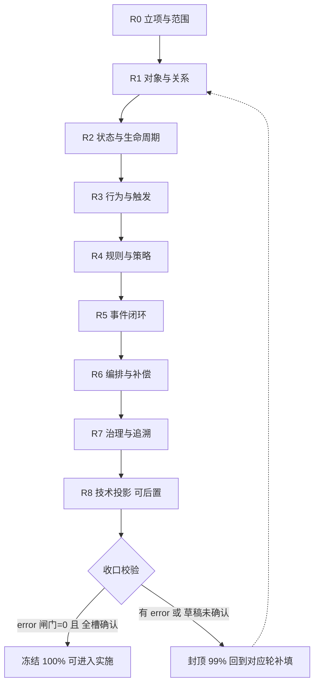
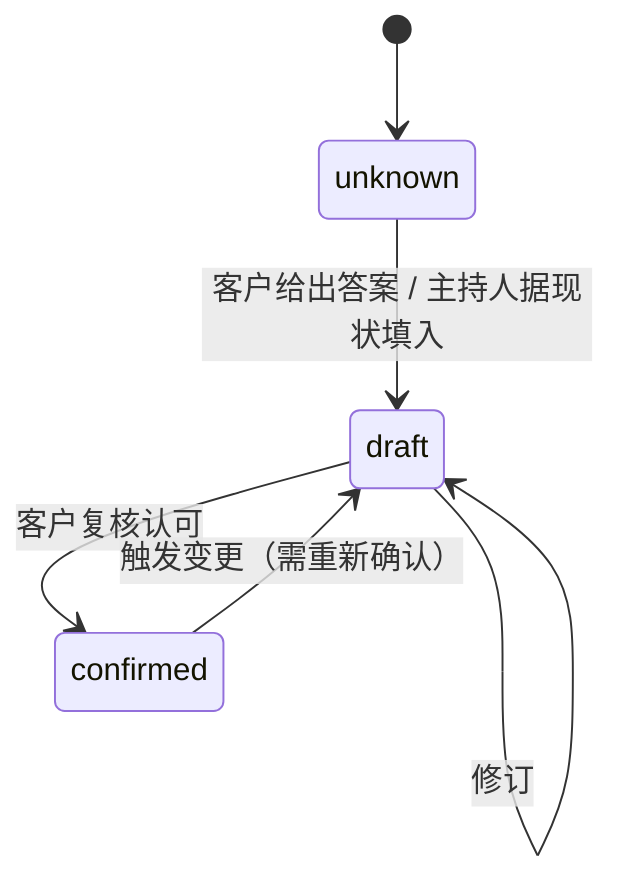
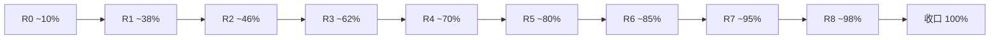

# 本体数据填充方法论（SOP + 完成度引擎）

> **版本**：v1.0　**状态**：正式（阶段二交付物）
> **定位**：本文定义"**如何把一个真实业务系统地灌进本体元模型，直到完成度 100%**"的标准作业流程（SOP）与完成度计量引擎。它把《本体模型设计规格书（完整版）》第 9 章的"槽位清单"转化为**可执行的提问流程**与**可计算的进度标尺**。
> **与规格书的关系**：规格书回答"**模型是什么**"（元素、字段、结构、校验）；本方法论回答"**怎么把它填满且填对**"（轮次、问法、计分、冻结）。槽位与闸门的权威定义以规格书第 9 章为准，本文不重复定义、只引用与操作化。
> **读者**：业务顾问 / 需求分析师（主持填充）、本体建模者、完成度引擎实现者、AI 编程智能体（消费冻结后的本体）。
> **相关文档**：[阶段一-本体模型设计规格书-完整版.md](阶段一-本体模型设计规格书-完整版.md)（元模型与槽位源）、[设计器使用手册.md](设计器使用手册.md)（工具操作）。

---

## 目录

- [第 0 章　方法论概述](#第-0-章方法论概述)
- [第 1 章　完成度引擎规格](#第-1-章完成度引擎规格)
- [第 2 章　提问 SOP 总则](#第-2-章提问-sop-总则)
- [第 3 章　分轮提问清单（合同管理全程示范）](#第-3-章分轮提问清单合同管理全程示范)
- [第 4 章　合同管理完整问答实录（端到端示例）](#第-4-章合同管理完整问答实录端到端示例)
- [第 5 章　合同管理试金石：完成度演进](#第-5-章合同管理试金石完成度演进)
- [第 6 章　出口门禁核对](#第-6-章出口门禁核对)
- [附录 A　问题模板速查](#附录-a问题模板速查)
- [附录 B　完成度报告 Schema](#附录-b完成度报告-schema)

---

## 第 0 章　方法论概述

### 0.1 它解决什么问题

把"做需求"从**主观、易漏、难判定**变成**客观、可度量、有终点**的过程：

- **不漏**：每个模型元素的每个必填槽位 = 一道必须问清的问题；问完即不漏。
- **不多**：每个核心元素都要溯源到某条已确认需求；无源即疑似过度设计。
- **可判定**：完成度是一个可计算的百分比 + 一道硬闸门，而非"差不多了"。

### 0.2 核心理念

> **本体即问卷，槽位即问题，完成度即进度，自洽即质检。**

| 理念 | 含义 |
|---|---|
| 本体即问卷 | 元模型的每类元素 = 一组结构化问题；填本体就是答问卷 |
| 槽位即问题 | 规格书第 9.3 节每个"必填槽位"对应一道对客户的问法 |
| 完成度即进度 | 已答槽位 / 应答槽位 = 填充率；配 5 级阶梯看推进 |
| 自洽即质检 | error 级闸门是放行前的硬质检，不过则封顶、禁止冻结 |

### 0.3 与规格书第 9 章的对接

| 规格书第 9 章提供 | 本方法论补充 |
|---|---|
| 完成度定义（填充 ∧ 自洽） | 可计算的**填充率公式**、**封顶闸**、**5 级阶梯** |
| 5 类闸门校验码 | 闸门在流程中的**触发时机**与**处置动作** |
| 维度与必填槽位清单（含"问卷问题"列） | 每槽位的**人话问法 / 追问 / 示例答案**与**分轮归并** |
| —— | **槽位三态**（未知 / 草稿 / 客户确认）与状态推进规则 |
| —— | **轮次化 SOP**（R0→R8→收口）与回溯规则 |

### 0.4 全景流程



---

## 第 1 章　完成度引擎规格

本章把规格书 [9.1](阶段一-本体模型设计规格书-完整版.md) 的完成度定义**操作化**为可计算引擎。

### 1.1 完成度定义（呼应规格书 9.1）

$$\text{完成度} = \text{填充完整度} \;\wedge\; \text{自洽性}$$

- **填充完整度**：所有必填槽位已填（见 [1.3](#13-填充率计算)）。
- **自洽性**：全部 error 级闸门 = 0，且 `ORPHAN_REQUIREMENT = 0`。
- **100% 当且仅当**：填充率 = 100%（且全槽=客户确认）∧ 自洽性成立。`warn` 不阻断 100%，单列"健康度提示"。

### 1.2 槽位三态

每个必填槽位在填充过程中处于三态之一：

| 态 | 标记 | 含义 | 计入填充率 | 可否冻结 |
|---|---|---|---|---|
| **未知** | `unknown` | 尚未问到 / 客户答不上来 | 否（0） | 否 |
| **草稿** | `draft` | 已填入答案，但未经客户复核确认 | **是（1）** | 否 |
| **客户确认** | `confirmed` | 客户已复核认可，作为契约基线 | 是（1） | 是 |

> 规则：**填充率"已答即计"**（草稿与确认同等计入分子）；但**冻结 / 100% 额外要求"全部必填槽 = confirmed"**。这让"答完了"与"敲定了"两件事分别度量、互不掩盖。

### 1.3 填充率计算

- **计量单位**：规格书 9.3 列出的**必填槽位**。每个元素实例按其类型展开为一组必填槽位。
- **等权平摊**：每个必填槽位权重相等（透明、可审计、无主观权重争议）。
- **公式**：

$$\text{填充率} = \frac{\bigl|\{\,\text{槽位} : \text{state} \in \{draft, confirmed\}\,\}\bigr|}{\bigl|\{\,\text{全部必填槽位}\,\}\bigr|}$$

$$\text{确认率} = \frac{\bigl|\{\,\text{槽位} : \text{state} = confirmed\,\}\bigr|}{\bigl|\{\,\text{全部必填槽位}\,\}\bigr|}$$

- **分母范围**：针对**当前已纳入范围**的全部元素（已命名即纳入）。命名新元素会扩大分母——故 R0/R1 命名期百分比常先抑后扬，请以**阶梯**（[1.6](#16-五级数据阶梯)）为主、百分比为辅判断推进。
- `warn` 级缺口（如 `CARDINALITY_MISSING`）对应的槽位**计入分母**，未填则压低填充率，但不触发封顶闸。

### 1.4 封顶闸（自洽对完成度的硬约束）

完成度展示值受自洽性"封顶"：

$$\text{展示完成度} = \begin{cases} \min(\text{填充率},\ 99\%) & \text{若 } \exists\ \text{error 闸门} > 0 \ \lor\ \text{ORPHAN\_REQUIREMENT} > 0 \\[4pt] \text{填充率} & \text{否则} \end{cases}$$

- 含义：**只要还有一个 error 级漏洞，完成度永远到不了 100%**——哪怕所有槽位都已填。
- 封顶值取 99%，用于直观提示"差最后一步质检"。
- `warn` 不参与封顶，只在报告中作健康度提示。

### 1.5 100% / 冻结判定

同时满足以下三条，方可判定 100% 并**冻结**本体：

1. **填充率 = 100%**（全部必填槽位已填）。
2. **确认率 = 100%**（全部必填槽位 = `confirmed`）。
3. **自洽性成立**：全部 error 闸门 = 0 且 `ORPHAN_REQUIREMENT = 0`。

冻结后本体打版本快照（规格书 VER 模型），作为进入阶段三（AI 生成）的唯一契约基线。

### 1.6 五级数据阶梯

阶梯是比百分比更稳健的推进标尺；每级有明确**准入判据**：

| 级 | 名称 | 大致填充率 | 准入判据 | 对应轮次 |
|---|---|---|---|---|
| **L1** | 骨架 | ~20% | 核心对象与关键行为已**命名**；需求目录已登记 | R0–R1 |
| **L2** | 结构 | ~40% | 对象属性、关系（含基数/类型）、状态机已就位 | R1–R2 |
| **L3** | 行为闭环 | ~60% | 行为（含触发/前后置）、规则、策略、事件链已连通 | R3–R5 |
| **L4** | 治理完备 | ~80% | 编排（按需）、术语表、需求双向追溯、关键授权已就位 | R6–R7 |
| **L5** | 自洽冻结 | 100% | 投影（按需）齐全 + 全槽 confirmed + error 闸门=0 | R8–收口 |

> 阶梯**不可跳级**：L3 未达（事件链未闭环）不进 L4 治理收尾，避免"在残缺结构上做治理"。

### 1.7 完成度报告结构

每轮结束输出一份完成度报告（Schema 见[附录 B](#附录-b完成度报告-schema)），核心字段：

| 字段 | 说明 |
|---|---|
| `overall` | 展示完成度（已封顶） |
| `fillRate` / `confirmRate` | 填充率 / 确认率 |
| `ladder` | 当前阶梯 L1–L5 |
| `byElementType` | 各元素类型的 已填/总 槽位与确认数 |
| `gates` | 5 类闸门的 error/warn 计数明细 |
| `blocking` | 阻断 100% 的 error 列表（含定位） |
| `unknownSlots` | 仍为 `unknown` 的槽位清单（= 下一轮提问目标） |
| `draftSlots` | 仍为 `draft` 待确认的槽位清单 |

---

## 第 2 章　提问 SOP 总则

### 2.1 轮次模型总览

| 轮 | 主题 | 产出元素 | 目标阶梯 |
|---|---|---|---|
| **R0** | 立项与范围 | 项目元信息、关键 ACTOR、REQUIREMENT 目录 | →L1 |
| **R1** | 对象与关系 | OBJ（属性/不变量/references 基数与类型） | →L2 |
| **R2** | 状态与生命周期 | OBJ.lifecycle（states/transitions 占位行为） | L2 |
| **R3** | 行为与触发 | BHV（前后置/trigger/授权/qos） | →L3 |
| **R4** | 规则与策略 | RULE（4 纯类型）、POLICY（事件驱动） | L3 |
| **R5** | 事件闭环 | EVT（载荷/语义）、闭环连通、环路检测 | →L4 |
| **R6** | 编排与补偿 | SCN（步骤/补偿，按需） | L4 |
| **R7** | 治理与追溯 | GLOSSARY、REQUIREMENT 双向追溯、QOS | L4 |
| **R8** | 技术投影（可后置） | MAP / API / VIEW / VER | →L5 |
| **收口** | 校验与冻结 | 5 类闸门=0、全槽 confirmed、版本快照 | L5/100% |

### 2.2 统一问题模板格式

第 3 章每个槽位按下列五列展开，确保"对客户说人话 + 答案有处可落 + 可校验"：

| 列 | 作用 |
|---|---|
| **对客户的问法** | 不含术语的自然语言主问题 |
| **追问 / 澄清** | 答案模糊时的二次提问，逼出精确槽位值 |
| **落到字段** | 答案写入元模型的哪个字段（规格书锚点） |
| **示例答案（合同管理）** | 一个标准答案样例，供主持人对照 |
| **关联校验码** | 该槽位填错/漏填会触发的闸门，用于即时质检 |

### 2.3 三态推进规则



- **进入 draft**：任何一次有效作答即可（哪怕粗略），保证流程不卡。
- **进入 confirmed**：必须经客户（或被授权干系人）显式复核。收口轮集中确认。
- **回退**：任一上游答案变更，受影响槽位**自动退回 draft**，确认率随之下降——保证"改了就要再敲定"。

### 2.4 增量与回溯规则

后轮常会发现前轮遗漏（如 R3 定义行为时发现缺一个对象）。处置：

1. **就地补登**：在当前轮直接补建缺失元素，标 `draft`，并在报告 `unknownSlots` 记录其未填槽位。
2. **回溯标记**：被影响的前轮元素相关槽位退回 `draft`。
3. **不阻断前进**：除非缺口触发 error 闸门，否则允许带着 `draft` 继续后续轮，收口统一清账。
4. **环路即停**：若补登引入事件环（`EVENT_CYCLE`）或状态机不可终结，**立即停在本轮修复**，不得后延。

### 2.5 主持要点（对客户说人话）

- **先讲故事再填格子**：让客户用自己的话讲一遍业务流程，主持人据此回填槽位，再逐项确认。
- **拒绝术语**：不问"这个聚合的基数是多少"，而问"一个客户能签几份合同？一份合同属于几个客户？"。
- **用反例逼边界**：问"合同生效后还能改金额吗？""审批被驳回会怎样？"以挖出状态迁移与规则。
- **当场落槽**：每得到一个答案，立即指出它落到哪个字段、是否触发校验，让客户看见"答案变成了模型"。

---

## 第 3 章　分轮提问清单（合同管理全程示范）

> 全程以《规格书》第 10 章的合同管理模型为目标产物：对象 `Contract / Customer / Delivery`，8 个行为、5 个事件、1 规则、1 策略、1 场景、2 角色、术语、需求、投影。每轮给出"目标 / 进入条件 / 问题清单 / 出轮判据"。

### 3.0 R0　立项与范围

- **目标**：定项目边界、关键角色、登记客户原始需求（建立"不漏"的分母）。
- **进入条件**：无（起点）。

| 对客户的问法 | 追问 / 澄清 | 落到字段 | 示例答案（合同管理） | 关联校验码 |
|---|---|---|---|---|
| 咱们这套系统先管哪一块业务？用一句话说说它要解决什么。 | 它管到哪为止？哪些事情它**不**管？ | `name` / `description` | "管理 B2B 销售合同从草拟到履约到期的全流程" | — |
| 平时谁会用它？各自干什么？ | 谁来拟、谁来批？有没有外部系统插一脚？ | `actors[]`（仅命名） | `SalesRep` 销售代表、`SalesManager` 销售经理 | — |
| 你们明确提了哪些要求？一条一条说。 | 这条是"必须有"还是"最好有"？谁提的？ | `requirements[]`（`status=confirmed`） | req：两日内出审批结论；实物合同自动配送；合同全生命周期流转 | `ORPHAN_REQUIREMENT`（后续兑现） |

- **出轮判据**：项目元信息齐全；已确认需求逐条登记；关键角色命名。→ **L1 起步（~10%）**。

### 3.1 R1　对象与关系

- **目标**：识别核心业务对象、属性、聚合边界与对象间关系。
- **进入条件**：R0 需求目录就绪。

| 对客户的问法 | 追问 / 澄清 | 落到字段 | 示例答案（合同管理） | 关联校验码 |
|---|---|---|---|---|
| 这摊业务里有哪些"东西/单据"？比如合同、客户、单子…… | 哪个是主角（核心单据）？哪些是挂在它下面的明细？ | `objects[].id/name` | `Contract`（合同）、`Customer`（客户）、`Delivery`（配送单） | — |
| 每一类单据，靠什么编号来区分彼此？ | 编号有规则吗？ | `identity` | `Contract.contractNo`（合同号） | — |
| 每一类单据上要记哪些信息？ | 里面有金额吗（要精确到分）？有日期吗？ | `attributes[]` | 合同号/金额(decimal)/状态(enum)/到期日(date) | — |
| 一份合同里能装多条产品明细吗？ | 这些明细能脱离合同单独存在吗？ | `entities[]` / `valueObjects[]` | `ContractItem` 子实体；`ShippingAddress` 值对象 | — |
| 有没有"任何时候都必须对得上"的铁规矩？ | 比如合同总额必须等于各明细金额之和？ | `invariants[]` | `amount == sum(items.subtotal)`（合同总额=各明细小计之和）；明细数 ≥ 1 | — |
| 合同和客户怎么关联？数量上几对几？ | 一个客户能签几份合同？一份合同属于几个客户？ | `references[].targetObjectId` + `cardinality` | `Contract→Customer` 多对一（一个客户可有多份合同） | `DANGLING_OBJ_REF` |
| 删掉一份合同时，它的产品明细、它关联的客户，分别会怎样？ | 明细应随合同一起删；客户要保留，对吗？ | `references[].kind` | 对 Customer 为 `association`（关联，删合同不删客户）；对 ContractItem 为 `composition`（组合，随合同一起删） | `CARDINALITY_MISSING`<br>`REF_KIND_MISSING`(warn) |

- **出轮判据**：核心对象齐全、属性与关系（含基数/类型）就位。→ **L2（~30→40%）**。

### 3.2 R2　状态与生命周期

- **目标**：为有状态流转的对象建状态机（states + transitions，迁移先占位行为名）。
- **进入条件**：R1 对象就位。

| 对客户的问法 | 追问 / 澄清 | 落到字段 | 示例答案（合同管理） | 关联校验码 |
|---|---|---|---|---|
| 这类单据从生到死会经历哪些状态？ | 它从哪个状态开始？哪些状态算"走到头了"？ | `lifecycle.states[]` | 草稿→审批中→生效→（到期/终止） | `NO_REACHABLE_TERMINAL` |
| 用哪个信息记录它现在走到哪一步了？ | 这个取值和上面列的状态对得上吗？ | `lifecycle.stateAttr` | `status`（状态字段） | `STATE_ATTR_MISMATCH`(warn) |
| 从一个状态走到下一个，靠什么动作推动？ | 有没有前提条件？谁来推动？ | `transitions[].onBehaviorRef`（占位） | 提交/激活/驳回/到期/终止 | `DANGLING_TRANSITION_BHV`（R3 兑现） |
| 有没有"走不到头"或"回不去"的状态？ | 比如被驳回后，还能重新提交吗？ | 迁移完整性 | 审批中可驳回退草稿 | `STATE_UNREACHABLE`(warn) |

- **出轮判据**：状态机含唯一 initial + 至少一个可达 final；每条迁移挂了行为名（即便行为下一轮才详细定义）。→ **L2（~45%）**。

### 3.3 R3　行为与触发

- **目标**：定义对象上的原子操作，补全 R2 占位的迁移行为，明确触发方式与前后置。
- **进入条件**：R2 状态机就位（迁移行为待兑现）。

| 对客户的问法 | 追问 / 澄清 | 落到字段 | 示例答案（合同管理） | 关联校验码 |
|---|---|---|---|---|
| 围绕这份单据，大家平时会对它做哪些操作？ | 每个操作动的是哪一类单据？ | `behaviors[].objectRef` | `SubmitForApproval`（提交审批）<br>`ActivateContract`（激活合同）<br>`RejectContract`（驳回合同）<br>`ExpireContract`（到期失效）<br>`DeactivateContract`（人工终止）<br>`CreateInvoicePlan`（创建开票计划）<br>`CreateDelivery`（创建配送单）<br>`SendExpiryReminder`（发送到期提醒） | `DANGLING_OBJECT` |
| 这个操作是怎么发起的？ | 人工点的？被前一件事带出来的？还是到点自动跑？ | `trigger.kind` | 提交=manual；建配送=event；到期失效=timer | `TRIGGER_KIND_FIELD_MISMATCH` |
| 人工的话谁能点；自动的话跟着哪件事、或什么时间跑？ | 是每天定点，还是到某个日子才跑？ | `trigger.actorRef/eventRefs/schedule/deadline` | 激活=SalesManager；到期提醒=每日 9 点且到期前 7 天 | `TIMER_NO_SPEC` / `DANGLING_TRIGGER_*` |
| 做这个操作之前必须先满足什么？做完之后系统要保证什么？ | 条件不满足会怎样？ | `pre/postconditions` | 前置"审批通过且首付到账"→后置"状态生效" | `LIFECYCLE_PRE_POST_MISMATCH`(warn) |
| 这个操作万一做错了，怎么补救？ | 有没有一个"反向操作"能撤回它？ | `compensatedBy` | 激活↔终止 | `DANGLING_COMPENSATION` |

- **出轮判据**：R2 所有迁移行为已定义且 `objectRef` 自洽；触发方式齐全。→ **L3 起步（~60%）**。

### 3.4 R4　规则与策略

- **目标**：抽取可复用纯规则（RULE）与事件驱动反应（POLICY）。
- **进入条件**：R3 行为就位。

| 对客户的问法 | 追问 / 澄清 | 落到字段 | 示例答案（合同管理） | 关联校验码 |
|---|---|---|---|---|
| 有哪些判断或计算，是反反复复要用到的？ | 它是"检查对不对"、"算个数额"、还是"卡风险"？ | `rules[].type` + `condition` | `CreditLimitCheck`（validation）：已用额度+本单≤授信 | `RULE_EVENT_FIELD_PRESENT` |
| 这条判断只在某一步用，还是到处都用？ | 比如只在激活合同时查，还是多处都查？ | RULE vs 行为前后置 | 信用校验在激活时 `appliedRuleRefs` 引用 | `DANGLING_RULE` |
| 有没有"一发生某件事，就自动做另一件事"的规则？ | 是哪件事触发它？它做完又会引出哪件事？ | `policies[].subscribed/triggeredEventRefs` | `DeliveryConditionCheck`（配送条件判断）：收到"合同激活"→（含实物且地址确认）→请求配送 | `POLICY_NO_SUB`<br>`POLICY_NO_TRIGGER` |

- **出轮判据**：纯规则与策略分离正确（纯规则无事件字段）；策略订阅/触发事件已命名。→ **L3（~70%）**。

### 3.5 R5　事件闭环

- **目标**：定义事件载荷与投递语义，连通"行为→事件→策略→事件→行为"，并做环路检测。
- **进入条件**：R3/R4 已引用一批事件名。

| 对客户的问法 | 追问 / 澄清 | 落到字段 | 示例答案（合同管理） | 关联校验码 |
|---|---|---|---|---|
| 前面这些"一发生就要通知别人"的事，每条通知里要带上哪些信息？ | 收到通知的人，得有哪些信息才能接着干活？ | `events[].payload` | `ContractActivated{contractNo,productType}`（合同已激活：携带合同号、产品类型） | — |
| 这条通知可以偶尔丢吗？要不要保证只处理一次？ | 万一同一条通知发重了，接收方受得了吗？ | `deliverySemantics` | 多数 `AT_LEAST_ONCE`（至少一次，不丢可重复）；提醒 `BEST_EFFORT`（尽力而为，可丢） | — |
| 每条通知都有"谁发出"和"谁接收"吗？ | 有没有发了没人理、或没人发却有人在等的？ | 生产/订阅连通 | 5 事件均有产销 | `ORPHAN_EVENT`(warn) |
| 顺着这些通知一路传下去，会不会绕回自己？ | 比如 A 引出 B、B 又反过来引出 A？ | 事件图无环 | 链路无环 | `EVENT_CYCLE`（error，**即停修复**） |

- **出轮判据**：事件载荷齐全；闭环连通；`EVENT_CYCLE = 0`。→ **L3→L4（~80%）**。

### 3.6 R6　编排与补偿（按需）

- **目标**：对需要显式、可审计、带补偿的跨聚合流程建 SCN；简单事件链流程可跳过（见规格书 1.5）。
- **进入条件**：R5 事件闭环健康。

| 对客户的问法 | 追问 / 澄清 | 落到字段 | 示例答案（合同管理） | 关联校验码 |
|---|---|---|---|---|
| 有没有"一连串步骤、必须按序、错了要回滚"的流程？ | 哪步触发？步骤顺序？ | `scenarios[].trigger/steps` | `OrderFulfillment`（订单履约）：开票计划 → 等待配送请求 → 建配送 | `DANGLING_STEP_REF` |
| 流程中途失败，已做的要不要撤？ | 撤的策略是逐步回退吗？ | `compensation` | `backward`（逐步回退），每步回退到其 `compensatedBy`（补救行为） | `COMPENSATION_NO_TARGET`(warn) |

- **出轮判据**：场景步骤可达；补偿目标存在；与事件链**不重复表达**同一流程。→ **L4（~85%）**。

### 3.7 R7　治理与追溯

- **目标**：统一术语、把每个核心元素溯源到需求、补关键授权与 SLA。这是把完成度推上 L4 的关键一轮。
- **进入条件**：R1–R6 结构基本就位。

| 对客户的问法 | 追问 / 澄清 | 落到字段 | 示例答案（合同管理） | 关联校验码 |
|---|---|---|---|---|
| 业务里那些关键"黑话"，各自到底什么意思？ | "生效""首付款"具体指什么？有别的叫法吗？ | `glossary[]` | `生效`=签字且首付到账后；别名"激活" | `DUPLICATE_TERM`/`UNDEFINED_KEY_TERM` |
| 这个词在系统里具体对应哪份单据、哪个操作、哪个状态？ | 它是靠哪个操作实现的？ | `relatedElementRefs` | 生效↔`Contract/ActivateContract/ContractActivated` | `DANGLING_TERM_REF` |
| 我们建的每样东西（每份单据、每个操作），分别是为满足你提的哪条要求？ | 找不到对应要求的，是不是多余的？ | 元素 `requirementRefs` | 自动配送行为←`req_auto_delivery` | `UNTRACED_ELEMENT`(warn) |
| 你提的那些要求，是不是每一条都在系统里落实了？ | 有没有"提了却没做"的？ | 双向追溯 | 3 条确认需求全被引用 | `ORPHAN_REQUIREMENT`（**error，必清零**） |
| 对外的关键操作，谁有权做？ | 没权限的人去做会怎样？ | `BHV.authorize` | 激活仅 `SalesManager`（销售经理） | `DANGLING_ROLE`<br>`MISSING_AUTHORIZATION`(warn) |
| 关键操作有快慢或可靠性要求吗？ | 多快算达标？ | `qosProfiles` + `BHV.qos` | 快写 `qos_fast_write` 500ms/0.999 | `DANGLING_QOS` |

- **出轮判据**：`ORPHAN_REQUIREMENT = 0`、`DANGLING_TERM_REF = 0`、关键授权就位。→ **L4 完备（~95% 填充，但多为 draft）**。

### 3.8 R8　技术投影（可后置）

- **目标**：为进入实施补持久化/接口/读模型/版本投影。可在冻结业务闭环后再做。
- **进入条件**：核心闭环（L4）稳定。

| 对客户的问法 / 工程问法 | 落到字段 | 示例答案（合同管理） | 关联校验码 |
|---|---|---|---|
| 每个对象落到哪张主表？子实体/值对象怎么存？ | `mappings[]` | `map_contract→t_contract`（合同→合同表）；`map_customer→t_customer`（客户→客户表） | `DANGLING_MAP_OBJECT`<br>`MAP_FK_TARGET_UNKNOWN`(warn) |
| 对外暴露哪些接口？映射到哪个行为？ | `apis[]` | `api_activate→ActivateContract`（激活合同接口 → 激活行为） | `DANGLING_API_TARGET`<br>`DANGLING_API_ACTOR` |
| 前端/报表需要哪些读模型？随哪些事件刷新？ | `views[]` | `view_contract_summary`（合同概览，源 Contract/Customer） | `DANGLING_VIEW_SOURCE`<br>`DANGLING_VIEW_EVENT` |
| 本体当前版本？兼容策略？ | `versionInfo` | `current 2.0`（当前 2.0 版本），`backward`（向后兼容） | `VERSION_FORMAT_INVALID`(warn) |

- **出轮判据**：投影引用全部有效（FK 目标表有映射）。→ **L5 候选（~98%）**。

### 3.9 收口：校验与冻结

- **目标**：把全部 `draft` 转 `confirmed`，跑全量校验清零 error，冻结打版本。
- **进入条件**：R0–R8 槽位全部已填（draft/confirmed）。

| 收口动作 | 通过判据 |
|---|---|
| 逐元素客户复核 | 全部必填槽位 `state = confirmed`（确认率 100%） |
| 引用完整校验 | 全部 `DANGLING_*`、`DUPLICATE_ID` = 0 |
| 闭环健康校验 | `EVENT_CYCLE = 0`；状态机可终结 |
| 覆盖完备校验 | `TIMER_NO_SPEC = 0`；warn 缺口已知会 |
| 需求追溯校验 | `ORPHAN_REQUIREMENT = 0` |
| 语义一致校验 | `TRIGGER_KIND_FIELD_MISMATCH`、`TRANSITION_STATE_UNDEF`、`RULE_EVENT_FIELD_PRESENT` = 0 |
| 冻结 | 满足 [1.5](#15-100--冻结判定) 三条 → 打 VER 快照，**完成度 100%** |

---

## 第 4 章　合同管理完整问答实录（端到端示例）

> 本章是第 3 章问法的**真实演绎**，以**表格**逐轮罗列「**顾问提问 → 客户回答 → 落槽结果**」三段信息；「落槽结果」列显示这段对话**变成了模型里的什么**。全程不要求客户懂任何技术术语。
>
> 对话产出的本体与《规格书》第 10 章完全一致：**3 对象 / 8 行为 / 5 事件 / 1 规则 / 1 策略 / 1 场景 / 2 角色 / 1 SLA / 2 术语 / 3 需求 / 2 映射 / 1 接口 / 1 视图 / 1 版本**。各轮完成度如何逐步爬升，见 [第 5 章](#第-5-章合同管理试金石完成度演进)。
>
> **出场人**：顾问（需求收集人）｜客户方——销售总监（业务负责人）、销售经理、运营专员。

### 4.1 R0　立项与范围

| # | 顾问提问 | 客户回答（角色） | 落槽结果（写入模型） |
|:--:|---|---|---|
| 1 | 这套系统先管哪一块业务？管到哪为止、哪些不管？ | **销售总监**：管 B2B 销售合同全流程——拟合同 → 审批 → 生效 → 履约发货 → 到期；不管财务记账与发票明细，只到"通知开票 / 发货"为止。 | `name` = 合同管理系统<br>`description` = 管理 B2B 销售合同从草拟到履约到期的全流程 |
| 2 | 平时谁会用它？各自干什么？ | **销售总监**：销售代表拟合同、提交审批；销售经理审批、激活，也能驳回 / 终止，是销售代表的上级。 | 角色 `SalesRep`（销售代表）<br>`SalesManager`（销售经理，`parentRef=SalesRep`，上级为销售代表） |
| 3 | 你们明确提了哪些要求？谁提的、急不急？ | **销售总监**：① 合同提交后两个工作日内必须出审批结论（硬指标）。<br>**运营专员**：② 含实物商品的合同生效后要自动发起配送，免手工建单；③ 合同要支持审批驳回、到期自动失效、人工终止的完整流转。 | 3 条 `confirmed` 需求：<br>`req_approve_within_2d`（两日内出审批结论；来源：销售总监；优先级 high）<br>`req_auto_delivery`（实物合同生效自动配送；来源：需求文档 v1；medium）<br>`req_contract_lifecycle`（驳回 / 到期失效 / 终止完整流转；来源：运营；medium） |

### 4.2 R1　业务对象与关系

| # | 顾问提问 | 客户回答（角色） | 落槽结果（写入模型） |
|:--:|---|---|---|
| 1 | 这摊业务里有哪些"东西 / 单据"？哪个是主角？ | **销售总监**：核心是合同；合同总得有个客户；实物合同还要生成配送单。 | 对象 `Contract`（合同）<br>`Customer`（客户）<br>`Delivery`（配送单） |
| 2 | 每类单据靠什么编号区分彼此？ | **销售总监**：合同有合同号，客户有客户编号，配送单有配送单号。 | `Contract.identity = contractNo`（合同号）<br>`Customer.identity = customerId`（客户编号）<br>`Delivery.identity = deliveryNo`（配送单号） |
| 3 | 合同上要记哪些信息？有金额（精确到分）吗？有日期吗？ | **销售总监**：合同号、对应客户、合同金额（精确到分）、当前状态（草稿 / 审批中 / 生效 / 到期 / 终止）、产品类型（实物 / 服务）、服务到期日。 | `Contract.attributes`：<br>`contractNo`（合同号，string）<br>`customerId`（客户，reference）<br>`amount`（金额，decimal）<br>`status`（状态，enum）<br>`productType`（产品类型，enum）<br>`endDate`（到期日，date） |
| 4 | 一份合同能装多条产品明细吗？明细能脱离合同单独存在吗？ | **销售总监**：能装多条产品明细（产品 / 数量 / 单价 / 小计）；明细离开合同没有意义，跟着合同走。实物合同还有收货地址（省 / 市 / 详细地址）。 | 子实体 `ContractItem`（产品明细：`itemId/quantity/price/subtotal`；随合同存亡，`composition` 组合）<br>值对象 `ShippingAddress`（收货地址：`province/city/detail`） |
| 5 | 有没有"任何时候都必须对得上"的铁规矩？客户这边呢？ | **销售总监**：合同总金额必须等于各明细小计之和，且至少一条明细；客户有授信额度与已用额度，已用不能超过授信。 | `Contract.invariants`：`amount == sum(items.subtotal)`（总额=明细之和）、`count(items) >= 1`（至少一条明细）<br>`Customer.attributes`：`creditLimit`（授信额度）、`creditUsed`（已用额度）<br>`Customer.invariants`：`creditUsed <= creditLimit`（已用≤授信） |
| 6 | 合同和客户怎么关联？几对几？删合同时客户会怎样？配送单与合同呢？ | **销售总监**：一份合同属于一个客户，一个客户能有多份合同，删合同不动客户。<br>**运营专员**：一份配送单对应一份合同，配送单上还记配送员。 | `Contract → Customer`（外键 `customerId`，多对一，`association` 关联，反向"名下合同"，删合同不删客户）<br>`Delivery → Contract`（外键 `contractNo`，多对一，`association`）<br>`Delivery` 增属性 `courierId`（配送员） |

### 4.3 R2　状态与生命周期

| # | 顾问提问 | 客户回答（角色） | 落槽结果（写入模型） |
|:--:|---|---|---|
| 1 | 合同从生到死会经历哪些状态？从哪开始、到哪算走到头？ | **销售总监**：草稿起步 → 提交进审批中 → 批了就生效 → 最后要么到期、要么被终止；到期和终止都是终点。 | `Contract.lifecycle.stateAttr = status`（状态字段）<br>状态 `Draft`（草稿，initial 初态）、`Reviewing`（审批中）、`Active`（生效）、`Expired`（到期，final 终态）、`Terminated`（终止，final 终态） |
| 2 | 状态之间靠什么动作推动？有没有能回退的？ | **销售总监**：草稿提交 → 审批中；审批通过并激活 → 生效（前提：审批过且首付到账）；审批中驳回 → 退回草稿；生效后到期 → 到期；生效中人工终止 → 终止。 | 迁移（先挂动作名，行为下一轮细化）：`提交`、`激活`（条件"审批通过且首付到账"）、`驳回`、`到期`、`终止` |

### 4.4 R3　行为与触发

| # | 顾问提问 | 客户回答（角色） | 落槽结果（写入模型） |
|:--:|---|---|---|
| 1 | 围绕合同会做哪些操作？每个动哪类单据、谁发起、怎么触发？ | **销售总监**：销售代表提交审批（人工）；销售经理激活、驳回、终止合同（都人工）。<br>**运营专员**：生效后系统创建开票计划（自动，被"合同已激活"带出）；实物合同系统创建配送单（自动，被"配送已请求"带出，需有可用配送员）；到期前 7 天每天早 9 点发到期提醒（定时）；到期当天自动失效（定时）。 | 8 个行为：<br>`SubmitForApproval`（提交审批｜Contract）：草稿→审批中；manual / SalesRep；产出 `ContractSubmitted`；溯源 `req_approve_within_2d`<br>`ActivateContract`（激活合同｜Contract）：审批中+首付到账→生效；manual / SalesManager；产出 `ContractActivated`<br>`RejectContract`（驳回合同｜Contract）：审批中→退回草稿；manual / SalesManager；溯源 `req_contract_lifecycle`<br>`ExpireContract`（到期失效｜Contract）：生效+已过到期日→到期；`timer，deadline=endDate`；溯源 `req_contract_lifecycle`<br>`DeactivateContract`（人工终止｜Contract）：生效→终止；manual / SalesManager；溯源 `req_contract_lifecycle`<br>`CreateInvoicePlan`（创建开票计划｜Contract）：已生效→生成开票计划；event，订阅 `ContractActivated`<br>`CreateDelivery`（创建配送单｜Delivery）：有可用配送员→建单并分配；event，订阅 `DeliveryRequested`；产出 `DeliveryCreated`；溯源 `req_auto_delivery`<br>`SendExpiryReminder`（发送到期提醒｜Contract）：生效→已发送提醒；`timer，schedule="0 9 * * *"，deadline="endDate - P7D"`；产出 `ExpiryReminded` |
| 2 | 激活合同万一搞错了，怎么补救？ | **销售经理**：那就终止它。 | `ActivateContract.compensatedBy = DeactivateContract`（激活 ↔ 终止互为补救） |

### 4.5 R4　规则与策略

| # | 顾问提问 | 客户回答（角色） | 落槽结果（写入模型） |
|:--:|---|---|---|
| 1 | 有哪些判断或计算反复要用到？是检查、算数还是卡风险？ | **销售经理**：信用额度校验——客户已用额度加这单金额不能超授信；这是激活合同时必过的一道卡。 | 规则 `CreditLimitCheck`（信用额度校验，`validation` 校验型）：`customer.creditUsed + contract.amount <= customer.creditLimit`（已用+本单≤授信）；由 `ActivateContract` 激活时引用（`appliedRuleRefs`） |
| 2 | 有没有"一发生某事就自动做另一件事"的规则？哪件事触发、又引出哪件事？ | **运营专员**：合同一激活，系统就判断——若含实物商品行且收货地址已确认，就发起配送请求。 | 策略 `DeliveryConditionCheck`（配送条件判断）：订阅 `ContractActivated`（合同激活）；条件"含实物商品行 且 收货地址已确认"；触发 `DeliveryRequested`（配送已请求）；溯源 `req_auto_delivery` |

### 4.6 R5　事件与闭环

| # | 顾问提问 | 客户回答（角色） | 落槽结果（写入模型） |
|:--:|---|---|---|
| 1 | 前面这些"一发生就通知别人"的事，每条通知带哪些信息？能偶尔丢吗？会不会重复？ | **运营专员**：合同提交审批带合同号；合同激活带合同号+产品类型；配送已请求带合同号；配送单已创建带配送单号；到期提醒已发送带合同号——这条丢了也无所谓、尽力发就行；其余几条别丢、可重复（按合同号去重）。 | 5 个事件（含投递语义）：<br>`ContractSubmitted{contractNo}`（合同已提交：合同号）— `AT_LEAST_ONCE` 至少一次<br>`ContractActivated{contractNo,productType}`（合同已激活：合同号+产品类型）— `AT_LEAST_ONCE`<br>`DeliveryRequested{contractNo}`（配送已请求：合同号）— `AT_LEAST_ONCE`<br>`DeliveryCreated{deliveryNo}`（配送单已创建：配送单号）— `AT_LEAST_ONCE`<br>`ExpiryReminded{contractNo}`（到期提醒已发送：合同号）— `BEST_EFFORT` 尽力而为（可丢） |
| 2 | 顺着这些通知一路传，会不会绕回自己？ | **运营专员**：不会。激活 →（开票计划 / 配送条件判断）→ 配送请求 → 建配送单 → 配送已创建，是一条单向链。 | 闭环 `ActivateContract → ContractActivated → DeliveryConditionCheck → DeliveryRequested → CreateDelivery → DeliveryCreated`，并行 `ContractActivated → CreateInvoicePlan`；事件图无环（`EVENT_CYCLE=0`） |

### 4.7 R6　编排与补偿

| # | 顾问提问 | 客户回答（角色） | 落槽结果（写入模型） |
|:--:|---|---|---|
| 1 | 履约这段是不是"多步骤、按顺序、错了要回滚"的流程？要显式编排出来吗？ | **运营专员**：是。合同激活后先建开票计划 → 等配送请求 → 建配送单，三步有先后；中途出错要能逐步回退。 | 场景 `OrderFulfillment`（订单履约）：触发 `ContractActivated`；步骤 `s1 CreateInvoicePlan`（建开票计划）→ `s2 等待 DeliveryRequested`（等配送请求）→ `s3 CreateDelivery`（建配送单）；补偿 `backward`（逐步回退，超时 30s、最多重试 3 次）。与 R5 事件链是同一流程的两种视图，实施时二选一 |

### 4.8 R7　治理与追溯

| # | 顾问提问 | 客户回答（角色） | 落槽结果（写入模型） |
|:--:|---|---|---|
| 1 | 业务里那些关键"黑话"到底什么意思？有别的叫法吗？ | **销售总监**："生效"——双方签字且首付到账后的状态，从这天起算服务期，平时也叫"激活"；"首付款"——合同总额按比例的首期回款，是生效的前置条件。 | 术语 `生效`（别名"激活"；关联 `Contract` / `ActivateContract` / `ContractActivated`）<br>`首付款`（生效的前置条件） |
| 2 | 我们建的每样东西分别为满足哪条要求？反过来，三条要求都落实了吗？ | **销售总监**：审批时限 → 提交审批与审批流；自动配送 → 配送条件策略+创建配送单；完整流转 → 驳回 / 到期失效 / 终止。三条都落实了。 | 各元素挂 `requirementRefs` 双向追溯；三条 `confirmed` 需求全部被引用 → `ORPHAN_REQUIREMENT=0`（无孤儿需求） |
| 3 | 对外关键操作谁有权做？有性能要求吗？ | **销售经理**：激活合同只有销售经理能做；激活要快，最好半秒内完成、几乎不能宕。 | `ActivateContract.authorize.roles=[SalesManager]`（仅销售经理可激活）<br>SLA `qos_fast_write`（快写：≤500ms、可用性 0.999、1000 QPS），挂在 `ActivateContract` |

### 4.9 R8　技术投影（工程侧）

> 此轮主要面向工程 / 实现人员，业务方可不参与。

| # | 顾问提问（对工程） | 工程回答 | 落槽结果（写入模型） |
|:--:|---|---|---|
| 1 | 每类单据落哪张表？对外开哪些接口？前端要哪些查询视图？版本与兼容策略？ | **工程**：合同落 `t_contract`，明细落 `t_contract_item`，收货地址以 JSON 存，客户外键指向 `t_customer`；客户落 `t_customer`。对外开"激活合同"接口。前端要一个"合同概览"，合同激活时刷新。本体当前版本 2.0，向后兼容。 | 映射 `map_contract`（合同 → 表 `t_contract`；明细 → `t_contract_item`；值对象存 JSON；外键 `customerId → customer_id → t_customer`）<br>映射 `map_customer`（客户 → 表 `t_customer`）<br>接口 `api_activate`（`POST /contracts/{contractNo}/activate` → 行为 `ActivateContract`，鉴权 `SalesManager`）<br>视图 `view_contract_summary`（合同概览；源 `Contract` / `Customer`；随 `ContractActivated` 刷新；字段 `contractNo` / `status`）<br>版本 `versionInfo.current=2.0`、`compatibility=backward`（向后兼容） |

### 4.10 收口与冻结

| # | 顾问动作 | 客户 / 系统响应 | 落槽结果（写入模型） |
|:--:|---|---|---|
| 1 | 把刚才每一项跟客户逐条过一遍，请其确认无误。 | **销售总监**：（逐条）确认。 | 所有槽位 `state=confirmed`（确认率 100%） |
| 2 | 跑一遍全量校验。 | **系统**：全部通过——引用无悬空、事件链无环、状态机能到终点、三条需求全兑现、字段与触发方式一致。 | 5 类闸门 error=0（自洽性成立） |
| 3 | 宣布完成并冻结。 | **顾问**：本体完成度 100%，打 2.0 版本快照冻结；此后再改要走版本演进、受影响项退回待确认。 | `decision=FROZEN`；完成度演进明细见 [第 5 章](#第-5-章合同管理试金石完成度演进) |

### 4.11 全量业务信息核对（对话已覆盖）

下表确认本章对话已采集**全部业务信息**，且每条都已落到模型：

| 业务信息 | 来自轮次 | 模型落点 |
|---|---|---|
| 业务范围、边界 | R0 | `name` / `description` |
| 销售代表、销售经理（含上下级） | R0 | `SalesRep` / `SalesManager(parentRef)` |
| 审批时限 / 自动配送 / 完整流转 三条要求 | R0 | `req_approve_within_2d` / `req_auto_delivery` / `req_contract_lifecycle` |
| 合同 / 客户 / 配送单 三类单据 + 编号 | R1 | `Contract` / `Customer` / `Delivery` + `identity` |
| 合同字段（号/客户/金额/状态/类型/到期日） | R1 | `Contract.attributes` |
| 产品明细、收货地址 | R1 | 子实体 `ContractItem`、值对象 `ShippingAddress` |
| 总额=明细之和、明细≥1、已用≤授信 | R1 | `invariants`（含 `Customer` 信用约束） |
| 合同↔客户多对一、配送单↔合同、配送员 | R1 | `references` + `Delivery.courierId` |
| 五状态、终点、可回退 | R2 | `Contract.lifecycle` |
| 8 个操作（含触发/前后置/授权/补救） | R3 | `behaviors[]` |
| 信用额度校验 | R4 | `CreditLimitCheck` |
| 激活后按条件自动配送 | R4 | `DeliveryConditionCheck` |
| 5 条通知 + 各自数据 + 可丢/去重 | R5 | `events[]` + `deliverySemantics` |
| 履约三步 + 可回滚 | R6 | `OrderFulfillment` + 补偿 |
| "生效""首付款"含义与别名 | R7 | `glossary[]` |
| 需求双向追溯 | R7 | 元素 `requirementRefs` |
| 激活限销售经理、激活要快 | R7 | `authorize` + `qos_fast_write` |
| 落表 / 接口 / 视图 / 版本 | R8 | `mappings` / `apis` / `views` / `versionInfo` |

---

## 第 5 章　合同管理试金石：完成度演进

证明本 SOP 能把合同管理从 0 填到 100%。

### 5.1 各轮完成度快照

> 百分比针对"当前已纳入范围"的必填槽位；R0–R1 命名期分母快速扩张，故以阶梯为主。

| 轮 | 新增/完善 | 展示完成度 | 阶梯 | 主要待办（unknown/draft） |
|---|---|---|---|---|
| R0 | 3 需求、2 角色命名、项目元信息 | ~10% | L1 起 | 对象/属性全未知 |
| R1 | 3 对象 + 属性 + 关系(基数/类型) | ~38% | L2 | 状态机、行为未知 |
| R2 | Contract 状态机（5 态 5 迁移占位） | ~46% | L2 | 迁移行为待兑现 |
| R3 | 8 行为（前后置/触发/补偿） | ~62% | L3 | 规则/策略/事件载荷未知 |
| R4 | 1 规则 + 1 策略 | ~70% | L3 | 事件载荷、闭环未验 |
| R5 | 5 事件载荷 + 闭环 + 环检测 | ~80% | L3→L4 | 治理未做（多 draft） |
| R6 | 1 场景 + 补偿 | ~85% | L4 | 术语/追溯/授权未做 |
| R7 | 术语×2、需求双向追溯、授权、qos | ~95% | L4 | 多数槽位仍 draft；投影未做 |
| R8 | 2 映射 + 1 接口 + 1 视图 + 版本 | ~98% | L5 候选 | 全量 draft 待确认 |
| 收口 | 全槽 confirmed + error 闸门=0 | **100%** | **L5 冻结** | — |



### 5.2 收口完成度报告样例

```yaml
completenessReport:
  project: 合同管理系统
  version: "2.0"
  overall: 100%            # 已满足封顶闸：无 error
  fillRate: 100%
  confirmRate: 100%
  ladder: L5
  byElementType:
    OBJ:        { instances: 3, slotsFilled: 27,  slotsTotal: 27,  confirmed: 27 }
    BHV:        { instances: 8, slotsFilled: 56,  slotsTotal: 56,  confirmed: 56 }
    EVT:        { instances: 5, slotsFilled: 15,  slotsTotal: 15,  confirmed: 15 }
    RULE:       { instances: 1, slotsFilled: 3,   slotsTotal: 3,   confirmed: 3  }
    POLICY:     { instances: 1, slotsFilled: 4,   slotsTotal: 4,   confirmed: 4  }
    SCN:        { instances: 1, slotsFilled: 4,   slotsTotal: 4,   confirmed: 4  }
    ACTOR:      { instances: 2, slotsFilled: 4,   slotsTotal: 4,   confirmed: 4  }
    QOS:        { instances: 1, slotsFilled: 3,   slotsTotal: 3,   confirmed: 3  }
    GLOSSARY:   { instances: 2, slotsFilled: 6,   slotsTotal: 6,   confirmed: 6  }
    REQUIREMENT:{ instances: 3, slotsFilled: 6,   slotsTotal: 6,   confirmed: 6  }
    MAP:        { instances: 2, slotsFilled: 4,   slotsTotal: 4,   confirmed: 4  }
    API:        { instances: 1, slotsFilled: 4,   slotsTotal: 4,   confirmed: 4  }
    VIEW:       { instances: 1, slotsFilled: 3,   slotsTotal: 3,   confirmed: 3  }
    VER:        { instances: 1, slotsFilled: 2,   slotsTotal: 2,   confirmed: 2  }
  gates:
    引用完整: { error: 0, warn: 0 }
    闭环健康: { error: 0, warn: 0 }
    覆盖完备: { error: 0, warn: 2 }   # 个别 EVT/BHV 未直接挂 requirementRefs（可间接溯源）
    需求追溯: { error: 0, warn: 0 }   # ORPHAN_REQUIREMENT = 0
    语义一致: { error: 0, warn: 0 }
  blocking: []                         # 无阻断项
  healthHints:
    - "UNTRACED_ELEMENT(warn)：ExpiryReminded 等未直接挂需求，经上游行为间接溯源"
  decision: FROZEN                     # 可进入阶段三（AI 生成）
```

### 5.3 自洽校验逐项核对

| 5 类闸门 | 结果 | 依据 |
|---|---|---|
| 引用完整 | error=0 | 全部 `*Ref(s)`、`onBehaviorRef`、`compensatedBy`、外键目标均命中 |
| 闭环健康 | error=0 | 事件链无环；状态机 `Draft→…→Expired/Terminated` 可达且终结 |
| 覆盖完备 | error=0 | 无 `TIMER_NO_SPEC`；warn 级 cardinality/kind 已补全 |
| 需求追溯 | error=0 | 3 条 confirmed 需求全被引用 |
| 语义一致 | error=0 | trigger 字段与 kind 一致；迁移状态有定义；纯规则无事件字段 |

→ 满足 [1.5](#15-100--冻结判定) 三条 → **完成度 100%，冻结**。

---

## 第 6 章　出口门禁核对

| 阶段二出口门禁 | 是否达成 | 证据 |
|---|---|---|
| SOP 能把合同管理填到 100% | ✅ | 第 5 章：R0→收口 完整演进至 100% 并冻结 |
| 完成度算法可计算 | ✅ | 第 1 章：填充率/确认率公式 + 封顶闸 + 5 级阶梯，皆可机械计算 |
| 完成度与门禁一致 | ✅ | 100% 判定（1.5）严格等价于"全槽 confirmed ∧ error 闸门=0"，与规格书 9.1 一致 |
| 每维度有人话问法 + 期望槽位 | ✅ | 第 3 章：14 类元素全部给出五列问题模板 |
| 问法通俗、非技术人员可落地 | ✅ | 第 3 章问法已去术语化；第 4 章给出完整"人话"问答实录 |
| 槽位三态可推进 | ✅ | 2.3：unknown→draft→confirmed 状态机 + 回退规则 |

> **结论**：阶段二出口门禁全部达成，可提交评审。批准后进入**阶段三：本体驱动 AI 编程方法**。

---

## 附录 A　问题模板速查

| 轮 | 一句话开场（对客户） |
|---|---|
| R0 | "用一句话说，这个系统要解决什么？谁用它？你们提了哪些明确要求？" |
| R1 | "这摊业务里有哪些单据/对象？谁是主角？它们之间怎么关联、数量上几对几？" |
| R2 | "这个单据会经历哪些状态？从哪开始、到哪结束？靠什么动作往前走？" |
| R3 | "围绕它会做哪些操作？每个操作谁来、怎么触发、做之前要满足什么、做完承诺什么？" |
| R4 | "有哪些反复用到的判断或计算？有没有'一发生某事就自动做某事'的规则？" |
| R5 | "这些事件各带什么数据？能不能丢、会不会重复？顺着走会不会绕回自己？" |
| R6 | "有没有'多步骤、按顺序、错了要回滚'的复杂流程？" |
| R7 | "关键黑话各是什么意思？每件事都对得上某条需求吗？谁有权做关键操作？" |
| R8 | "每个对象落哪张表？对外开哪些接口？前端要哪些查询视图？" |
| 收口 | "我们逐条过一遍，请你确认每一项；我来跑全量校验确保没有漏洞。" |

## 附录 B　完成度报告 Schema

```ts
type SlotState = 'unknown' | 'draft' | 'confirmed'
type Ladder = 'L1' | 'L2' | 'L3' | 'L4' | 'L5'

interface ElementTypeStat {
  instances: number
  slotsFilled: number      // draft + confirmed
  slotsTotal: number       // 必填槽位总数
  confirmed: number        // 仅 confirmed
}

interface GateStat { error: number; warn: number }

interface CompletenessReport {
  project: string
  version: string
  overall: number          // 展示完成度（已封顶，0–100）
  fillRate: number         // 填充率（0–100）
  confirmRate: number      // 确认率（0–100）
  ladder: Ladder
  byElementType: Record<string, ElementTypeStat>   // OBJ/BHV/EVT/...
  gates: Record<string, GateStat>                  // 引用完整/闭环健康/覆盖完备/需求追溯/语义一致
  blocking: { code: string; locus: string; message: string }[]   // 阻断 100% 的 error
  unknownSlots: { elementId: string; slot: string }[]            // 下一轮提问目标
  draftSlots:   { elementId: string; slot: string }[]            // 待确认
  healthHints: string[]                                          // warn 级提示
  decision: 'IN_PROGRESS' | 'CAPPED_99' | 'FROZEN'
}

// 完成度计算（伪代码）
function computeOverall(r: { fillRate: number; gates: Record<string, GateStat>; orphanRequirement: number }): number {
  const hasErrorGate = Object.values(r.gates).some(g => g.error > 0) || r.orphanRequirement > 0
  return hasErrorGate ? Math.min(r.fillRate, 99) : r.fillRate
}
```

---

> **冻结即契约**：完成度 100% 并打版本快照后，本体成为阶段三 AI 生成的唯一输入契约；此后任何改动须经 VER 模型走版本演进，并使受影响槽位退回 `draft`、完成度相应回落。
